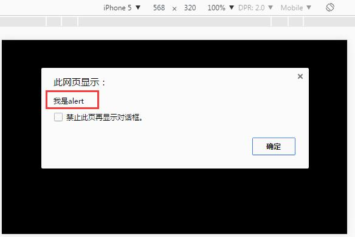
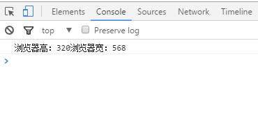
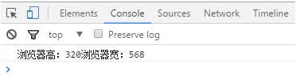

# **AS3与JS混合编码**

　　AS3与JS交互是一种常见的需求，flash插件提供了一个简单的接口函数`ExternalInterface.call`和`ExternalInterface.addCallback`与JS交互。但是发布HTML5，这个flash的接口就不能用了。

　　作为支持AS3语言编写HTML5的引擎，LayaAir可以通过`Browser.windows`和`__JS__`方法来和JS交互，并且LayaAir引擎的AS编译器还支持特有的宏编译，帮助AS3开发者实现更加复杂的AS3与JS混合编码。

### 1. 初识AS3与浏览器交互

　　假设我们创建了一个名为JSDemo.as的启动类文件，在AS3代码中实现JS的原生alert弹窗效果。示例代码如下：

**方式一：**

```java
package 
{
	import laya.utils.Browser;
	public class JSDemo {
		
		public function JSDemo() 
		{
			//初始化引擎
			Laya.init(0, 0);
			//运行JS alert
			Browser.window.alert('我是alert');			
		}		
	}
}
```

**方式二：**

```java
package 
{
	public class JSDemo
	{
		public function JSDemo()
		{
			//初始化引擎
			Laya.init(0, 0);
			//运行JS alert
			__JS__('alert("我是alert")');
		}
	}
}
```

　　以上两种方式从运行的结果上看，是完全一致的，如图1所示。

 <br />
（图1）

　　那两种方式的区别在哪里呢？

　　`Browser.window`这是对浏览器window的引用，浏览器的全局函数都是挂载在`window`上，因此可以用Browser.window.alert唤起弹窗的函数。所有window上所有的函数和属性均可以通过这种方式进行。

　　`	__JS__`是LayaCompiler编译器提供的一个宏编译函数，　`	__JS__()`函数内的代码将不被编译，会直译成js代码。


### 2. AS3与浏览器交互进阶

　LayaAir引擎与浏览器的交互远不止于alert那么简单，下面通过示例代码进一步了解AS与浏览器的交互。

**方式一：**

```java
package 
{
	import laya.utils.Browser;

	public class JSDemo
	{
		public function JSDemo()
		{
			//初始化引擎
			Laya.init(0, 0);
	
			var Height:int = Browser.window.innerHeight;
			var width:int = Browser.window.innerWidth;
			Browser.window.console.log("Console Log：浏览器高："+ Height + " 浏览器宽：" + width);
		}
	}
}
```

**方式二：**

```java
package 
{

	public class JSDemo
	{
		public function JSDemo()
		{
			//初始化引擎
			Laya.init(0, 0);
			
			var BrowserInfo:String = __JS__('"Console Log：浏览器高：" + window.innerHeight + " 浏览器宽："+ window.innerWidth');
			trace(BrowserInfo);
		}
	}
}
```

　　以上两种方式从运行的结果上看，是完全一致的，如图2所示。
 <br />
（图2）

　　以上两种方式相对而言，我们推荐采用`Browser.window`方式交互，`__JS__`方式由于是以字符串内写JS代码，如果不小心写错，也没有报错提示，会增加查错成本。


### 3.  AS3与JS混合编码

　　在项目中我们难免会用到第三方的js类库来辅助开发。那么在AS项目中我们怎么处理呢？下面我们就拿最常用的jquery.js来进行讲解。

​	首先在jquery的[官网下载](http://jquery.com/download/)jquery.js版本，示例中我们用`jquery-3.2.0.min.js`。在index.html页面添加`<script type="text/javascript" src="jquery-3.1.1.js"></script>`。

​	*Tips: 第三方库必须添加在LayaAir引擎库之前。*

​	在入口页面添加完库的引用后，我们在AS3入口库中编写如下代码：

```java
package {
	import laya.utils.Browser;
	public class JSDemo {
		
		public function JSDemo() {
			//初始化引擎
			Laya.init(0, 0);
          	//Browser.window后的$(Browser.document)为第三方库jquery的方法。
			Browser.window.$(Browser.document).ready(function():void{
				
				Browser.window.alert("jquery调用成功");
			});
			
		}
		
	}
}
```

编译运行后，我们可以看到弹窗成功，表明已经调用成功。我们在AS3项目中成功的实现了混合编码。


### 4. JS调用AS接口

　　有时候我们开发项目要和web开发者交叉调用，通过上面的方法我们可以调用web开发者的js方法，那么web开发者怎么调用我们写的逻辑呢？其实开发者可以进一步思考下：我们用as3开发H5，其实是通过编译器直接编译生成了js，因此，只需要把接口暴露出来，让web开发者直接调用我们的js代码就可以了。下面用一个简单的示例代码来说明一下用法。

**代码如下:**

```java
package {
	import laya.webgl.WebGL;

	public class JSDemo {
		
		public function JSDemo() {
			//初始化引擎
			Laya.init(0, 0);
			
		}
      //定义一个静态函数 对外暴露给web调用者。
		public static function getGameName():String
		{
			return "myGame";
		}
		
	}
}
```

​	编译运行，然后我们打开浏览器控制台，然后输入`JSDemo.getGameName()` 发现输出了`"myGame"`，如图3所示。表明调用成功，由此实现了和web开发者交互。

<br />
（图3）


​	上面的示例只是定义了一个静态的方法，我们甚至可以开放内部的所有方法和属性，代码修改如下：

```java
package {
	import laya.utils.Browser;

	public class JSDemo {
		
		private var name:String = "Game";
		public function JSDemo() {
			//初始化引擎
			Laya.init(0, 0);
         	//定义一个命名空间的属性为app；
			Browser.window.app = this;
			
		}
		public static function getGameName():String
		{
			return "myGame";
		}
		public function getVersion():String
		{
			return "1.2.0";
		}
		
	}
}
```

​	编译运行，打开浏览器控制台，先后输入`app`、`app.name`、`app.getVersion()`可以看到的效果如图4所示，已经达到了我们调用的效果。由此看出LayaAir引擎的AS开发和web开发者交互式无缝的。

 <br />
（图4）


### 5. 代码智能提示

​	在上面的示例里，我们调用JS原生方法很简单，但是原生的JS方法，在AS3项目中并没有代码提示。因此，我们结合宏编译方法进行手动添加函数声明，从而获得代码提示。

比如window这个类。我们可以把浏览器常用的函数封装起来便于调用。代码如下：

```java
/*[IF-FLASH]*/package
{
	public class window
	{
		public function window()
		{
		}
		public static function alert(msg:Object):void
		{			
		}
	}
}
```

`/*[IF-FLASH]*/`代表这是flash模式的类，js不会翻译这个类。我们看下调用方式：

```java
package {
	import laya.webgl.WebGL;

	public class Game {
		
		private var name:String = "Game";
		public function Game() {
			//初始化引擎
			Laya.init(600, 400,WebGL);//
			window.alert("我是alert");
			
		}
	}
}
```

编译运行可以看到弹窗出现。所以其他常用的Window的方法开发者也可以封装起来。这样代码的智能提示就会有了。


