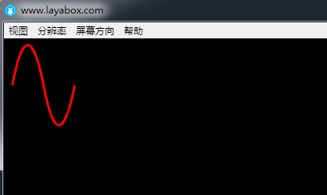

# 绘制曲线

> 相对于直线而言，曲线的绘制与坐标关系更难理解一些。由于LayaAir引擎绘制的是贝塞尔曲线，所以本文中先针对贝塞尔曲线的基础进行说明，然后再结合引擎的API进行讲解。
>


### **一、贝塞尔曲线的基础**

​        贝塞尔曲线在港澳台等地称为貝茲曲線，新加坡马来西亚等地称为贝济埃曲线。一般的矢量图形软件通过它来精确画出曲线，贝塞尔曲线由线段与节点组成，节点是可拖动的支点，线段像可伸缩的皮筋，我们在绘图工具上看到的钢笔工具就是来做这种矢量曲线的。

​        贝塞尔曲线是应用于二维图形应用程序的数学曲线。曲线的定义有四个点：起始点、终止点（也称锚点）以及两个相互分离的中间点。滑动两个中间点，贝塞尔曲线的形状会发生变化。

​       基于线性、二次方、三次方等公式的不同，贝塞尔曲线也被称为一次、二次……五次贝塞尔曲线，有些文章也称为一阶、二阶……说的是一回事。下面通过动图让大家直观的理解一下：

#### **1.1 一次贝塞尔曲线**

​        <br/>
​   	（图1）  

​        说明：上图是由 P0 至 P1 的连续点， 描述的是一条线性的贝赛尔曲线。线性贝塞尔曲线函数中的 t 会经过由 P0 至 P1 的 B(t) 所描述的曲线。例如当 t=0.25 时，B(t) 即一条由点 P0 至 P1 路径的四分之一处。就像由 0 至 1 的连续 t，B(t) 描述一条由 P0 至 P1 的直线。

#### **1.2 二次贝塞尔曲线**

​        <br/>
​   	（图2）  

​      <br/>
​   	（图3）  

​        说明：为建构二次贝塞尔曲线，上图由 P0 至 P1 的连续点 Q0，描述一条线性贝塞尔曲线。由 P1 至 P2 的连续点 Q1，描述一条线性贝塞尔曲线。由 Q0 至 Q1 的连续点 B(t)，描述一条二次贝塞尔曲线。

#### **1.3 三次贝塞尔曲线**

​        <br/>
​   	（图4）  

​          <br/>
​   	（图5）  

​        说明：对于三次曲线，可由线性贝塞尔曲线描述的中介点 Q0、Q1、Q2，和由二次曲线描述的点 R0、R1 所建构。

#### **1.4 高阶贝塞尔曲线**

**由于高阶贝塞尔曲线并不常见，本文将不再详细说明，想对贝塞尔曲线原理了解更多的可以查看其它相关文章。

​        <br/>
​   	（图6）  四次贝塞尔曲线

​        <br/>
​   	（图7） 五次贝塞尔曲线


### **二、用LayaAir引擎API绘制二次贝塞尔曲线**

​        LayaAir引擎的曲线绘制采用的是二次贝塞尔曲线，开发者可以在API文档中搜索laya.display.Graphics类可以查看到“drawCurves();”曲线绘制方法。该方法的详细说明如下图所示：

​        <br/>
​   	（图8）  

下面我们用LayaAir引擎绘制矢量曲线，示例代码如下：

```javascript
package
{
    import laya.display.Sprite;
    import laya.display.Stage;
    import laya.webgl.WebGL;
      
    public class Sprite_DrawShapes
    {
        private var sp:Sprite;
          
        public function Sprite_DrawShapes()
        {
            Laya.init(500, 300, WebGL);
            drawSomething();
        }
  
        private function drawSomething():void
        {
            sp = new Sprite();
            Laya.stage.addChild(sp);
            //画曲线
            sp.graphics.drawCurves(10, 58, [0, 0, 19, -100, 39, 0], "#ff0000", 3);
              
        }
    }
}
```

发布后如下图所示，我们成功的绘制了一条简单的曲线。

​        <br/>
​   	（图9）  

通过增加drawCurves的第三位points点集合的参数，我们可以让曲线更复杂一些，修改的示例代码如下：

```javascript
//增加58, 100与78, 0坐标让曲线更复杂一些
 
sp.graphics.drawCurves(10, 58, [0, 0, 19, -100, 39, 0, 58, 100, 78, 0], "#ff0000", 3);
```

发布后如下图所示，

​        <br/>
​   	（图10）  
如果想绘制更复杂的曲线，可自行调整drawCurves中的参数，再结合二次贝赛尔曲线原理进行理解。

最后提醒一下，与绘制折线一样，第三位参数中所有的坐标都是相对坐标，都会受到第一位和第二位参数的“10，58”而影响。一旦“10，58”产生改变，整体曲线都会受到影响。


### 三、用LayaAirIDE拖动控件绘制二次贝塞尔曲线

​	**步骤一：**打开我们的LayaAirIDE，点击设计模式，新建一个View页面

​	<br/>
​   	（图11）  

**步骤二：**将组件中的曲线组件拖动到View页面上，就会自动生成默认的曲线

​	<br/>
​   	（图12）  

**步骤三：**修改（添加/减少）Curves组件属性中的point的数值，改变曲线的位置或弯曲程度

​   	<br/>
​   	（图13）  

​   	<br/>
​   	（图14）  

到此我们通过LayaAirIDE组件绘制曲线就完成了。