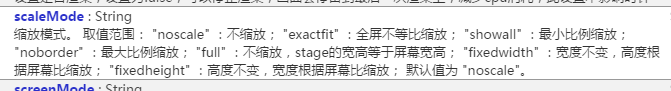
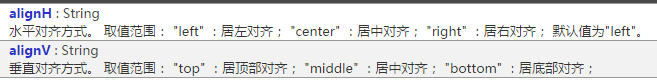
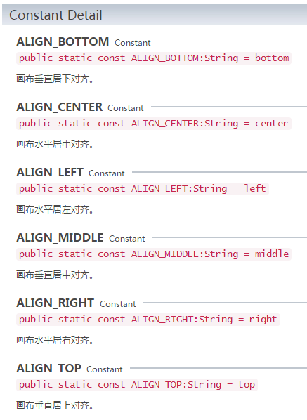
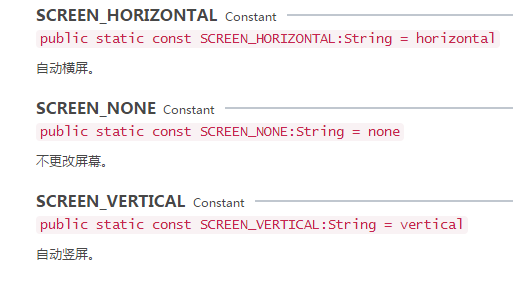

# 屏幕适配API概述

　　随着移动端设备(手机、平板、电视)的增多，设备碎片化、屏幕碎片化的程度也在不断增加，而我们今天要探讨的，则是对游戏显示影响比较大的屏幕碎片化。

​	为了更深入的了解屏幕适配，我们先从Iphone屏幕分辨率发展说起：

　　在早先的移动设备中，屏幕像素都比较低，如 Iphone3，它的分辨率为320×480，在Iphone3上，一个像素等于一个屏幕物理像素。后来随着设备屏幕像素密度越来越高，从iphone4开始，苹果推出了Retina屏，分辨率变成了640×960，提高一倍，但屏幕尺寸却没变化，这就意味着同样大小的屏幕上，像素却多了一倍，这提高的就是devicePixelRatio，其他安卓移动设备也类似与此。

　　所以我们得出一个公式：   `物理分辨率=像素分辨率*devicePixelRatio`;

　　引擎对上述两种分辨率做了封装。

　　设备像素分辨率:Laya.Browser.clientWidth，Laya.Browser.clientHeight;

　　设备物理分辨率：Laya.Browser.width，Laya.Browser.height;

　　像素比：Laya.Browser.pixelRatio;

　　 默认从浏览器获得的clientWidth不是像素分辨率，而是经过缩放过的分辨率，想要获得正确的分辨率，需要在html页面内设置viewport meta标签，设置content的值为"`width=device-width,initial-scale=1.0,minimum-scale=1.0,maximum-scale=1.0,user-scalable=no`"。

　　在LayaAir引擎内，如果页面未设置过viewport标签，则引擎会自动生成一个，以确保获取的正确宽高。

　　屏幕适配是每个游戏都会用到。关于移动设备，尤其是手机的屏幕适配，LayaAir引擎如何实现，我们先了解一下相关API“`laya.display.stage`”。

## 一、关于屏幕适配的缩放模式设置

屏幕适配的缩放模式共分为七种，相关介绍如图1、图2、图3所示：

​		 
​		图（1）屏幕适配的缩放模式

​		 
​		图（2）屏幕适配的缩放模式
​		 
​		图（3）屏幕适配的缩放模式

## 二、关于对齐模式的设置

 在对齐模式方面，是常规的水平对齐方式和垂直对齐方式。相关的API参数介绍如图4、图5、图6所示：
​		  
​		图（4）屏幕适配的对齐模式

​		 
​		图（5）屏幕适配的对齐模式

​		 
​		图（6）对齐模式中的属性

## 三、屏幕方向的智能适配设置

LayaAir引擎可以依据浏览器显示的比例设置自动横屏或竖屏，不受系统锁屏而影响。相关API设置参数如图7、图8所示：

​		 
​		图（7）屏幕方向的适配

​		 
​		图（8）屏幕方向的适配

更多关于`laya.display.stage` API的说明，请进入API文档查看：http://layaair.ldc.layabox.com/api/index.html?category=Core&class=laya.display.Stage