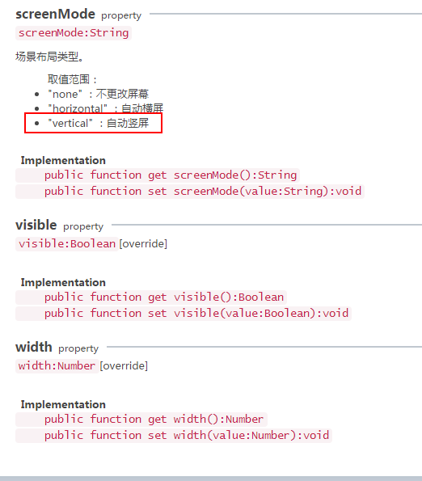
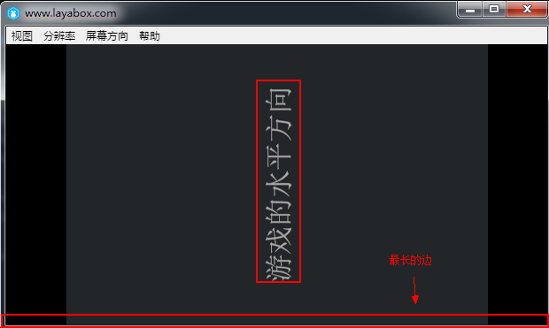

# 游戏自动竖屏及保持竖屏状态


​        通过LayaAir的自动竖屏设置，无论手机如何旋转，都可让游戏的水平方向始终与浏览器显示屏幕的最长边保持垂直。 

关于屏幕方向的API参数如下图所示：

​	<br/>
​	图（1）屏幕方向的适配

​	<br/>
​	图（2）screenMode设置的属性


LayaAir自动竖屏的示例代码如下：

```javascript
package 
{
    import laya.display.Stage;
    import laya.display.Text;
    import laya.webgl.WebGL;
 
    public class SmartScale_Portrait
    {
        public function SmartScale_Portrait() 
        {
            //初始化舞台，不支持WebGL时会自动切换至Canvas
            Laya.init(200, 300, WebGL);
             
            Laya.stage.alignV = "middle";
            Laya.stage.alignH = "center";
             
            Laya.stage.scaleMode = "showall";
 
            //自动竖屏，让游戏的水平方向始终与浏览器显示屏幕的最长边保持垂直。
            Laya.stage.screenMode = "vertical";
             
            Laya.stage.bgColor = "#232628";
             
            showText();
        }
         
        private function showText():void 
        {
            var text:Text = new Text();
             
            text.text = "游戏的水平方向";
            text.color = "gray";
            text.fontSize = 20;
             
            text.x = Laya.stage.width - text.width >> 1;
            text.y = Laya.stage.height - text.height >> 1;
             
            Laya.stage.addChild(text);
        }
    }
}

```


手机竖屏状态下的LayaAir自动竖屏运行效果如下图所示：

​	<br/>
​	图（3）设置竖屏之后的运行结果


手机横屏状态下的LayaAir自动竖屏运行效果如下图所示：

​	<br/>
​	图（4）改变最长边之后的运行结果


