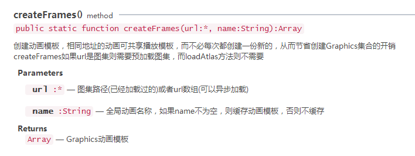

# 图集动画运用

## 1. 图集动画概述

游戏开发中，动画的运用基本无处不在，LayaAir引擎提供了功能强大的的Animation动画类，它可以使用多种动画资源生成游戏动画。

我们可以用LayaAir IDE创建时间轴动画的方式生成后缀名为“.ani”的动画资源，也可以直接图集打包动画帧图片创建后缀名为“.atlas” 或“.json”的动画图集资源，然后赋给动画类去加载使用。

用IDE创建动画并使用在此不再多作介绍，在“技术文档”中有大量的实例，如果希望代码量较少，可以用此种方式。

图集动画方式，动画帧图片直接打包即可，但需要较多的代码控制。此种方式优点是程序开发上更加灵活。下例中为使用图集方式制作的动画演示（图1），并通过UI进行了控制。

<br/>（图1）


## 2.制作角色图集动画

### 2.1 图集资源准备

动画图集资源需注意一些情况，像角色类动画因为帧数较多，一般是一套角色图一个资源，在命名上根据动作名称加帧序号命名（图2）。特效类动画因为每个特效帧数量不多可以多个特效组合成一张图集资源。

<br/>（图2）

通过IDE打包后，会生成3个文件，分别为“.atlas”、“.json”、".png"文件（图3）。动画类Animation通过加载“.atlas”或“.json”文件获得图像资源。建议使用“.atlas”文件，不需要在url中加入类型设置代码。

<br/>（图3）


### 2.2 代码加载图集资源并生成默认动画

下列代码中，我们通过`Laya.loader.load(["res/atlas/role.atlas"], Handler.create(this, createAni));`方法加载了角色的图集动画资源。

加载完成后创建动画实例，并通过`roleAni.loadAtlas("res/atlas/role.atlas");`方法把资源赋给动画后，动画实例就可以播放了。当然，不使用loader加载器也行，也可以直接使用loadAtlas()方法加载资源（图4），只是加载的资源不方便统一管理。

<br/>（图4）

播放动画使用了play()方法，因为我们并未在方法中设置参数，那么它会默认播放图集中的所有动画帧。

```java
package
{
	import laya.debug.DebugPanel;
	import laya.display.Animation;
	import laya.display.Stage;
	import laya.events.Event;
	import laya.maths.Rectangle;
	import laya.utils.Handler;
	import laya.webgl.WebGL;
	
	import ui.PlayControlUI;

	public class AtlasAnimation
	{
		/****角色动画****/
		private var roleAni:Animation
		
		public function AtlasAnimation()
		{
			// 不支持WebGL时自动切换至Canvas
			Laya.init(1280,720, WebGL);
			//画布垂直居中对齐
			Laya.stage.alignV = Stage.ALIGN_MIDDLE;
			//画布水平居中对齐
			Laya.stage.alignH = Stage.ALIGN_CENTER;
			//等比缩放
			Laya.stage.scaleMode = Stage.SCALE_SHOWALL;
			//背景颜色
			Laya.stage.bgColor = "#1b2436";
			
			
			//加载角色图集资源
			Laya.loader.load(["res/atlas/role.atlas"], Handler.create(this, createAni));
		}
		
		private function createAni():void 
		{
			
			//实例化角色动画
			roleAni = new Animation();
			// 加载图集动画
			roleAni.loadAtlas("res/atlas/role.atlas");	
			// 设置动画每帧间播放间隔（单位：毫秒）
			roleAni.interval = 100;
			//角色动画放大
			roleAni.scale(1.4,1.4);
			//默认会播放全部动画
			roleAni.play();	
			
			//动画实例无宽高，需通过getGraphicBounds()或getBounds()获取
			//获取动画的边界信息
			var bounds:Rectangle = roleAni.getGraphicBounds();
			//设置动画轴心点
			roleAni.pivot(bounds.width / 2, bounds.height / 2);
			//设置动画在舞台中心位置
			roleAni.pos(Laya.stage.width / 2-200, Laya.stage.height / 2);
			//加载到舞台
			Laya.stage.addChild(roleAni);

		}
	}
}
```


## 3.创建动画模版

### 3.1 动画模版概述

在上面的代码中，我们加载了图集资源，创建了图集的动画。但暂时来说还无法真正的在游戏中使用，我们可以发现，动画调用play()方法后，播放了所有的图片序列帧，角色站立、移动、死亡、攻击动画都被依次播放了出来，那么我们用什么方法才能只播放一种动作呢？

一种方式是把每个动作都打包成图集，然后通过loadAtlas()方法调用不同的资源播放。但显然这种方式是不可取的，这会增加图片的资源数量，也增加了游戏性能的消耗。

更好的方式就是在图集中使用某个动作的图片资源组创建缓存的动画模版，然后播放它。这种方式性能较高，图集数量也少，是我们推荐的方式。

查看play()方法的API（图5），它的参数name是指播放缓存中的某个动画，比如创建了站立的缓存动画，名字取名为“stand”，就可以通过play(0,true,"stand")方法来独立播放站立动画。

<br/>（图5）

因此，我们需要为上例中角色动画创建不同动作的缓存动画，然后就可以指定播放动作了。同时，缓存的动画在LayaAir引擎中也叫作动画模版。Animation动画类提供了两种创建缓存动画模版的方法，分别为静态方法Animation.createFrames()和实例方法loadIamges()。API如下：

<br/>（图6）

<br/>（图7）


### 3.2 动画模版的创建与运用

根据动画模版的概述，我们修改代码，并加入动画模版创建方法Animation.createFrames()，它需要的两个参数分别是动作的图片序列url地址，及动作的名称，代码如下：

```java
package
{
	import laya.debug.DebugPanel;
	import laya.display.Animation;
	import laya.display.Stage;
	import laya.events.Event;
	import laya.maths.Rectangle;
	import laya.utils.Handler;
	import laya.webgl.WebGL;
	
	import ui.PlayControlUI;

	public class AtlasAnimation
	{
		/****角色动画****/
		private var roleAni:Animation
		
		public function AtlasAnimation()
		{
			// 不支持WebGL时自动切换至Canvas
			Laya.init(1280,720, WebGL);
			//画布垂直居中对齐
			Laya.stage.alignV = Stage.ALIGN_MIDDLE;
			//画布水平居中对齐
			Laya.stage.alignH = Stage.ALIGN_CENTER;
			//等比缩放
			Laya.stage.scaleMode = Stage.SCALE_SHOWALL;
			//背景颜色
			Laya.stage.bgColor = "#1b2436";
			
			
			//加载角色图集资源
			Laya.loader.load(["res/atlas/role.atlas"], Handler.create(this, createAni));
		}
		
		private function createAni():void 
		{
			
			//实例化角色动画
			roleAni = new Animation();
			// 加载图集动画
			roleAni.loadAtlas("res/atlas/role.atlas");	
			// 设置动画每帧间播放间隔（单位：毫秒）
			roleAni.interval = 100;
			//角色动画放大
			roleAni.scale(1.4,1.4);			
			
			//创建动画模版，以供动作切换控制使用
			Animation.createFrames(actionUrls("stand",7),"stand");    	//站立动画
			Animation.createFrames(actionUrls("move",8),"move");		//移动动画
			Animation.createFrames(actionUrls("die",8),"die");			//死亡动画
			Animation.createFrames(actionUrls("attack",7),"attack");	//攻击动画
			
			//播放某个缓存的动画模版
			roleAni.play(0,true,"attack");	
			
			//动画实例无宽高，需通过getGraphicBounds()或getBounds()获取
			//获取动画的边界信息
			var bounds:Rectangle = roleAni.getGraphicBounds();
			//设置动画轴心点
			roleAni.pivot(bounds.width / 2, bounds.height / 2);
			//设置动画在舞台中心位置
			roleAni.pos(Laya.stage.width / 2-200, Laya.stage.height / 2);
			//加载到舞台
			Laya.stage.addChild(roleAni);

		}
		
		/**
		 * 动作资源的一组url数组（美术资源地址数组）
		 * @param aniName  动作的名称，用于生成url
		 * @param length   动画的帧数
		 */		
		private function actionUrls(aniName:String,length:int):Array
		{
			var urls:Array=[];
			for(var i:int=0;i<length;i++)
			{
				urls.push("role/" + aniName + i + ".png")
			}
			return urls;
		}
	}
}
```

编译运行上述代码，我们可以看到，默认不再播放全部动画序列，只播放了角色的攻击动作。可以切换 `roleAni.play(0,true,"attack");`中的第二个参数“attack”为其他动画模版名称观察效果，其他动画模版是否播放正确。


## 4. 动画的播放控制

为了更好的观察创建的动画效果，切换不同动作的动画模版，并让大家了解更多的动画播放控制。我们在IDE中制作了控制UI，并设置了按钮名称name，用于控制测试角色动作。UI效果图及说明如下（图8）：

<br/>（图8）

在程序中加载UI资源并实例化生成的PlayControlUI类，加入UI监听角色切换和播放控制代码。

动画播放控制运用了动画的stop()方法，及动画的index当前播放索引、count动画总长度属性。

tips：index 播放索引是指当前播放动画（或动画模版）的帧位置。如果当前播放的是动画模版，index会切换成动画模版的帧索引位置，而不是整个图集动画的帧索引位置。同时，count属性也会从整个动画的总长度切换成动画模版的总长度（总帧数）。

代码参考如下：

```java
package
{
	import laya.debug.DebugPanel;
	import laya.display.Animation;
	import laya.display.Stage;
	import laya.events.Event;
	import laya.maths.Rectangle;
	import laya.utils.Handler;
	import laya.webgl.WebGL;
	
	import ui.PlayControlUI;

	public class AtlasAnimation
	{
		/****角色动画****/
		private var roleAni:Animation
		/***IDE制作的角色动画控制UI***/
		private var control:PlayControlUI
		
		public function AtlasAnimation()
		{
			// 不支持WebGL时自动切换至Canvas
			Laya.init(1280,720, WebGL);
			//画布垂直居中对齐
			Laya.stage.alignV = Stage.ALIGN_MIDDLE;
			//画布水平居中对齐
			Laya.stage.alignH = Stage.ALIGN_CENTER;
			//等比缩放
			Laya.stage.scaleMode = Stage.SCALE_SHOWALL;
			//背景颜色
			Laya.stage.bgColor = "#1b2436";
			
			//加载角色图集资源
			Laya.loader.load(["res/atlas/role.atlas","res/atlas/comp.atlas"], Handler.create(this, createAni));
		}
		
		private function createAni():void 
		{
			//实例化控制UI,并加载到舞台上
			control=new PlayControlUI();
			Laya.stage.addChild(control);
			
			
			//实例化角色动画
			roleAni = new Animation();
			// 加载图集动画
			roleAni.loadAtlas("res/atlas/role.atlas");	
			// 设置动画每帧间播放间隔（单位：毫秒）
			roleAni.interval = 100;
			//角色动画放大
			roleAni.scale(1.4,1.4)
			//默认会播放全部动画
			roleAni.play();	
			
			//动画实例无宽高，需通过getGraphicBounds()或getBounds获取
			//获取动画的边界信息
			var bounds:Rectangle = roleAni.getGraphicBounds();
			//设置动画轴心点
			roleAni.pivot(bounds.width / 2, bounds.height / 2);
			//设置动画在舞台中心位置
			roleAni.pos(Laya.stage.width / 2-120, Laya.stage.height / 2);
			//加载到舞台
			Laya.stage.addChild(roleAni);
			
			
			//创建动画模版，以供动画切换控制使用
			Animation.createFrames(actionUrls("stand",7),"stand");    	//站立动画
			Animation.createFrames(actionUrls("move",8),"move");		//移动动画
			Animation.createFrames(actionUrls("die",8),"die");			//死亡动画
			Animation.createFrames(actionUrls("attack",7),"attack");	//攻击动画
			
			//动画播放控制按钮组事件监听
			control.box_control.on(Event.MOUSE_DOWN,this,onControl);
			//动作切换按钮组事件监听
			control.box_frames.on(Event.MOUSE_DOWN,this,onChangeFrames);
		}
		
		/****角色动画切换****/
		private function onChangeFrames(e:Event):void
		{
			//根据名字播放动画模版（IDE中设置按钮名字name与动画模版设置名字需相同）
			roleAni.play(0,true,e.target.name);
			//改变标题
			control.title.text="当前播放动画为："+e.target.name
		}
		
		/****角色动画播放控制****/
		private function onControl(e:Event):void
		{
			//获得按钮名字（IDE中设置的按钮名字name）
			var names:String=e.target.name;
			if(names=="stop")
			{
				//动画停止
				roleAni.stop();	
				control.title.text="停止动画";
			}else if(names=="play")
			{
				//播放动画
				roleAni.play();	
				control.title.text="播放动画";
				
			}else if(names=="up")//动画的上一帧
			{
				//动画停止
				roleAni.stop();	
				//当前动画的帧位置减1（如播放动画模版，index、count都会切换为动画模版的帧位置与总帧数）
				roleAni.index--;
				//如果帧位置小于0，则帧位置等于当前动画的帧总数-1
				if(roleAni.index<0) roleAni.index=roleAni.count-1;
				control.title.text="当前帧位置为："+roleAni.index;
				
			}else if(names=="next")//动画的下一帧
			{
				//动画停止
				roleAni.stop();	
				//当前动画的帧位置加1（如播放动画模版，index、count都会切换为动画模版的帧位置与总帧数）
				roleAni.index++;
				//如果帧位置大于动画的帧总数-1，则帧位置等于0
				if(roleAni.index>roleAni.count-1) roleAni.index=0;
				control.title.text="当前帧位置为："+roleAni.index;
			}

		}
		
		/**
		 * 一组动画资源的url数组（美术资源地址数组）
		 * @param aniName  动作的名称，用于生成url
		 * @param length   动画的帧数
		 */		
		private function actionUrls(aniName:String,length:int):Array
		{
			var urls:Array=[];
			for(var i:int=0;i<length;i++)
			{
				urls.push("role/"+aniName+i+".png")
			}
			return urls;
		}
	}
}
```

编译运行代码，效果也如图1所示。我们可以通过点击不同按钮来播放不同的动画动作及动画的停止和帧切换了。 