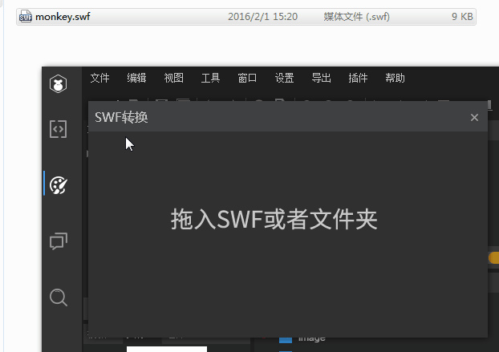
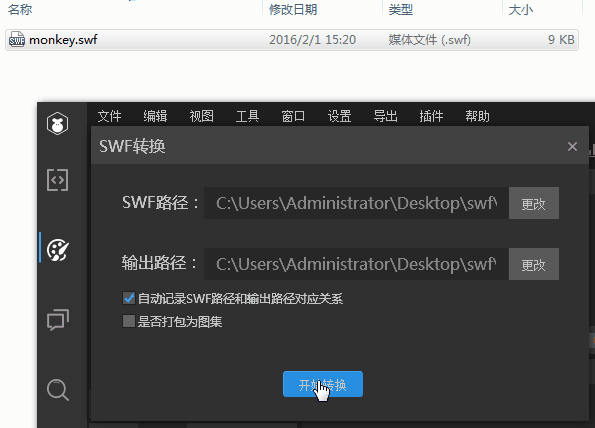
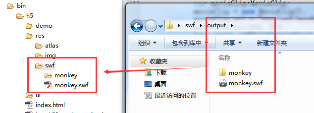

# SWF动画在LayaAir引擎中使用

### 1、在LayaAir引擎中使用SWF动画的前提

为了支持Flash页游项目快速移植到HTML5项目中，LayaAir引擎提供了SWF文件的转换工具，将原生的SWF文件转换为LayaAir引擎可识别的格式，但是转换工具不支持在SWF文件中包含文本、形状渐变、遮罩、代码这样的特殊内容。如果包括了上述的内容，转换后将无法达到原SWF中的效果或转换失败。

如果开发者并不熟悉Flash以及swf动画文件的制作与导出相关知识，不必继续阅读本文，推荐使用LayaAirIDE制作动画。


### 2、将SWF动画转换为LayaAir引擎识别的格式

先准备好符合SWF转换规范的动画文件，然后打开LayaAirIDE的设计模式。

选择菜单 `工具` --> `SWF转换` 就可以打开SWF转换工具面板，如图1所示。

 

（图1）

在新打开的 `SWF转换` 面板中，如动图2所示，拖入符合转换规范SWF动画或文件夹。

  

（动图2）

点击`开始转换`， 如动图3所示。默认会在swf的同级目录生成一个`output`目录，转换成功后会在output目录内生成一个新的swf和一个图片文件夹。

  

（动图3）

**Tips**：

- 如果是复杂的swf文件会生成多张位图，因此建议在`开始转换`前勾选 `是否打包为图集` 。

- 默认生成在output目录，开发者可以在输入路径栏，点击`更改`改变输出目录。

- 转换工具生成的新swf不可以再次转换。

  ​


### 3、使用转换后的swf动画

在使用swf动画之前，我们先将转换后的`.swf`格式文件与生成的`文件同名目录`复制到项目的资源目录（*本例为项目根目录下的res/swf/目录*），如图4所示。



(图4)

LayaAir引擎中使用转换后的swf动画，需要使用**MovieClip类**，如下面代码所示：

入口类MovieClipSample.as

```java
package  
{
	import laya.ani.swf.MovieClip;
	
	public class MovieClipSample 
	{
		
		public function MovieClipSample() 
		{
			Laya.init(1334, 750);
			var movieClip:MovieClip;
			movieClip = new MovieClip();
			Laya.stage.addChild(movieClip);
			movieClip.url = "res/swf/monkey.swf";
			movieClip.pos(100, 100);
		}
	}
}
```
