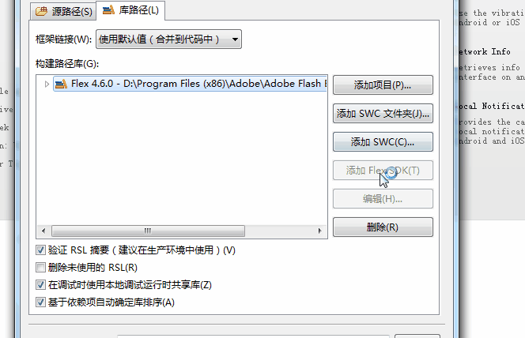
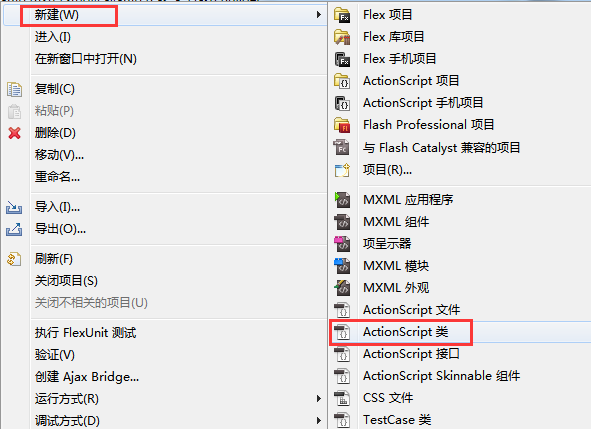

# FlashBuiler中第一个程序“Hello Layabox”

> **本篇采用AS3语言在FlashBuilder环境中显示文本Hello Layabox，学完本篇即为完成LayaAir引擎的第一个程序。在学习本篇前务必保证先阅读完：Flash Builder开发环境的配置**
>
> 如果大家已阅读《用LayaAirIDE创建AS3项目并详解目录结构》，并且已建立好项目的，可以跳过第一步。我们建议大家采用LayaAirIDE建立项目。
>


## 第一步 新建项目

**步骤一：**

打开Flash Builder，在菜单栏里点“文件”，然后选中“新建”点击“ActionScript项目”，进入创建项目的窗口。如图1所示

<br />
(图1)


**步骤二：**

在“项目名”输入栏里输入项目名称，然后在“文件夹”输入栏里输入项目存储目录或者是点击“浏览”选择存储的目录。然后点击“下一步”进入引擎编译与引擎库配置的“构建路径”窗口。如图2所示

<br />
(图2)


**步骤三：**

在构建的路径配置“库路径”窗口中先删除系统自带的编译SDK（目的是为了避免导错包），

然后点击“添加SWC”，将引擎包里的“playerglobal.swc”添加进来。

如果项目有发布Flash版本的需求就把LayaAirFlash中的“LayaAirFlash.swc”添加进来。如动图3所示

 <br /> (动图3)


***Tips**：引擎包目录下`LayaAirFlash/flash`文件夹中的`glsl2agal.swc`也是用于Flash版本的发布，但是，引用`glsl2agal.swc`之后需要在项目的源路径处引用发布Flash的库。而LayaAirFlash.swc集成了库，所以无需重复引用。需要注意的是`LayaAirFlash.swc`和`glsl2agal.swc`文件只能引入其中一个。


**步骤四：**

在引入swc之后，建议将输出文件夹由默认的`bin-debug`设置为`bin`，如图4所示。因为LayaAirIDE创建项目后默认的发布目录是采用的bin目录，由于通常UI、动画等游戏设计需要用到LayaAirIDE，所以建议在创建项目的时候统一设置为`bin`。

 <br /> (图4)


**步骤五**：

在构建路径配置的“`源路径`”窗口里点击“`添加文件夹`”，输入“引擎库所在目录”或点击“浏览”选择“引擎库所在目录”（注意：引擎库所在的目录是libs文件夹下的src文件），然后点击确定，即完成了引擎库的导入。如动图5所示

 <br /> (动图5)

如果我们需要发布Flash版本，并且之前库路径引用的是`glsl2agal.swc`，那么在源路径引用的时候，还需要添加发布flash所需的源库（*引用LayaAirFlash.swc的不用添加*），flash源库位于“`引擎库目录\as\LayaAirFlash\flash\src`”目录内，如图5-2所示。

 <br /> （图5-2）


**最后，点击最下方的“完成”按钮，结束新建项目的引导。**

　　


## 第二步 显示文字“Hello Layabox”

**步骤一：**

菜单栏“文件”中选中“新建”，单击“ActionScript类”，打开新建类文件的窗口。如图6所示

<br /> (图6)


*Tips：新建的ActionScript项目中会自带一个跟项目名称同名的ActionScript类，如果需要用到这个类的话需要把里边的Sprite包删除掉，因为是Flash原生的包，不删除的话会报错。*


**步骤二：**

在名称栏输入HelloLayabox，点击“完成”新建一个ActionScript类。如图6-1所示

<br />
(图6-1)


**步骤三：**

将HelloLayabox.as设置为默认应用程序。如图7所示

<br />
(图7)


**步骤四：**

双击打开HelloLayabox.as，开始编写代码。将一个“Hello Layabox”的文本添加到舞台，代码如下：

```typescript
package
{
	import laya.display.Text;
	public class HelloLayabox
	{
		public function HelloLayabox()
		{
			//初始化引擎
			Laya.init(600, 300);
			var txt:Text = new Text();
			//设置文本内容
			txt.text = "Hello Layabox";
			//设置文本颜色为白色，默认颜色为黑色
			txt.color = '#ffffff';
			//将文本内容添加到舞台 
			Laya.stage.addChild(txt);
		}
	}
}
```


**步骤五：**

完成代码编写后，使用之前文章里配置的编译器，点击按钮开始编译，编译完成后会自动启动chrome运行代码。如图8所示

 <br />

(图8)


运行结果如图9所示

<br />
(图9)


**步骤六：**

“Hello Layabox”虽然已经显示出来了，但是太简陋了，下面我们就让“Hello Layabox”变的好看一些，代码如下：

```typescript
package
{
	import laya.display.Text;
	public class HelloLayabox
	{
		public function HelloLayabox()
		{
			//初始化引擎
			Laya.init(600, 300);
			var txt:Text = new Text();
			txt.text = "Hello Layabox";
			//设置文本颜色   
			txt.color = '#FF0000';
			//设置文本字体大小，单位是像素   
			txt.fontSize = 66;
			//设置字体描边   
			txt.stroke = 5;
			//描边为5像素   
			txt.strokeColor = '#FFFFFF';
			//设置为粗体   
			txt.bold = true;
			//设置文本的显示起点位置X,Y   
			txt.pos(60, 100);
			//设置舞台背景色   
			Laya.stage.bgColor = '#23238E';
			//将文本内容添加到舞台   
			Laya.stage.addChild(txt);
		}
	}
}
```


运行结果如图10所示

<br />
(图10)


至此，如果您能跟随本篇入门教程完成上图的显示，恭喜您入门成功，我们已经完成了第一个采用AS3语言开发的HTML5程序，也说明了LayaAir的开发环境配置无误。更多LayaAir引擎开发的API使用方法，请前往官网Layabox开发者中心查看在线API与在线DEMO。