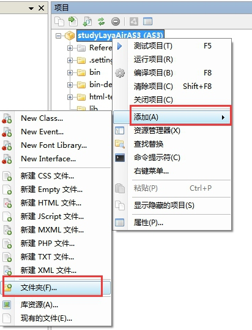
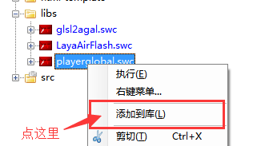
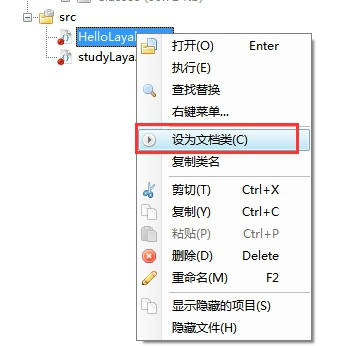

# FlashDevelop中第一个程序“Hello Layabox”

> ### 本篇采用AS3语言在FlashDevelop环境中显示文本Hello Layabox
> 学完本篇即为完成LayaAir引擎的第一个程序。在学习本篇前务必保证先阅读完：**FlashDevelop开发环境配置**
>
> 如果大家已阅读《用LayaAirIDE创建AS3项目并详解目录结构》，并且已建立好项目的，可以跳过第一步。我们建议大家采用LayaAirIDE建立项目。
>


## 第一步 通过FlashDevelop新建项目

​    **步骤一**：打开FlashDevelop，在菜单栏找到“项目”然后点击“新建项目”。

​    <br/>
​   图（1）

​    **步骤二**：选择”AS3 Project“类型，输入项目名称，选择项目存放位置后，点击“确定”完成新建项目的操作。

​    <br/>
​   图（2）

  

## 第二步 配置项目

### 2.1 引用引擎库       

**步骤一**：在项目面板点击“项目属性”按钮，打开项目属性配置窗口。

​    <br/>
​   图（3）

​    **步骤二**：点击“添加类路径”选择LayaAir引擎所在目录，然后点击“确定”完成LayaAir引擎库的引用。

<br/>
​   图（4）

 

### 2.2 将swc添加到库

​    在下载引擎的时候，引擎包解压缩后，我们可以看到3个swc文件，分别为根目录的“playerglobal.swc”和LayaAirFlash目录下的“LayaAirFlash.swc”、子目录下的“glsl2agal.swc”。playerglobal.swc是用于在开发过程中使用LayaAir引擎API提示。另两个swc文件是发布Flash版本用到的。如果不考虑发布Flash版本，“LayaAirFlash.swc”、“glsl2agal.swc”也可以不添加到库。

​    **步骤一**：在新建的项目studyLayaAirAS3下添加一个libs文件夹。

​    <br/>
​   图（5）

​    **步骤二**：将下载解压后的LayaAir引擎根目录下“playerglobal.swc”通过鼠标点中拖拽的方式，拖到刚创建的libs文件夹下。或者是复制粘贴的方式，粘贴到libs文件夹下。然后右键点中swc文件，再左键点击“添加到库”，分别添加到库中。

​    <br/>
​   图（6）

 


## 第三步 显示文字“Hello Layabox”

### 3.1 新建类文件HelloLayabox

​    **步骤一**：右键“src目录”添加一个新类。(提示：添加的类文件必须在src目录下，或者通过“添加类路径”引用进来，否则是无法被编译的)

​    <br/>
​   图（7）

​    **步骤二**：将类名称设置为HelloLayabox

​    <br/>
​   图（8）

### 3.2 在H5页面上显示“Hello Layabox”

​    **步骤一**：将HelloLayabox.as设为文档类。

​    <br/>
​   图（9）

​    **步骤二**：将一个“Hello Layabox”的文本添加到舞台，代码如下：

```java
package {
 import laya.display.Text;
  
 /** @author Charley */
  
 public class HelloLayabox {
  public function HelloLayabox() {
   //创建舞台，默认背景色是黑色的
   Laya.init(600, 300);
   var txt:Text = new Text();
    
   //设置文本内容
   txt.text = "Hello Layabox";
    
   //设置文本颜色为白色，默认颜色为黑色
   txt.color = '#ffffff';
    
   //将文本内容添加到舞台 
   Laya.stage.addChild(txt);
  }
 }
}
```

​    **步骤三**：完成代码编写后，使用之前定义的编译快捷键（Alt+F5），把AS3代码编译成HTML5。

​    <br/>
​   图（10）

​        编译完成后，编译器自动启动chrome查看显示结果。

​    <br/>
​   图（11）

​    **步骤四**：如上图所示，“Hello Layabox”已经显示出来了，但是比较简陋，下面我们就让“Hello Layabox”变的更好看些，代码如下：

```java
package {
 import laya.display.Text;
  
 /**
  * @author Charley
  */
 public class HelloLayabox {
  public function HelloLayabox() {
   //创建舞台
   Laya.init(600, 300);//舞台默认背景色是黑色的
   var txt:Text = new Text();
   txt.text = "Hello Layabox";
    
   //设置文本颜色
   txt.color = '#FF0000';
   //设置文本字体大小，单位是像素
   txt.fontSize = 66;
    
   //设置字体描边
   txt.stroke = 5;  //描边为5像素
   txt.strokeColor = '#FFFFFF';
    
   //设置为粗体
   txt.bold = true;
    
   //设置文本的显示起点位置X,Y
   txt.pos(60, 100);
    
   //设置舞台背景色
   Laya.stage.bgColor = '#23238E';
    
   //将文本内容添加到舞台
   Laya.stage.addChild(txt);
   
  }
 }
}
```

​    运行结果如下图所示：

​    <br/>
​   图（12）


**至此，如果您能跟随本篇入门教程，完成上图的显示，恭喜您入门成功，我们已经完成了第一个采用AS3语言开发的HTML5程序，也说明了LayaAir的开发环境配置无误。更多LayaAir引擎开发的API使用方法，请前往官网Layabox开发者中心查看在线API与在线DEMO。**
