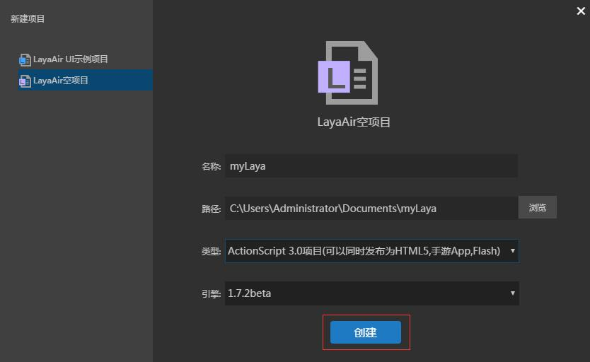
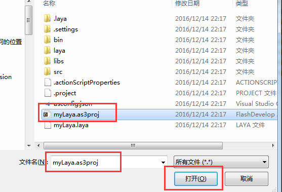
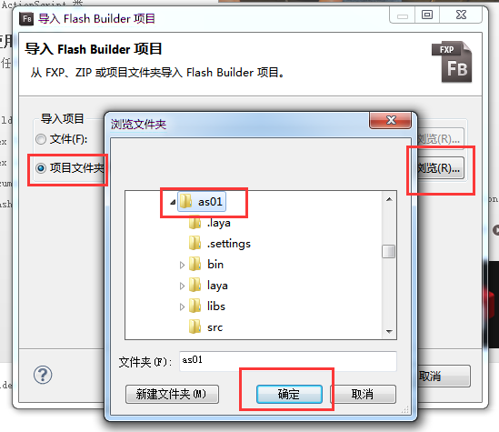

# 用LayaAirIDE创建AS3项目并详解目录结构

​    尽管当前推荐AS3开发者采用FlashDevelop和FlashBuilder环境开发LayaAir引擎的HTML5项目。但是我们建议先通过LayaAirIDE创建项目，再通过FlashDevelop或FlashBuilder打开编辑。通过LayaAirIDE创建项目会默认建立清晰的目录结构。下面我们就以LayaAirIDE工具创建AS3空项目作为开始，带领大家创建项目并介绍项目的结构。


## **一、用LayaAirIDE创建AS3项目**

步骤一：打开LayaAirIDE，点击新建项目，如图1

   <br />（图1）


步骤二：选择“LayaAir空项目”在设置项目名称、路径、类型，以及选择完引擎版本后，点击“创建”建立一个新的空项目。如图2。

 <br /> （图2）


步骤三：在点击“创建”后，可以看到项目的结构，项目文件夹结构如图3所示：

  <br />（图3）


至此我们已成功的创建了一个AS3项目工程，推荐采用FlashDevelop或Flash Builder打开项目。


## **二、介绍AS3项目结构**

**接下来，将会结合上一节中创建的项目结构来介绍每个目录的作用。**

​    

### 2.1 项目配置目录（.laya文件夹）

​    .laya 文件夹下存放的是项目在开发运行中的一些配置信息，如图4所示。

<br />
（图4）


#### 2.1.1  `.laya/launch.json`文件介绍 

 `.laya/launch.json` 文件保存了项目调试的一些配置信息,分别是LayaAirIDE的调试配置和chrome浏览器调试配置。不要轻易去改动，改错后会影响项目的调试。

　　`configurations`： 这个属性下有`layaAir`和`chrome`两种调试的配置可用。

　　`"type": "layaAir"` ： 表示用LayaAirIDE内置的调试方式。

　　`"type": "chrome"`   ： 表示用本地chrome浏览器调试。

　　`"file": "${workspaceRoot}\\bin\\h5\\index.html"` ： 代表项目运行启动的入口文件，注意路径符号不要写成`/`，如果写成`"file": "${workspaceRoot}/bin/h5/index.html"`，会出现下图的错误提示。<br />

 <br />

 <br />

*Tips: 如果碰到上图的提示时，需要检查一下file的配置。*

`"runtimeExecutable": "C:/Program Files (x86)/Google/Chrome/Application/chrome.exe"`： 为本地chrome浏览器的路径，开发者根据自己的需要来设置这个路径。

`"userDataDir": "${tmpdir}"` 代表chrome调试缓存的临时目录，默认为用户的临时目录，开发者可以更改设置，例如将缓存设置为当前项目根目录下的cache目录： `"userDataDir": "${workspaceRoot}/cache"`。

​	

#### 2.1.2 `tasks.json`文件介绍 

`tasks.json` 是任务配置文件，打开后内容如下图所示：

<br />

**args参数说明：**

　　`command`属性是代表启动哪个文件，AS项目启动的是LayaCompiler编译器工具。

　　`args`属性代表传递的参数，默认的是传递的. actionScriptProperties这个文件。

​	假如你是fd的配置文件可以修改成为：

```
"args": ["${workspaceRoot}/LayaUISample.as3proj;iflash=false;windowshow=false;chromerun=false"];
```

#### 2.1.3  `astool`目录

​	`astool`是LayaCompiler编译器存放目录，`layajs`是MAC系统下的AS3编译器，`layajs.exe`是windows系统下的AS3编译器。


### 2.2 项目的输出目录（bin/h5）

​    `bin/h5`目录存放的是当前项目的输出文件。用于存放项目中的ActionScript3.0 文件编译生成的js 文件和HTML5页面。

​    *Tips: 如果开发者需要新建资源等运行目录或文件，需要放置于`bin/h5`的同级或子级目录中。*

 

### 2.3 UI项目目录（laya）

​    “`laya`”目录用于存放LayaAirIDE当前的UI项目。

​    “`laya/assets`” 目录用来存放UI页面、粒子等组件所需的图片资源。

​    “`laya/pages`”目录用来存放LayaAirIDE创建页面布局生成的文件。

​    “`laya/.laya`”文件是LayaAirIDE的UI项目配置文件。

 

### 2.4 项目库目录（libs）

​    “`libs`”目录内为项目的库目录，用于存放项目使用的库文件。

​    “`libs/laya/src`”目录内存放LayaAir引擎库文件。


### 2.5 项目的AS3代码目录（src）

​    项目中的用到的AS3代码文件（.as文件）默认将存放在 src 目录。


## 三、项目配置文件介绍

### 3.1 LayaAirIDE项目配置文件（项目名.laya）

​    `项目名.laya` 是LayaAirIDE项目的配置文件，文件内记录了当前项目的项目名称、使用的类库版本号和项目类型。

​    例如：

```json
{"proName":"myLaya","version":"1.5.4","proType":0}
```


### **3.2 FlashDevelop项目配置文件（项目名.as3proj）**

​    `项目名.as3proj`文件是FlashDevelop项目的配置文件。使用 FlashDevelop 编辑器开发AS3项目时，可以通过打开资源管理器，然后在目录中双击此文件用FlashDevelop 打开此项目。



或者先打开FlashDevelop工具，然后在菜单栏通过“文件”->“打开”找到项目名.as3proj所在的目录打开此项目。




### **3.3 Flash Builder 项目配置文件**

​    `.settings`文件夹、`.actionScriptProperties`文件和`.project`文件是Flash Builder 项目的配置文件。使用 Flash Builder时，可以通过菜单栏“文件”->“导入Flash Builder项目”来导入LayaAirIDE创建的AS3项目。导入Flash Builder项目如下图所示：

 

 