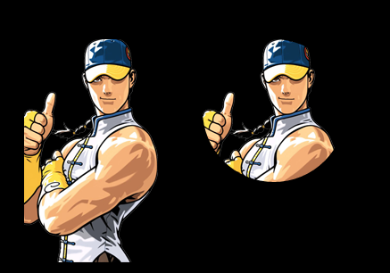
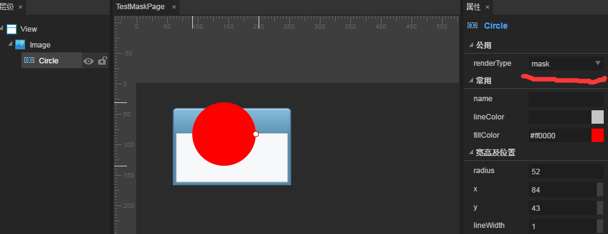
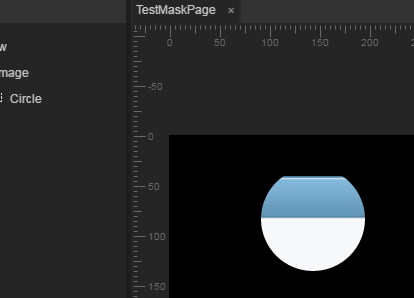

# 设置遮罩

> LayaAir的遮罩，可以设置一个对象(支持位图和矢量图)，然后根据对象形状进行遮罩显示。 
>


## 一、遮罩API介绍

　　遮罩属性位于[laya.display.Sprite](http://layaair.ldc.layabox.com/api/index.html?category=Core&class=laya.display.Sprite#mask) API内，该属性的说明如图1所示：

<br />（图1）


## 二、简单的遮罩示例

　　2.1 我们先用LayaAir引擎显示一张位图，代码如下：

```java
package
{
	import laya.display.Sprite;
	import laya.resource.Texture;
	import laya.utils.Handler;
	
	public class MaskDemo
	{
		public var Res:String;
		public function MaskDemo()
		{
			Laya.init(1136,640);
			//设置舞台背景色
			Laya.stage.bgColor = "#ffffff"                        
			Res = "res/img/monkey1.png";
			
			//先加载图片资源，在图片资源加载成功后，通过回调方法绘制图片并添加到舞台
			Laya.loader.load(Res,Handler.create(this,graphicsImg));          
		}
			
		private function graphicsImg():void
		{
			var img:Sprite = new Sprite();
			//获取图片资源，绘制到画布
			img.graphics.drawTexture(Laya.loader.getRes(Res),150,50);
			
			//添加到舞台
			Laya.stage.addChild(img);
		}	
	}
}
```

运行效果如图2所示：

<br />（图2）

　　2.2 创建一个圆形的遮罩区域，将2.1示例代码修改为如下代码：

```java

```


**代码示例：**

```javascript
package  
{
    import laya.display.Sprite;
    import laya.net.Loader;
    import laya.resource.Texture;
    import laya.utils.Handler;
    import laya.webgl.WebGL;
    /**
     * ...
     * @author ww
     */
    public class MaskSample 
    {
         
        public function MaskSample() 
        {
            Laya.init(1000, 900);
            //加载引擎需要的资源
            Laya.loader.load([{url: "res/atlas/comp.json", type: Loader.ATLAS}], Handler.create(this, onLoaded));
        }
        private function onLoaded():void
        {
            //不带遮罩的显示对象
            var sprite0:Sprite;
            sprite0 = new Sprite();
            sprite0.graphics.drawTexture(Loader.getRes("comp/image.png"));
            sprite0.pos(100, 100); 
            Laya.stage.addChild(sprite0);
             
             
            //带遮罩的显示对象
            var sprite1:Sprite;
            sprite1 = new Sprite();
            sprite1.graphics.drawTexture(Loader.getRes("comp/image.png"));
            sprite1.pos(300, 100); 
            Laya.stage.addChild(sprite1);
             
            //创建遮罩对象
            var tMask:Sprite;
            tMask = new Sprite();
            //画一个圆形的遮罩区域
            tMask.graphics.drawCircle(0, 0, 80, "#ff0000");
            tMask.pos(80, 80);
            //给sprite1设置遮罩
            sprite1.mask = tMask;
             
             
        }
         
    }
 
}
```

​	<br/>
​	图（1）代码生成的遮罩效果


### 二、在IDE中设置遮罩

除了直接在代码中设置遮罩，也可以通过LayaAirIDE方便的给对象设置遮罩。

**第一步：我们先创建一个Image。**

​	<br/>
​	图（2）拖入一个Image到View上

**第二步：双击进入Image内部添加一个圆形**
​	<br/>
​	图（3）画一个圆形

**第三步：将圆形的renderType设置为mask。然后双击退出Image进入主场景即能预览看到结果。**

​	<br/>
​	图（4）设置renderType为mask之后的效果