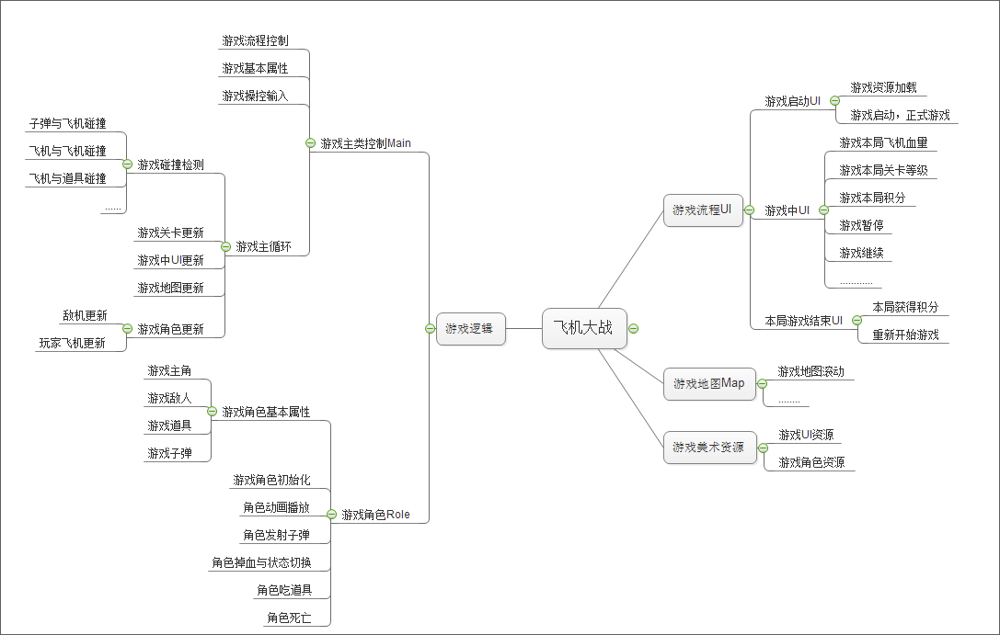
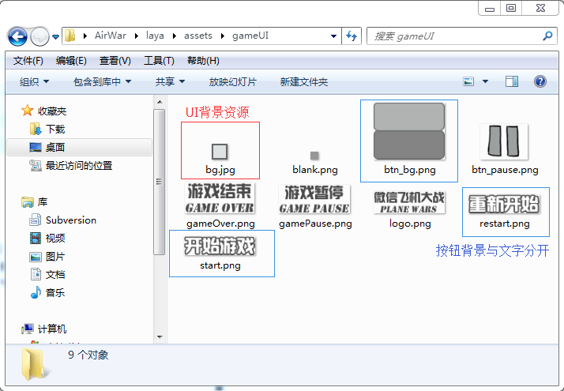
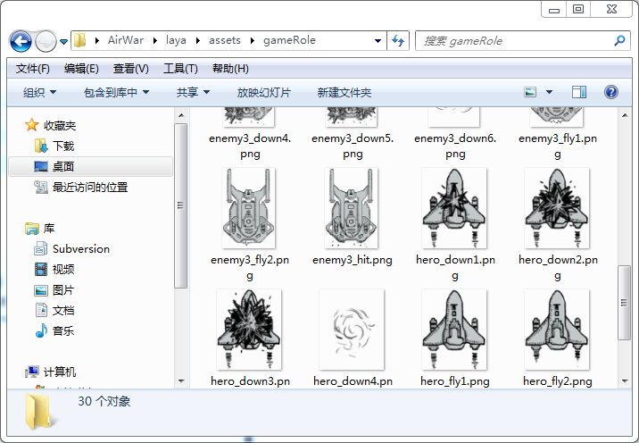

# 一、《飞机大战》项目需求分析与资源准备

>  本教程与旧版《微信飞机大战》视频教程有所区别，更多的采用了LayaAirIDE编辑器方式进行开发，增加了流程UI的功能与制作教程，减少了代码量，程序结构也有所优化。学习过视频教程的开发者也可以按本教程重新梳理学习一遍。

###前言

​	记得当年微信小游戏《飞机大战》吧，无需下载即可在微信直接玩，并且还能分享自己的排名，无数人为之疯狂，这是html5游戏的传播魅力。

​	本着向经典致敬的理想，本次笔者将演示如何使用LayaAir快速开发，重现经典游戏。先声明一下：游戏内场景与角色资源全部为原开发者所有，本例只做研究学习之用，源码和资源请勿商用。

**游戏试玩地址**: [http://layabox.github.io/layaair-examples/](http://layabox.github.io/layaair-examples/)

 （图1） 

 （图2）

 （图3）

### 项目需求分析

​	在所有的游戏项目开始阶段，项目需求分析占有较大的时间比例。策划出了项目需求后，有经验的程序员也会自己构建逻辑思维导图，使程序架构上考虑得更加合理，开发思路上更清晰。

​	因此，本教程根据开发需求提供了基本逻辑思维导图作为参考。建议开发者养成项目开发规划的习惯。

 （图4）

​	根据以上思维导图分析我们得出以下开发思路：

1. 可视化素材制作，分为两步，一是编辑UI，美术制作出效果图，输出与IDE命名规则匹配的图片资源，再进行UI页面编辑；二是可视化角色动画制作，通过IDE时间轴制作角色动画效果，所见即所得，程序直接调用动画生成文件，还可减少代码量。
2. 游戏流程控制，处理游戏开始、游戏中、游戏结束界面流程页面，并实现其UI功能。
3. 游戏主要逻辑功能分步骤开发，游戏地图、游戏角色、游戏操控、游戏逻辑、游戏升级等。

​        基本开发思路有了后，首先让我们开始游戏准备工作吧！

### 新建LayaAir项目

​	打开LayaAirIDE，新建一个空项目，如图5所示，项目名称可自定义，本例以 ActionScript 3.0 语言为版本，其他语言同理。点击创建按钮后IDE默认的“代码模式”项目管理器中会出现项目目录。

 （图5）

​	项目目录结构和如何用LayaAirIDE创建项目及环境配置，”技术文档－2D基础篇－快速上手“中已经讲过，这里就不再絮讲。不了解的同学建议先看一下。

​       高楼大厦始于足下，凡事总有一个开始，从简到难，我们先从处理美术资源开始。

 

### 游戏资源准备

​	打开生成的项目，点击进入”设计模式“，将美术制作的图片资源拖拽到”资源管理器“中。或右键打开所在目录并拷入，目录为”...\AirWar\laya\assets“，拷贝完成后需（快捷键F5）刷新编辑器。

　　在资源管理器中，每一个文件夹在编辑器导出（快捷键F12）时会自动生成一个打包图集资源。建议图集大小不超过1024ｘ1024，如单张的图超过512ｘ512时，建议不打包。可打开菜单”**项目设置**“面板（快捷键F9）进行自动打包图集的大小限制。

​	游戏资源文件夹和资源大小管理上比较重要，处理得好的话，加载速度也会比较快，运行效率更高。例如制作本游戏的资源素材（图6），我们分为了两个文件夹，UI资源文件夹与角色动画资源文件夹，及一张超过512的背景图不打包。

  （图6）

　　在gameUI资源文件夹中（图7），bj.jpg背景资源做得较小，可以通过九宫格缩放放大；按钮文字与btn_bg.png按钮背景分开，按钮背景可反复使用节省资源。

   （图7）
（图6）

gameRole文件夹中只存放了角色动画资源（图8），用于IDE中制作动画。

 （图8）

### 游戏资源发布

当资源文件准备完成后可尝试发布资源（快捷键F12），生成图集资源的目录为：”...\AirWar\bin\h5\res\atlas“下（图8），在游戏程序中加载.atlas或.josn文件就可获得相应的图像资源。

 （图8） 

通过以上步骤我们清晰的理清了项目开发思路，并准备好了游戏美术素材资源。接下来开始正式进入游戏制作流程，首先从可视化的UI与动画制作开始。