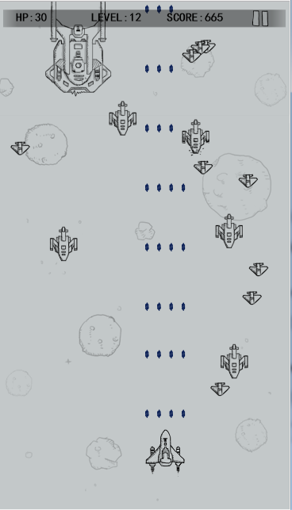

# 八、关卡升级与音效播放


​	通过上几节课的学习制作，《飞机大战》核心功能全部完成。为了达到更多的游戏趣味性和体验，这节课我们加入关卡升级功能，让游戏的难度逐步增加，玩家的成就感更强。然后加上音效播放，游戏体验感也会更好。


### 关卡升级，游戏难度增加

关卡升级由玩家获得的积分转换运算，关卡越高，说明玩家操控越好。随着关卡的升级，增强敌机的血量、创建敌机时间缩短、敌机飞行速度加快、数量也逐步增加，这样游戏难度就增加了。

#### 增加关卡相关属性

在Main类中增加关卡相关属性。createTime、speedUp、hpUp、numUp、levelUpScore。

```
		//游戏关卡提升属性
		/***敌人刷新加速****/
		private var createTime:Number = 0;
		/***敌人速度提升***/
		private var speedUp:Number = 0;
		/***敌人血量提升	***/		
		private var hpUp:Number = 0;
		/***敌人数量提升	***/					
		private var numUp:Number = 0;
		/***升级等级所需的成绩数量***/
		private var levelUpScore: Number = 10;
```


#### 创建关卡升级计算方法

在主类Main中增加游戏升级方法levelUp()。

```
		/**
		 游戏升级计算
		 */
		private function levelUp():void
		{
			if(score>levelUpScore)
			{
				//关卡等级提升
				level++;
				//角色血量增加，最大30
				hero.hp=Math.min(hero.hp+level*1,30);
				//关卡越高，创建敌机间隔越短
				createTime = level < 30 ? level * 2 : 60;
				//关卡越高，敌机飞行速度越高
				speedUp = Math.floor(level / 6);
				//关卡越高，敌机血量越高
				hpUp = Math.floor(level / 8);
				//关卡越高，敌机数量越多
				numUp = Math.floor(level / 10);
				//提高下一级的升级分数
				levelUpScore += level * 10;
			}
		}

```


#### 主循环中检测关卡升级

如果角色未死亡，那么每帧检测是否关卡升级。

			/**
			 游戏主循环
			 */
			private function loop():void
			{
				//本局游戏数据更新
				play.update(hero.hp,level,score)
				//如果主角死亡
				if(hero.hp<=0)
				{
					//玩家飞机死亡后延迟时间，100帧后弹出游戏结束界面
					this.deathTime++
					if (this.deathTime>=100)
					{
						this.deathTime=0;
						//游戏结束
						gameOver();
						//本方法内后续逻辑不执行
						return;
					}
				}else//主角未死亡
				{
					//主角射击
					hero.shoot();
					//游戏升级计算
					this.levelUp();
				}
				......


#### 创建敌机时，加入升级数据

当关卡升级时，创建的敌机参数会有所改变，我们需要在Main类主循环中修改创建敌机部分代码。

```
			//创建敌机，加入关卡升级数据，提高难度
			//生成小飞机
			if (Laya.timer.currFrame % (80 - createTime) ==0)
			{
				createEnemy(0, hps[0],speeds[0] + speedUp , nums[0] + numUp);
			}
			//生成中型飞机
			if (Laya.timer.currFrame % (170 - createTime * 2) == 0) 
			{
				createEnemy(1, hps[1] + hpUp * 2,speeds[1] + speedUp , nums[1] + numUp);
			}
			//生成boss
			if (Laya.timer.currFrame % (1000 - createTime * 3) == 0) 
			{
				createEnemy(2, hps[2] + hpUp * 6,speeds[2], nums[2]);
			}
```


#### 游戏初始化，重置关卡数据

在Main类gameInit()方法中，一定要重置关卡数据。否则重新开始后，上局的关卡数据还留着，UI显示是从上一局数据开始增加，同时一大波超快、血量超厚的飞机会碾向你.....

```
		/**
		 游戏中，游戏初始化
		 */
		private function gameInit():void
		{
			//缓动动画关闭效果。IDE中页面为Dialog才可用
			start.close();
			
			//重置关卡数据
			//游戏关卡数
			level=1;
			//玩家得分
			score=0;
			//敌人刷新加速
			createTime= 0;
			//敌人速度提升
			speedUp = 0;
			//敌人血量提升	
			hpUp = 0;
			//敌人数量提升				
			numUp= 0;
			//升级等级所需的成绩数量
			levelUpScore= 10;			
			
			//实例化地图背景页面
			map||=new GameMap();
			//加载到舞台
			Laya.stage.addChild(map);
			......
```

修改完所有代码，编译运行可以看到随着积分score的增加，UI中的关卡数level也增加了，同时，敌机的速度、血量等也会越来越高，游戏的难度也变得更大（图1）。重新开始后数据也重新刷新，一切正常。

当然，同学们也可以自己去调整一下升级数据，让你的游戏或更难，或更易。


<br />（图1）


### 增加游戏音效

游戏中增加了好的音乐音效，会让一款游戏增色不少。在开始页面GameStart.as中，我们已经加载了游戏音效资源，也把游戏音效sound目录拷贝到了发布目录h5中，因此本节课中我们可以直接使用。

注：提前加载音效可以减少声音的延迟现象。

LayaAir提供了SoundManager类方便管理声音（详情请看API）。其中playSound用来播放声音特效，比如游戏射击声音，击中声音，爆炸声音，UI按钮声音等。playMusic是用来播放背景音乐，两者都可以设置一个url参数和loops播放次数。

下面我们在角色Role类中增加音效播放

吃道具音效，在eatProp()方法中加入代码

```
		/**
		 * 角色吃到道具，加血或子弹级别
		 */		
		public function eatProp(prop:Role):void
		{
			//如果调用者是主角或prop不是道具，则返回
			if(this.type!="hero"||prop.propType==0) return;
			
			//添加吃强化道具音效					
			SoundManager.playSound("sound/achievement.mp3");
			......
```

发射子弹音效，在shoot()方法中增加代码

```
		/**
		 角色射击，生成子弹
		 */		
		public function shoot():void
		{
			//获取当前时间
			var time:Number = Browser.now() ;
			//如果当前时间大于下次射击时间
			if (time >this.shootTime)
			{
				//获得发射子弹的位置数组
				var pos:Array=bulletPos[this.shootNum-1]
				for(var i:int=0;i<pos.length;i++)
				{
					......
					//添加到舞台上
					this.parent.addChild(bullet);
					//添加子弹音效					
					SoundManager.playSound("sound/bullet.mp3");
				}
			}
		}
```

角色死亡音效，在lostHp()方法中，播放角色死亡动画处增加死亡音效播放代码

```
		/**
		 * 角色失血
		 */		
		public function lostHp(lostHp:Number):void 
		{
					......
					//添加死亡动画
					this.playAction("die");
					//添加死亡音效
					if(this.type=="hero")	    SoundManager.playSound("sound/game_over.mp3");
					else		                SoundManager.playSound("sound/enemy1_die.mp3");
					......
				}
			}
		}
```

保存并编译，我们发现，当我们开炮、角色死亡及吃道具时已有音效播放。同学们也可以去找更多更好的音效音乐，让你的游戏更加完美。


下面我们把修改后的Main类与Role类代码全部代码全部展示出来。

### 主类Main.as全部代码

```
package {
	
	import laya.display.Sprite;
	import laya.display.Stage;
	import laya.events.Event;
	import laya.net.Loader;
	import laya.utils.Handler;
	import laya.utils.Pool;
	import laya.utils.Stat;
	import laya.webgl.WebGL;
	
	
	public class Main
	{
		/**开始页面***/
		private var start:GameStart
		/**地图页面***/
		private var map:GameMap
		/**游戏中界面***/
		private var play:GamePlay
		/**游戏结束页面***/
		private var over:GameOver
		
		/**游戏关卡数***/
		public static var level:int=1;
		/**玩家得分***/
		public static var score:int=0;
		
		/**角色层容器***/
		private var roleLayer:Sprite;
		/**玩家主角***/
		private var hero:Role;
		
		
		/**鼠标上一帧x座标** */		
		private var moveX:Number;
		/**鼠标上一帧y座标** */	
		private var moveY:Number;
		
		
		/****敌机血量表****/
		private var hps: Array = [1, 7, 15];
		/***敌机生成数量表**/
		private var nums:Array = [2, 1, 1];
		/***敌机速度表***/
		private var speeds: Array = [3, 2, 1];
		/***敌机被击半径表***/
		private var radius: Array = [20, 35, 80];
		
		/****主角死亡后游戏结束时间***/
		private var deathTime:int=0
			
		//游戏关卡提升属性
		/***敌人刷新加速****/
		private var createTime:Number = 0;
		/***敌人速度提升***/
		private var speedUp:Number = 0;
		/***敌人血量提升	***/		
		private var hpUp:Number = 0;
		/***敌人数量提升	***/					
		private var numUp:Number = 0;
		/****升级等级所需的成绩数量***/
		private var levelUpScore: Number = 10;
		
		
		public function Main()
		{
			//初始化引擎，建议增加WebGl模式
			Laya.init(720, 1280,WebGL);
			
			Stat.show();
			//全屏不等比缩放模式
			Laya.stage.scaleMode = Stage.SCALE_EXACTFIT;
			//加载游戏页面资源(如果界面资源太多太大[超过50k],建议开始页面单独建立文件夹打包)
			Laya.loader.load("res/atlas/gameUI.atlas",Handler.create(this,this.gameStart))
				
		}
		
		/**
		 资源加载完成后，加载游戏开始界面
		 */
		private function gameStart():void
		{
			//实例化开始页面
			start=new GameStart();
			//以弹出方式打开，有缓动效果。IDE中页面为Dialog才可用
			start.popup();
			//监听开始游戏开始按钮事件,点击后进入游戏中
			start.btn_start.on(Event.MOUSE_UP,this,gameInit)
		}
		
		/**
		 游戏中，游戏初始化
		 */
		private function gameInit():void
		{
			//缓动动画关闭效果。IDE中页面为Dialog才可用
			start.close();
			
			//重置关卡数据
			//游戏关卡数
			level=1;
			//玩家得分
			score=0;
			//敌人刷新加速
			createTime= 0;
			//敌人速度提升
			speedUp = 0;
			//敌人血量提升	
			hpUp = 0;
			//敌人数量提升				
			numUp= 0;
			//升级等级所需的成绩数量
			levelUpScore= 10;			
			
			//实例化地图背景页面(如果已实例化，不需要重新new)
			map||=new GameMap();
			//加载到舞台
			Laya.stage.addChild(map);
			
			
			//实例化角色层并加载到舞台(如果已实例化，不需要重新new)
			roleLayer||=new Sprite();
			Laya.stage.addChild(roleLayer);
			
			//实例化游戏中UI页面(如果已实例化，不需要重新new)
			play||=new GamePlay();			
			//加载到舞台
			Laya.stage.addChild(play);
			
			//实例化主角(如果已实例化，不需要重新new)
			hero||=new Role();
			//初始化角色类型、血量，注：速度speed为0，因为主角是通过操控改变位置,阵营为0
			hero.init("hero",10,0,30,0);
			//死亡后会隐藏，重新开始后需显示
			hero.visible=true;
			//主角位置修改
			hero.pos(360,800);
			//角色加载到角色层中
			roleLayer.addChild(hero);
			
			//鼠标按下监听
			Laya.stage.on(Event.MOUSE_DOWN,this,onMouseDown);
			//鼠标抬起监听
			Laya.stage.on(Event.MOUSE_UP,this,onMouseUp);
			
			//游戏主循环
			Laya.timer.frameLoop(1,this,loop);
		}
		
		/**
		 点击开始触发移动
		 */	
		private function onMouseDown():void
		{
			//记录鼠标按下时的位置，用于计算鼠标移动量
			moveX=Laya.stage.mouseX;
			moveY=Laya.stage.mouseY;
			//
			Laya.stage.on(Event.MOUSE_MOVE,this,onMouseMove);
		}
		
		/**
		 主角跟随鼠标移动
		 */	
		private function onMouseMove():void
		{
			//计算角色移动量
			var xx:Number=moveX-Laya.stage.mouseX;
			var yy:Number=moveY-Laya.stage.mouseY;
			//更新移动位置
			hero.x-=xx;
			hero.y-=yy;
			//更新本帧的移动座标
			moveX=Laya.stage.mouseX;
			moveY=Laya.stage.mouseY;
		}
		/**
		 鼠标抬起、关闭移动监听
		 */		
		private function onMouseUp():void
		{
			Laya.stage.off(Event.MOUSE_MOVE,this,onMouseMove) ;
		}
		
		
		/**
		 游戏主循环
		 */
		private function loop():void
		{
			//本局游戏数据更新
			play.update(hero.hp,level,score)
			//如果主角死亡
			if(hero.hp<=0)
			{
				//玩家飞机死亡后延迟时间，100帧后弹出游戏结束界面
				this.deathTime++
				if (this.deathTime>=100)
				{
					this.deathTime=0;
					//游戏结束
					gameOver();
					//本方法内后续逻辑不执行
					return;
				}
			}else//主角未死亡
			{
				//主角射击
				hero.shoot();
				//游戏升级计算
				this.levelUp();
			}

			//地图滚动更新
			map.updateMap()
				
			//游戏碰撞逻辑
			//遍历所有飞机，更改飞机状态
			for (var i: int = roleLayer.numChildren - 1; i > -1; i--) 
			{
				//获取第一个角色
				var role:Role = roleLayer.getChildAt(i) as Role;
				//角色自身更新
				role.update();				
				//如果角色死亡，下一循环
				if(role.hp<=0) continue;
				//碰撞检测
				for(var j:int=i-1;j>-1;j--)
				{	//获取第二个角色
					var role1:Role=roleLayer.getChildAt(j) as Role;
					//如果role1未死亡且不同阵营
					if(role1.hp>0&&role1.camp!=role.camp)
					{
						//获取碰撞半径
						var hitRadius:int=role.hitRadius+role1.hitRadius;
						//碰撞检测
						if(Math.abs(role.x-role1.x)<hitRadius&&Math.abs(role.y-role1.y)<hitRadius)
						{
							//如果某一个碰撞体是道具，则吃道具，否则掉血
							if(role.propType!=0||role1.propType!=0)
							{
								//无法判断哪个是道具，因此都相互吃试试
								role.eatProp(role1);
								role1.eatProp(role);
							}else
							{
								//角色相互掉血
								role.lostHp(1);
								role1.lostHp(1);
							}
						}
					}
				}
			}
			
			//创建敌机，加入关卡升级数据，提高难度
			//生成小飞机
			if (Laya.timer.currFrame % (80 - createTime) ==0)
			{
				createEnemy(0, hps[0],speeds[0] + speedUp , nums[0] + numUp);
			}
			//生成中型飞机
			if (Laya.timer.currFrame % (170 - createTime * 2) == 0) 
			{
				createEnemy(1, hps[1] + hpUp * 2,speeds[1] + speedUp , nums[1] + numUp);
			}
			//生成boss
			if (Laya.timer.currFrame % (1000 - createTime * 3) == 0) 
			{
				createEnemy(2, hps[2] + hpUp * 6,speeds[2], nums[2]);
			}

		}

		/**
		 游戏升级计算
		 */
		private function levelUp():void
		{
			if(score>levelUpScore)
			{
				//关卡等级提升
				level++;
				//角色血量增加，最大30
				hero.hp=Math.min(hero.hp+level*1,30);
				//关卡越高，创建敌机间隔越短
				createTime = level < 30 ? level * 2 : 60;
				//关卡越高，敌机飞行速度越高
				speedUp = Math.floor(level / 6);
				//关卡越高，敌机血量越高
				hpUp = Math.floor(level / 8);
				//关卡越高，敌机数量越多
				numUp = Math.floor(level / 10);
				//提高下一级的升级分数
				levelUpScore += level * 10;
			}
		}
		
		/**
		 *  创建敌人
		 * @param index 	敌人编号
		 * @param hp   		 敌人血量
		 * @param speed		敌人速度
		 * @param num		敌人数量
		 */
		private function createEnemy(index:Number,hp:Number,speed:Number,num:Number):void 
		{
			for (var i: int = 0; i < num; i++)
			{
				//创建敌人，从对象池创建
				var enemy:Role = Pool.getItemByClass("role", Role);
				//初始化敌人
				enemy.init("enemy" + (index+1), hp, speed,radius[index],1);
				//从对象池中创建的对象死亡前被隐藏了，因此要重新初始化显示，否则新创建角色不会显示出来
				enemy.visible=true;
				//随机位置
				enemy.pos(Math.random() *(720-80)+50, -Math.random() * 100);
				//添加到舞台上
				roleLayer.addChild(enemy);
			}
		}
		
		/**
		 游戏结束
		 */
		private function gameOver():void
		{
			//移除所有舞台事件，鼠标操控
			Laya.stage.offAll();
			
			//移除地图背景
			map.removeSelf();
			//移除游戏中UI
			play.removeSelf();
			
			//清空角色层子对象
			roleLayer.removeChildren(0,roleLayer.numChildren-1);
			//移除角色层
			roleLayer.removeSelf();
			
			//去除游戏主循环
			Laya.timer.clear(this,loop);
			
			//实例化游戏结束页面
			over||=new GameOver();
			//游戏积分显示
			over.txt_score.text=score.toString();
			//以弹出方式打开，有缓动效果。IDE中页面为Dialog才可用
			over.popup();
			//重新开始事件监听,点击后进入游戏中
			over.on("reStart",this,gameInit);
		}
	}
}
```


### Role类全部代码：

```
package
{
	import laya.display.Animation;
	import laya.display.Sprite;
	import laya.events.Event;
	import laya.maths.Rectangle;
	import laya.media.SoundManager;
	import laya.utils.Browser;
	import laya.utils.Handler;
	import laya.utils.Pool;
	
	/**
	 * @author CHENZHENG
	 * 角色类，飞机、敌人、子弹、道具
	 */	
	public class Role extends Sprite
	{
		/***飞机的类型   “hero”:玩家飞机，“enemy”：敌人飞机、“bulle”：子弹、"ufo":道具****/
		public var type:String;
		/***飞机的血量***/
		public var hp:Number=0; 
		/***飞机的速度***/
		private var speed:Number=0;	
		
		/***飞机的被攻击半径***/
		public var hitRadius:Number;
		/***飞机的阵营（敌我区别）***/
		public var camp:Number;
		
		/***角色的动画资源***/
		private var roleAni:Animation;
		/***当前动画动作***/
		private var action:String;
		
		/***射击间隔***/
		public var shootInterval: Number= 300;
		/***下次射击时间***/
		public var shootTime: Number= 300;
		/***是否是子弹***/
		public var isBullet:Boolean = false;
		
		/****道具类型 0:飞机或子弹，1:子弹箱，2:血瓶***/
		public var propType:int=0;
		/***子弹级别（吃子弹道具后升级）***/
		public var bulletLevel: Number = 0;
		/***同时射击子弹数量***/
		public var shootNum: Number= 1;
		/***子弹偏移的位置***/
		private var bulletPos: Array = [[0], [-15, 15], [-30, 0, 30], [-45, -15, 15, 45]];
		
		
		public function Role()
		{
			//实例化动画
			roleAni=new Animation();
			//加载IDE编辑的动画文件
			roleAni.loadAnimation("GameRole.ani");
		}
		
		/**
		 * 角色初始化
		 * @param type  角色类型 ---“hero”:玩家飞机，“enemy1-3”：敌人飞机、“bulle:1-2”：子弹、"ufo1-2":道具
		 * @param hp      血量
		 * @param speed   速度
		 * @param hitRadius   碰撞半径
		 * @param camp    阵营
		 */		
		public function init(type:String,hp:Number,speed:Number,hitRadius:Number,camp:Number):void
		{
			//角色初始化属性
			this.type=type;
			this.hp=hp;
			this.speed=speed;
			this.hitRadius=hitRadius;
			this.camp=camp;
			
			//对象基本都从对象池中创建，如果之前为子弹，不重新赋值的话不会播放死亡动画
			this.isBullet=false;
			//道具属性初始为0
			this.propType=0;
			
			//加载动画对象
			this.addChild(roleAni)
			
			//监听动画完成事件
			roleAni.on(Event.COMPLETE,this,onComplete)
			//播放默认飞行动画
			playAction("fly");
		}
		
		/***动画完成后回调方法***/
		private function onComplete():void
		{
			//如果角色还未有宽，获得角色宽高	
			if(roleAni.width==0)
			{
				//获得动画矩形边界
				var bounds:Rectangle=roleAni.getBounds();
				//角色 宽高赋值
				roleAni.size(bounds.width,bounds.height)
			}
			//如果死亡动画播放完成
			if(this.action=="die")
			{
				//update()方法中，隐藏后进行回收
				this.visible=false;
				this.lostProp();
			}
			else if(this.action=="hit")//如果是受伤动画，下一帧播放飞行动画
			{
				this.playAction("fly");
			}
		}
		
		/**
		 * 角色失血
		 */		
		public function lostHp(lostHp:Number):void 
		{
			//减血
			this.hp -= lostHp;
			//根据血量判断
			if (this.hp > 0) 
			{
				//如果未死亡，则播放受击动画
				this.playAction("hit");
			}else 
			{
				//如果死亡，则播放爆炸动画
				if (this.isBullet) 
				{
					//隐藏，下一帧回收
					this.visible=false;
				}else 
				{
					//添加死亡动画
					this.playAction("die");
					//添加死亡音效
					if(this.type=="hero")	    SoundManager.playSound("sound/game_over.mp3");
					else		                SoundManager.playSound("sound/enemy1_die.mp3");
					//如果碰撞掉血死亡者不是角色和子弹
					if(this.type!="hero"&&!this.isBullet)
					{
						//增加游戏积分
						Main.score++;
					}
				}
			}
		}
		
		/**角色死亡掉落物品**/
		private function lostProp():void
		{
			if(this.type!="enemy3") return;
			
			//从对象池里面创建一个道具
			var prop:Role =Pool.getItemByClass("role",Role);
			
			//生成随机道具类型
			var r:Number=Math.random();
			var num:int=(r<0.7)?1:2;
			
			//重新初始化道具属性,阵营为敌方（只与主角发生碰撞）
			prop.init("ufo"+num,1,2,30,1);
			//道具类型
			prop.propType=num;
			
			//强制显示
			prop.visible=true;
			//生成的位置为死亡者位置
			prop.pos(this.x,this.y);
			//加载到父容器 
			this.parent.addChild(prop);
		}
		
		/**
		 * 角色吃到道具，加血或子弹级别
		 */		
		public function eatProp(prop:Role):void
		{
			//如果调用者是主角或prop不是道具，则返回
			if(this.type!="hero"||prop.propType==0) return;
			
			//添加吃强化道具音效					
			SoundManager.playSound("sound/achievement.mp3");
			
			//吃子弹箱
			if(prop.propType==1) 
			{
				//积分增加
				Main.score++;
				//子弹级别增加
				this.bulletLevel++
				//子弹每升2级，子弹数量增加1，最大数量限制在4个
				this.shootNum = Math.min(Math.floor(this.bulletLevel / 2) + 1,4);
				//子弹级别越高，发射频率越快
				this.shootInterval = 300 - 8 * (this.bulletLevel > 8 ? 8 : this.bulletLevel);
			}
			else if(prop.propType==2)//吃血
			{
				//血量增加
				this.hp+=2;
				//积分增加
				Main.score+=1;
			}
			//道具死亡
			prop.hp=0;
			//道具吃完后消失，下一帧回收
			prop.visible=false;
		}
		
		/**
		 * 播放动画 
		 * @param action 动画状态   "fly"、"hit"、"die"
		 */	
		public function playAction(action:String):void
		{
			this.action=action;
			//播放角色动画,name=角色类型_动画状态，如：hero_fly
			roleAni.play(0,true,this.type+"_"+action);
		} 
		
		/**
		 * 角色更新,边界检查
		 */		
		public function update():void
		{
			//如果角色隐藏，角色消亡并回收
			if(!this.visible)
			{
				//主角不死亡回收，只隐藏，以免其他对象以主角回对象创建，发生引用修改
				if(this.type!="hero") 	this.die();
				return;
			}
			//角色根据速度飞行
			this.y += this.speed;
			
			//如果移动到显示区域以外，则移除
			if (this.type!="hero"&&(this.y > 1280+100||this.y<-150))
			{
				this.visible=false;
			}
			
			//主角边界检查
			if(this.type=="hero")
			{
				//需减去角色宽或高的一半，因为在IDE中制作动画时，我们把角色的中心做为了角色对象的原点
				//判断是否左右超出
				if(this.x<roleAni.width/2)
				{
					this.x=roleAni.width/2;
				}
				else if(this.x>720-roleAni.width/2)
				{
					this.x=720-roleAni.width/2;
				}
				//判断是否上下超出
				if(this.y<roleAni.height/2)
				{
					this.y=roleAni.height/2;
				}
				else if(this.y>1280-roleAni.height/2)
				{
					this.y=1280-roleAni.height/2;
				}
			}
		}

		/**
		 角色射击，生成子弹
		 */		
		public function shoot():void
		{
			//获取当前时间
			var time:Number = Browser.now() ;
			//如果当前时间大于下次射击时间
			if (time >this.shootTime)
			{
				//获得发射子弹的位置数组
				var pos:Array=bulletPos[this.shootNum-1]
				for(var i:int=0;i<pos.length;i++)
				{
					//更新下次子弹射击的时间
					this.shootTime = time + this.shootInterval ; 
					//从对象池里面创建一个子弹
					var bullet: Role = Pool.getItemByClass("role",Role);
					//初始化子弹信息
					bullet.init("bullet2",1,-10,1,this.camp)
					//角色类型为子弹类型
					bullet.isBullet = true;
					//子弹消失后会不显示，重新初始化
					bullet.visible=true;
					//设置子弹发射初始化位置
					bullet.pos(this.x+pos[i], this.y-80);
					//添加到角色层
					this.parent.addChild(bullet);
					
					//添加子弹音效					
					SoundManager.playSound("sound/bullet.mp3");
				}
			}
		}
		
		/**角色死亡并回收到对象池**/
		public function die():void
		{
			//角色动画停止
			this.roleAni.stop(); 
			//去除所有动画监听
			this.roleAni.offAll();
			//从舞台移除
			this.removeSelf();
			//回收到对象池
			Pool.recover("role", this);
		}
	}
}
```