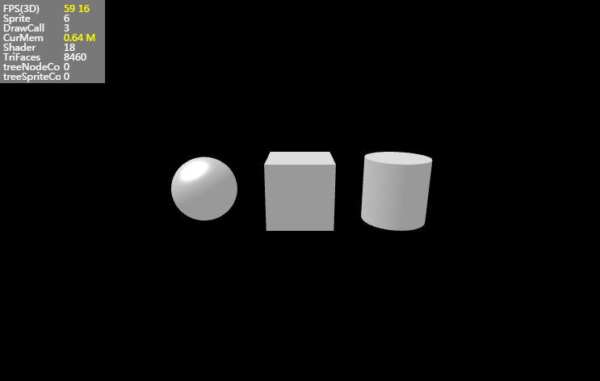

## LayaAir3D之模型

3D模型是指通过三维软件按照物体的结构建模形成的3D立体对象。目前LayaAir 3D引擎中包括了两种模型显示类型，一为普通模型MeshSprite3D，二为蒙皮动画模型SkinnedMeshSprite3D。

区别是蒙皮动画模型是指在制作时加入了蒙皮与骨骼动画的模型，常用于有动画的角色。而普通模型是指未有动画的场景景观模型等。

它们都包括了模型网格与材质两部分。

**模型网格(Mesh)：**

模型网格是由点、线、面组成的三维数据，LayaAir引擎中有专门的Mesh网格数据类，将它赋予3D模型显示对象MeshSprite3D或SkinnedMeshSprite3D后就可以在场景中显示出来。

目前3D制作软件较多，最主流的是3ds max与maya软件。3D模型的数据格式也较多，如FBX、3DS、OBJ等。

LayaAir引擎提供了模型导出工具FBXTools与unity3D导出插件，用于生成layaAir所需要的3D数据格式。建议使用unity导出插件，FBXTools工具以后将不会更新。

**材质(Material)：**

材质说明我们将在独立的章节介绍，在本章节中暂不说明。


### 创建引擎自带的基础模型

 在快速开启3D之旅的课程中，我们已用到了BoxMesh盒子模型，本节课中介绍LayaAir引擎提供的其他SphereMesh、CylinderMesh基础模型数据，我们依次创建它们，并通过transform属性去移动它们的位置，具体代码如下：。

创建时，需注意的是，加载到场景中的引擎自带模型，轴心点在模型正中心，因此我们是以模型中心点为参考进行移动、旋转、缩放。加载到场景中时，模型默认会放置到场景的世界座标原点上，与2D类似。

```java
package {

	import laya.d3.core.Camera;
	import laya.d3.core.MeshSprite3D;
	import laya.d3.core.light.DirectionLight;
	import laya.d3.core.material.StandardMaterial;
	import laya.d3.core.scene.Scene;
	import laya.d3.math.Vector3;
	import laya.d3.math.Vector4;
	import laya.d3.resource.Texture2D;
	import laya.d3.resource.models.BoxMesh;
	import laya.d3.resource.models.CylinderMesh;
	import laya.d3.resource.models.SphereMesh;
	import laya.display.Stage;
	import laya.utils.Stat;

	public class LayaAir3D_Model
	{
		
		public function LayaAir3D_Model() 
		{
			//初始化引擎
			Laya3D.init(1000, 500,true);
			
			//适配模式
			Laya.stage.scaleMode = Stage.SCALE_FULL;
			Laya.stage.screenMode = Stage.SCREEN_NONE;

			//开启统计信息
			Stat.show();
			
			//添加3D场景-----------------------
			var scene:Scene = new Scene();
			Laya.stage.addChild(scene);
			
			
			//创建摄像机(横纵比，近距裁剪，远距裁剪)-----
			var camera:Camera = new Camera( 0, 0.1, 1000);
			//加载到场景
			scene.addChild(camera);
			//移动摄像机位置
			camera.transform.position=new Vector3(0, 3, 10);
			//旋转摄像机角度
			camera.transform.rotate(new Vector3( -17, 0, 0), true, false);
			//加入摄像机移动控制脚本
			camera.addComponent(CameraMoveScript);
			
			
			//创建方向光 ------------------------
			var light:DirectionLight = scene.addChild(new DirectionLight()) as DirectionLight;
			//移动灯光位置
			light.transform.translate(new Vector3(0,2,5));
			//调整灯光方向
			light.direction = new Vector3(0.5, -1, 0);
			//设置灯光环境色
			light.ambientColor = new Vector3(1, 1, 1); 
			//设置灯光漫反射颜色
			light.diffuseColor = new Vector3(0.3, 0.3, 0.3);
			
			
			//创建模型-------------------------------
			//创建盒子模型(参数为：长、宽、高，单位：米)
			var boxMesh:BoxMesh=new BoxMesh(2,2,2);
			//创建模型显示对象
			var box3D:MeshSprite3D=new MeshSprite3D(boxMesh);
			scene.addChild(box3D);
			
			//创建球体模型(参数为：半径、水平层数、垂直层数)
			var sphereMesh:SphereMesh=new SphereMesh(1,8,8);
			//创建模型显示对象
			var sphere3D:MeshSprite3D=new MeshSprite3D(sphereMesh);
			//x轴上移动-3米（世界座标 向左）
			sphere3D.transform.translate(new Vector3(-3,0,0),false);
			scene.addChild(sphere3D);
			
			//创建圆柱体模型(参数为：半径、高、圆截面线段数)
			var cylinderMesh:CylinderMesh=new CylinderMesh(1,2,8);
			//创建模型显示对象
			var cylinder3D:MeshSprite3D=new MeshSprite3D(cylinderMesh);
			//x轴上移动3米（世界座标 向右）
			cylinder3D.transform.translate(new Vector3(3,0,0),false);
			scene.addChild(cylinder3D);
			
			//创建材质----------------------------------
			var material:StandardMaterial = new StandardMaterial();
			//为模型赋材质（单个材质可赋给多个模型）
			box3D.meshRender.material = material;
			
		}		 
		
	}
}
```

上面的代码中，创建了摄像机与灯光，并添加了三种基本几何体模型，它们使用了最基本的默认材质。显示效果如图1。

<br>（图1）


### 创建三维软件生成的模型

上述三种基本模型主要用于开发者学习测试。游戏中的模型大都是三维软件制作后，导入unity编辑器中编辑拼接，再用layaAir导出工具转化产生，然后通过3D场景或模型显示类加载使用。

在此我们再次来说明一下导出的资源类别与文件使用方法。

导出的文件夹中，包括的资源较多（图2），有场景、3D模型容器、3D模型、3D材质等解析文件，还有光照贴图、材质贴图等数据文件。

<br>（图2）

**loveScene文件夹**是在untiy中创建光照贴图后产生的文件夹，与在untiy中创建的场景名相同，光照贴图在场景Scene篇已有介绍。

**Materials文件夹**是在unity中导入FBX模型时创建材质球的文件夹，导出后的资源为对应的LayaAir材质数据解析文件，文件中存储着材质的渲染模式、贴图资源路径、材质的各种光色属性等。

**Texture文件夹**是在unity中创建的存放贴图的文件夹，其中资源为材质的贴图文件，是一系列的图片文件，在LayaAir引擎中我们使用jpg或png格式的图片，可使用导出工具把其他格式图片自动转化jpg或png，请开发者们一定注意。


#### *.ls格式Scene数据文件

导出的场景Scene类型数据文件，在之前的课程中我们已有讲解，在此不多作说明。


#### *.lh格式Sprite3D数据文件

导出的3D显示对象容器Spirte3D类型数据文件，JSON格式编码，是unity3D中layaAir导出插件选择导出”Sprite3D“类别生成，内部存储比*.ls格式少了光照贴图，其他全部相同。

“*.lh” 格式加载与场景加载方法类似，由异步加载Sprite3D.load()或预加载Laya.loader.create()方法加载，参考代码：

```java
//添加3D场景
var scene:Scene = new Scene();
Laya.stage.addChild(scene);

//方法一：直接异步加载
var sprite3D:Sprite3D = Sprite3D.load("res/room.lh");

//方法二：预加载，创建为Sprite3D类型
Laya.loader.create("res/room.lh",Handler.create(this,function():void{ 
				var sprite3D:Sprite3D=Laya.loader.getRes("res/room.lh");
  				scene.addChild(sprite3D);
				}),null,Sprite3D);
```


#### *.lm格式数据文件

无论是导出”Scene“文件或”Sprite3D“文件类型，在导出的资源文件夹中都包含了系列*.lm格式文件，本项目中model文件夹为unity中开发者自建的存储FBX模型的文件夹，如图2，在导出时生成了对应的文件夹和.lm资源文件。

<br>（图3）

"*.lm"文件是模型数据文件，可以生成MeshSprite3D或SkinnedMeshSprite3D类型显示对象的网格数据Mesh，包含了模型网格的顶点位置、法线、顶点色、顶点UV、模型使用的材质等信息。

通过异步加载MeshSprite.load()或预加载Laya.loader.create()方法加载，参考代码如下：

```java
//添加3D场景
var scene:Scene = new Scene();
Laya.stage.addChild(scene);

//方法一：直接异步加载
var meshSprite3D:MeshSprite3D = MeshSprite.load("LayaScene_01/Assets/model/loveScene_jianzhu.lm");

//方法二：预加载，创建为MeshSprite3D类型
Laya.loader.create("LayaScene_01/Assets/model/loveScene_jianzhu.lm",
                   Handler.create(this,function():void{ 
				  var meshSprite3D:MeshSprite3D=
                  Laya.loader.getRes("LayaScene_01/Assets/model/loveScene_jianzhu.lm");
        		  scene.addChild(meshSprite3D);
				   }),null,MeshSprite3D);
```

用上述的三种方法都可以在游戏画面中显示出模型，材质贴图引擎也会自动加载到模型上。在项目中我们可以根据情况使用上述三种方法，固定场景我们可以使用.ls格式加载，而活动的物品可以使用.ls或.lm方式加载。 

