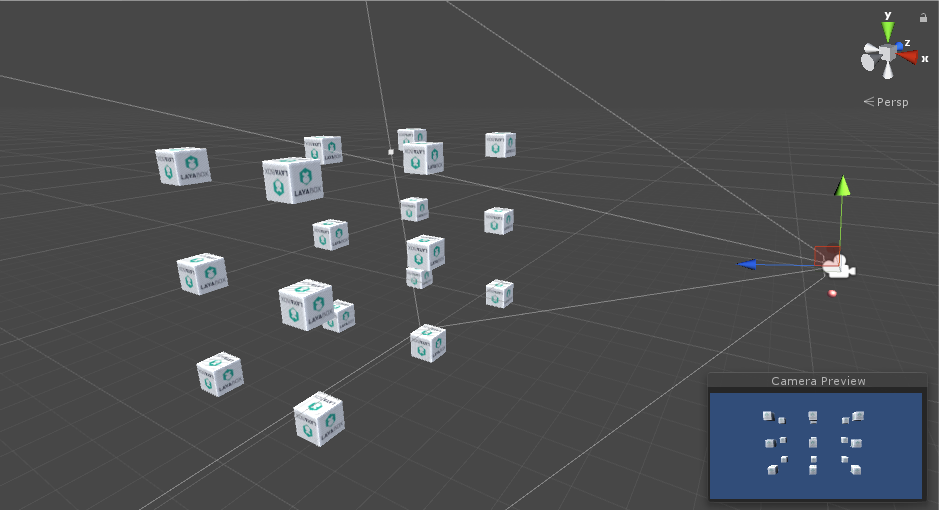

## 3D bullet shooting with collision detection


### requirement analysis

This article mainly demonstrates to beginners a sample application of collision detection between 3D objects. After the release of 3D Engine version 1.7.12, the script function of the engine tends to be perfect, and the triggering method for collision detection is added so that developers can conveniently The use of them for a similar shooting game development.

In previous examples, we used collision detection with ray and Collider, and realized mouse interaction or other collision logic by judging the attributes of collision information. However, it is troublesome to realize the collision detection of a bullet with other 3D objects in the scene during the moving process. Below, methods for implementing the collision detection are mainly described.

Basic needs are:
1. Mouse click on the scene of the 3D space, create a bullet, and aim the mouse point shooting direction.

2. After the bullet is created, it automatically flies according to the mouse click direction, the target point can be the 3D item in the scene, and it can also be a blank space.
3. When the bullet collides with the 3D object, the bullet is destroyed; if the bullet fails to hit the target, the bullet will be destroyed after a far flight trajectory.
4. When the object is hit by a subprojectile in the scene, the item is retreated according to the direction of the bullet, and the HP is reduced. When the HP is less than 0, the item is destroyed.

**Tips：The real shooting game is more complex, need a gun model, which rotates according to mouse movement, rays are emitted from the gun to detect an eventual collision. In this case, for beginners to learn basic concept, the course reduced to strict necessary functions. Bullet is sent out in a fixed position, and the direction of the flight is determined according to the click of the mouse.**

Reference effect as shown in Figure 1

<br>（Picture 1）


### request analysis of engine technical scheme

1、**Resource production：** Scenario are made in Unity and require the inclusion of a box-typ ecollider component on the wrecked 3D items. Currently engine and plug-in versions can export the collider component（MeshCollider grid collider can not be exported temporarily, and later will be supported.）. It does not need to be added to the code.

Bullets into the scene for the time being, living in the camera, used to clone to create a bullet. As the initiator of the collision detection, the bullet needs to add a collider (ball type) and a rigid body component, and the engine can recognize automatically when being exported.

2、**Collision detection principle ：** Because of the principle of engine optimization, collision detection is divided into collision initiator and collision passive receiver.

The 3D model of collision initiator needs to add "rigid body" components. The rigid body model is the collision initiator, and the 3D model without rigid components represents the collision receiver. After adding them to the scene, the engine automatically determines whether the initiator and the receiver collider overlap.

Therefore, in this case, the bullet, as a collision initiator, needs to add two components of the rigid body and the collider, and the cube box can only be added to the collider.

3. **Script triggered: ** When the engine determines that collision initiator and the receiver overlap, it queries whether there is a script component in the 3D model. If there is, it will trigger different methods of the script according to the different phases of the collision, similar to issuing various collision events, To implement a different callback method. These methods include triggering methods when the collision of the collision device, triggering method frame by frame when the collision device is overlapped, and triggering method when the collision device separates.

4. **Collider size settings：** From the 1.7.12 version of the engine, the size of the collider can also be set up. Sometimes, the collider is larger than or smaller than the 3D model for collision detection. Therefore, in Untiy, the size of the collider can be modified according to the need.


在Untiy中创建场景bulletShoot，如图2所示，在立方体盒子上添加碰撞器组件Box Collider，在红色子弹模型上添加Sphere Collider与Rigidbody组件，它们的组件参数采用默认设置即可。

<br>（图2）


### 功能实现

本示例功能实现可分为三个类进行逻辑编写：

**主控类Laya3D_BulletAttack.as**，主要用于加载资源、添加子弹与立方体盒子控制脚本，实现鼠标点击事件时创建子弹，生成子弹发射方向等功能。

**子弹脚本类BulletScript.as**，用于控制子弹飞行，通过脚本中碰撞检测的触发方法，实现判断是否击中及子弹销毁等功能。

**立方体控制脚本CubeScript.as**，用于判断是否被子弹击中，当被击中时，实现击退效果动画、减血及被摧毁功能。


#### 本例中所需向量数学知识

要充分理解本章内容，在此需要初学者们学习或回顾一下向量的基础知识，我们会用到向量的加减、归一、取模等运算。

三维向量在3D游戏开发中有多种含意，它可以表位置、距离、速度、角度、弧度等。在本例中，如子弹的射击方向就是一个三维向量，从方向向量也可以计算出子弹的速度，这些都需要用向量数学公式。

三维向量基础公式如下：

**A点到B点的方向：AB方向三维向量 = B目标位置三维向量 —  A起始位置三维向量** 

引擎提供方法为：`Vector3.subtract(a:Vector3, b:Vector3, out:Vector3)`。

运用：由3D空间中的两个点的位置，得到一个方向向量，比如子弹飞行方向，攻击的目标点位置向量-子弹当前位置向量。


**AC方向向量 = AB方向向量 + BC方向向量**    

引擎提供方法为：`Vector3.add(ab:Vector3, bc:Vector3, ac:Vector3)`。

AC表示A点到C点的方向向量，AB表示A点到B点方向向量，BC表示B点到C点的方向向量（可画图理解）。


**BC方向向量 = AB方向向量 — AC方向向量**

引擎提供方法为：`Vector3.subtract(ab:Vector3, ac:Vector3, bc:Vector3)`。

BC表示B点到C点的方向向量，AB表示A点到B点方向向量，AC表示A点到C点的方向向量（可画图理解）。


**AB标准方向向量（长度为单位一的向量） = AB方向向量归一化**

引擎提供方法为：`Vector3.normalize(s:Vector3, out:Vector3)`。

运用：任何向量的长度（模）都可以归一化为标准向量，单位为一。比如可以把方向向量归一后，作为速度的标准值，速度设置为归一向量的倍数。


**缩放后向量（长度缩放） = 原始向量 * 实数**

引擎提供方法为：`Vector3.scale(v3:Vector3, num:Number, out:Vector3)`。

根据num的值大小进行缩放，可以生成原始向量的num倍长度的向量。


**向量的长度值 = 开方（向量.x平方 + 向量.y平方 + 向量.z平方）**

引擎提供方法：`Vector3.scalarLength(a:Vector3)`，返回长度

运用：我们可以通过取向量长度来作为距离、速度参考，向量长度最小值为0。


#### 主控制类功能实现

主控类Laya3D_BulletAttack.as的主要功能为三点：

1. 通过getChildByName()方法在场景中找到立方盒子，为它们分别添加立方体控制脚本CubeScript，用于碰撞检测。

2. 鼠标点击事件中，使用克隆方法创建子弹，这种方法可以将子弹的碰撞器SphereCollider及刚体组件rigidbody一并克隆。
   创建子弹后，为子弹添加子弹控制脚本BulletScript，并使用BulletScript方法setShootDirection(directionV3:Vector3)设置子弹的飞行方向。

3. 子弹的飞行方向通过鼠标点击场景时产生的射线计算后获得。
   鼠标点击3D场景空间由摄像机产生射线，判断射线与场景中的3D模型是否相交（射线碰撞检测），如果相交，那么子弹方向就是相交目标位置与子弹起始位置产生的方向；如果不相交，那么根据射线方向、摄像机位置、子弹初始位置计算子弹飞行的方向。

   主类具体代码如下：

```typescript
package script_collision
{
	import laya.d3.core.Camera;
	import laya.d3.core.MeshSprite3D;
	import laya.d3.core.scene.Scene;
	import laya.d3.math.Ray;
	import laya.d3.math.Vector2;
	import laya.d3.math.Vector3;
	import laya.d3.utils.Physics;
	import laya.d3.utils.RaycastHit;
	import laya.display.Stage;
	import laya.display.Text;
	import laya.events.Event;
	import laya.events.MouseManager;
	import laya.utils.Handler;
	import laya.utils.Stat;

	public class Laya3D_BulletAttack
	{
		/**3D场景**/
		private var scene:Scene;
		/**3D摄像机**/
		private var camera:Camera;
		/**射线**/
		public var ray:Ray=new Ray(new Vector3(),new Vector3());
		/**鼠标坐标**/
		public var mousePos:Vector2=new Vector2();
		/**碰撞信息**/
		public var rayCastHit:RaycastHit=new RaycastHit();
		
		/**场景中的初始子弹**/
		public var bullet:MeshSprite3D;		
		
		
		public function Laya3D_BulletAttack()
		{
			//初始化引擎
			Laya3D.init(1000, 500,true);
//			Stat.show();
			//适配模式
			Laya.stage.scaleMode = Stage.SCALE_FULL;
			Laya.stage.screenMode = Stage.SCREEN_NONE;			
			//加载3D资源
			Laya.loader.create("LayaScene_bulletShoot/bulletShoot.ls",Handler.create(this,onComplete));
			
			//提示信息
			var txt:Text=new Text();
			txt.text="3D碰撞检测示例：点击鼠标发射子弹，击中盒子时，盒子会根据子弹发射方向被击退，3发子弹可摧毁盒子！！";
			txt.color="#FFFF00";
			txt.bold=true;
			txt.fontSize=20;
			txt.pos(10,10);
			Laya.stage.addChild(txt);
		}
		
		private function onComplete():void
		{
			//创建场景
			scene=Laya.loader.getRes("LayaScene_bulletShoot/bulletShoot.ls");
			Laya.stage.addChild(scene);
			Laya.stage.setChildIndex(scene,0);
			
			//获取摄像机
			camera=scene.getChildByName("Main Camera");
			
			//为场景中的立方体盒子加控制脚本
			var len:int=scene._childs.length;
			for(var i:int=1;i<len;i++)
			{
				var cube:MeshSprite3D=scene.getChildByName("Cube ("+i+")") as MeshSprite3D;
				if(cube) cube.addComponent(CubeScript);
			}
			
			//获取场景中的子弹用于克隆
			bullet=scene.getChildByName("bullet");
			//未产生子弹时移除克隆参考用子弹
			bullet.removeSelf();
			
			//鼠标控制创建子弹发射
			Laya.stage.on(Event.MOUSE_DOWN,this,onShoot);
		}
  
		/**
		 * 子弹发射
		 * 基本原理：鼠标点击产生射线，射线如与模型碰撞器相交，则获取碰撞点作为子弹发射方向；
		 * 如果未与3D模型相交，则直接使用射线计算出的方向作为发射方向。
		 */		
		private function onShoot():void
		{
			//克隆一颗子弹用于射击
			var bulletClone:MeshSprite3D=this.bullet.clone();
			//为子弹加控制脚本
			var script:BulletScript=bulletClone.addComponent(BulletScript) as BulletScript;
			scene.addChild(bulletClone);
			
			
			//鼠标点击屏幕的位置
			this.mousePos=new Vector2(MouseManager.instance.mouseX,	MouseManager.instance.mouseY);
			//鼠标点击屏幕产生射线
			camera.viewportPointToRay(this.mousePos,ray);
			//射线与3D模型中的碰撞器进行碰撞检测
			Physics.rayCast(ray,this.rayCastHit,30,0);	
			
			//-----------计算子弹发射方向并在子弹脚本中设置----------------------
            //射击的方向向量
			var dirV3:Vector3=new Vector3();          
			//如果鼠标点击到模型上（射线与碰撞器发生碰撞）
			if(rayCastHit.distance!==-1)
			{
				//子弹射击方向向量 = 由鼠标点中的目标位置向量 —— 子弹起始位置向量
				Vector3.subtract(rayCastHit.position,bullet.transform.position,dirV3);
				//设置子弹控制脚本中发射飞行方向
				script.setShootDirection(dirV3);
			}else
			{//如果鼠标未点击到模型上

              /**
			   *射线方向向量是归一化的单位向量，不能直接用于向量加减。需要根据射线产生的原理算
			   *出相当于有长短距离的方向向量用于计算，可以通过向量缩放方法实现。
			   *射线原理：原点是鼠标点击在近裁剪面上的点,方向是从摄像机位置到鼠标点击在远裁剪面
			   *上的点产生的归一化方向。因此可以用摄像机到远裁面的距离模拟原始方向向量		
			   **/
				//摄像机到鼠标点击处的方向向量
				var aV3:Vector3=new Vector3();
				//根据射线方向向量、摄像机远裁剪值缩放为射线方向原始向量
                //注：使用远裁距离会有一点误差，比实际射线长度稍短，但不影响效果。
				Vector3.scale(ray.direction,camera.farPlane,aV3);			
				
				//根据摄像机与子弹的位置求出子弹到摄像机的方向向量
				var bV3:Vector3=new Vector3();
              	//子弹到摄像机的方向向量=摄像机位置向量 - 子弹位置向量
				Vector3.subtract(camera.transform.position,bullet.transform.position,bV3);
				
				//射击的方向向量 = 射线方向向量 + 子弹到摄像机的方向向量
				Vector3.add(aV3,bV3,dirV3);
				
				//设置子弹控制脚本中发射方向
				script.setShootDirection(dirV3);
			}
		}
	}
}
```


#### 子弹控制脚本类功能实现

子弹控制脚本继承于脚本Script，引擎1.7.12版增加了脚本绑定者的碰撞检测触发方法，当然，前提是绑定者需要有碰撞器组件，否则无法触发成功。

当场景中的其它碰撞器与脚本绑定模型的碰撞器发生重叠，会触发多种状态，并根据状态去触发不同的方法。

触发状态共有三种，包括：其它碰撞器与自己碰撞器碰撞时方法`onTriggerEnter(other:Collider)`、其它碰撞器与自己碰撞器逐帧重叠时方法`onTriggerStay(other:Collider)`、其它碰撞器与自己碰撞器相互离开时方法`onTriggerExit(other:Collider)`。

它们对应着不同的触发方法（请查看下例代码），可以在脚本继承类中去覆盖原有触发方法，并在其中实现自己的逻辑。触发方法中还会把其它碰撞器作为参数传递过来，方便开发者获取其它碰撞器的模型对象、属性等。

子弹控制脚本代码如下：

```typescript
package
{
	import laya.d3.component.Script;
	import laya.d3.component.physics.Collider;
	import laya.d3.core.ComponentNode;
	import laya.d3.core.MeshSprite3D;
	import laya.d3.core.Sprite3D;
	import laya.d3.core.render.RenderState;
	import laya.d3.math.Vector3;
	import laya.utils.Tween;
	
	/**
	 * 子弹控制脚本
	 */	
	public class BulletScript extends Script
	{
		/**被绑定的子弹对象**/
		private var bullet:MeshSprite3D;
		/**子弹生命周期**/	
		private var life:int=200;		
		/**子弹发射的速度（也代表方向）**/		
		public var speedV3:Vector3=new Vector3();
				
		/**
		 * 子弹控制脚本
		 */	
		public function BulletScript(){
			super();
		}
		
		/**
		 * 脚本实例化完成载入后调度
		 * @param owner 脚本绑定的3D物体
		 */		
		override public function _load(owner:ComponentNode):void
		{
			//获取子弹
			this.bullet=this.owner as MeshSprite3D;			
		}		
		
		/**
		 * 设置子弹射击方向并计算速度
		 * @param directionV3
		 */		
		public function setShootDirection(directionV3:Vector3):void
		{
			/****
			 * 注：
			 * 三维向量即是位置、方向，也可以是速度，但速度需要一个统一的参考标准单位，比如“N*标准速度值/帧”或
			 * “N*标准速度值/毫秒”，它类似于“N*米/帧”。
			 * 而我们得到的方向向量，它的大小不一，无法作为标准速度值使用，这个时候可用Vector3.normalize()方法
			 * 把任一向量归一化，产生单位为一的向量作为标准速度值，再把它进行缩放作为不同物体的速度来使用，比如
			 * 0.2倍标准速度值，1.5倍标准速度值等，可使用Vector3.scale()方法缩放。
			 ****/
			//将方向向量归一成单位为一的方向速度向量(在LayaAir中相当于1米的长度)
			Vector3.normalize(directionV3,speedV3);
			trace("\n子弹攻击速度(方向)：",speedV3.elements)
			
			//用缩放方法去调整发射速度，0.2倍标准速度（注:子弹速度过快，可能会越过场景中物品，不发生碰撞！）
//			Vector3.scale(speedV3,0.2,speedV3);
		}
		
		/**
		 * 脚本帧循环更新
		 */		
		override public function _update(state:RenderState):void
		{
			//子弹位置更新
			bullet.transform.translate(speedV3,false);
			//生命周期递减
			life--;
			//生命周期结束后，一帧后销毁子弹（目前帧循环中直接销毁绑定对象会报错，后期版本解决此问题）
			if(life<0){
				Laya.timer.frameOnce(3,this,function(){bullet.destroy();});
			}
		}
		
		/**
		 * 当其他碰撞器进入绑定物体碰撞器时触发（子弹击中物品时）
		 * 注：如其他碰撞器相对移动速度过快，可能会直接越过
		 */	
		override public function onTriggerEnter(other:Collider):void {
		}
		
		/**
		 * 当其他碰撞器进入绑定物体碰撞器后逐帧触发（子弹进入物品过程中）
		 * 注：如其他碰撞器相对移动速度过快，可能会直接越过
		 */	
		override public function onTriggerStay(other:Collider):void	{
		}
		/**
		 * 当其他碰撞器退出绑定物体碰撞器时逐帧触发（子弹穿出物品时）
		 * 注：如其他碰撞器相对移动速度过快，可能会直接越过
		 */	
		override public function onTriggerExit(other:Collider):void 
		{
			//一帧后销毁子弹（目前脚本中直接销毁绑定对象会报错，后期版本解决此问题）
			Laya.timer.frameOnce(1,this,function(){ this.bullet.destroy()});
		}		
	}
}
```


#### 立方体脚本类功能实现

立方体控制脚本也继承于脚本Script，同样用到了新增脚本功能的三种触发方法，区别是在三种方法中的逻辑有所不同。

当子弹碰撞器进入立方体盒子碰撞器时方法`onTriggerEnter(other:Collider)`中，根据立方体盒子碰撞器获取到立方体的脚本，从它的脚本中获得子弹速度和方向，用于立方体盒子的击退速度和击退方向，并且在脚本更新方法中模拟立方体盒子被击退的效果。

当子弹碰撞器离开立方体盒子碰撞器时方法`onTriggerExit(other:Collider)`，立方体盒子生命值减少，被三发子弹击中后，立方体盒子被击毁消失。

立方体控制脚本代码如下：

```typescript
package
{
	import laya.d3.component.Script;
	import laya.d3.component.physics.Collider;
	import laya.d3.core.ComponentNode;
	import laya.d3.core.MeshSprite3D;
	import laya.d3.core.render.RenderState;
	import laya.d3.math.Vector3;
	import laya.display.Sprite;
	
	/**
	 * 立体体盒子控制脚本
	 */	
	public class CubeScript extends Script
	{
		/**被绑定的立方体对象**/
		public var cube:MeshSprite3D;
		/**是否被攻击**/
		private var isAttacked:Boolean=false;
		/**盒子被击退的标准速度（方向）**/	
		public var repelledV3:Vector3=new Vector3();
		/**盒子生命周期**/	
		public var life:int=60;		
		
		/**
		 * 立体体盒子控制脚本
		 */	
		public function CubeScript(){
			super();			
		}
		
		/**
		 * 脚本实例化完成载入后调度
		 * @param owner 脚本绑定的3D物体
		 */		
		override public function _load(owner:ComponentNode):void
		{
			//获取被绑定对象
			this.cube=this.owner as MeshSprite3D;			
		}
		/**
		 * 当其他碰撞器进入绑定物体碰撞器时触发（子弹击中盒子时）
		 * 注：如相对移动速度过快，可能直接越过
		 */		
		override public function onTriggerEnter(other:Collider):void 
		{
			//获取其他碰撞器绑定的模型
			var sp3D:MeshSprite3D=other.owner as MeshSprite3D;
			//获取子弹对象模型脚本
			var script:BulletScript=sp3D.getComponentByType(BulletScript) as BulletScript;
			//获取子弹速度与方向
			this.repelledV3=script.speedV3.clone();
			
			//设置为被攻击状态
			isAttacked=true;
			
			trace("\n1 子弹碰撞时位置(方向):",sp3D.transform.position.elements);
		}
		
		/**
		 * 当其他碰撞器进入绑定物体碰撞器后逐帧触发（子弹进入盒子时）
		 * 注：如相对移动速度过快，可能直接越过
		 */	
		override public function onTriggerStay(other:Collider):void
		{
			var sp3D:MeshSprite3D=other.owner as MeshSprite3D;
			trace("2 子弹穿过时位置(方向):",sp3D.transform.position.elements);
		}
		
		/**
		 * 当其他碰撞器退出绑定物体碰撞器时逐帧触发（子弹穿出盒子时）
		 * 注：如相对移动速度过快，可能直接越过
		 */	
		override public function onTriggerExit(other:Collider):void
		{
			//获取其他碰撞器绑定的模型
			var sp3D:MeshSprite3D=other.owner as MeshSprite3D;			
			trace("3 子弹穿出时位置(方向):",sp3D.transform.position.elements);
			
			//击中后生命减，为0时一帧后销毁（目前脚本中直接销毁绑定对象会报错，后期版本解决此问题）
			life-=20;
			if(life<=0)
			{
				this.enable=false;
				Laya.timer.frameOnce(1,this,function(){ this.owner.destroy()});
			}
		}
		
		/**
		 * 脚本的帧循环
		 */		
		override public function _update(state:RenderState):void
		{
			//被攻击状态下，盒子产生击退效果
			if(isAttacked)
			{
				//根据击退方向和速度移动
				this.cube.transform.translate(this.repelledV3,false);
				//击退速度逐步减小
				Vector3.scale(this.repelledV3,0.3,this.repelledV3);
				//当击退的速度长度小于0.01时，击退状态停止
				if(Vector3.scalarLength(this.repelledV3)<0.01)
				{
					isAttacked=false;
				}
			}
		}
	}
}
```


完成上述简单的三个类后，我们可以看到图1所示效果，当然，要真正完成一个射击游戏，不会如此简单，本例代码主要为初学者们打开思路，可以举一反三。

