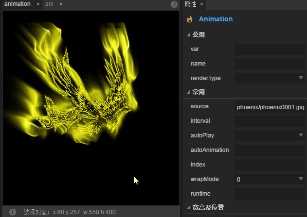
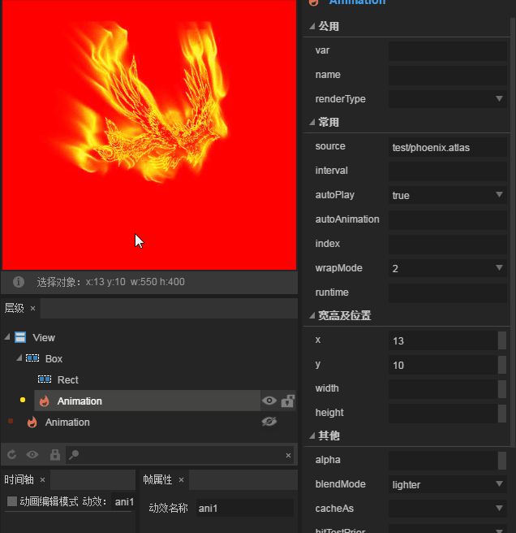

# Animation组件属性详解

> 由于很多组件属性是通用的，常用及通用的组件属性在`属性设置器`文档中已进行介绍。阅读本篇内容前请先阅读《属性设置器》文档。

## 1、初步认知Animation 组件

Animation组件是动画组件，可以方便的创建图集动画或者使用LayaAirIDE创建的ani动画。如动图1所示。

 

（动图1）

Animation的API介绍请参考 [https://layaair.ldc.layabox.com/api/?category=Core&class=laya.display.Animation](https://layaair.ldc.layabox.com/api/?category=Core&class=laya.display.Animation)

## 2、通过LayaAirIDE创建Animation 组件

### 2.1 创建Animation

Animation不是常用的UI组件，也不是容器组件。所以在创建Animation组件的时候，需要先从`组件库`里直接拖入Animation组件到IDE的`场景编辑器`中。如动图2所示。

 

（动图2）

### 2.2 通过source属性去接收动画数据源

在LayaAirIDE里创建Animation组件后，必须要通过source属性去接收动画数据源后才能使用。source属性可以接收图片集合（多张图片，通常是序列帧图）、图集文件（.atlas或.json后缀）、动画文件（.ani后缀）三种。

#### 2.2.1 用序列帧图片创建

打开`资源管理器`，我们将多张美术资源`同时选中`，`拖拽`到`source`属性栏，然后选中场景中刚刚创建的Animation动画，按`回车`键，即可预览动画播放效果。如动图3所示。

 

（动图3）

**Tips**：使用该类型创建的动画不会被缓存到动画模版缓存池中，如果需要缓存，要使用loadImages()方法。

#### 2.2.2 用图集文件创建

如果我们将图集文件放到`资源管理器`目录，也可以直接将图集文件`拖拽`到`source`属性栏，然后选中场景中刚刚创建的Animation动画，按`回车`键，即可预览动画播放效果。如动图4所示。

 

（动图4）

**Tips**：使用此类型创建的动画模版不会被缓存到动画模版缓存池中，如果需要缓存或者创建完毕的回调，要使用loadAtlas()方法。

#### 2.2.3 使用动画文件创建

创建的时间轴动画文件（后缀为.ani）也可以作为Animation动画组件的数据源，如动图5所示，直接`拖拽`到`source`属性栏，然后选中场景中刚刚创建的Animation动画，按`回车`键，即可预览动画播放效果。

 

(动图5) 

### 2.3 控制动画的播放模式（wrapMode）

动画播放模式属性wrapMode有三个值可选，默认值是0，正序播放。选1时，倒序播放。选2时，pingpong（乒乓）模式，直白一些就是来回播放。下面我们选一组序列图资源分别演示不同模式下的播放差异。

#### 2.3.1 正序模式播放

默认不设置wrapMode属性或是将wrapMode属性值设为0时，为正序播放模式。也就是序列图从前到后的顺序进行播放。

如动图6所示，即是从序列图phoenix0001到phoenix0025，依次播放。播放结束后，再次从phoenix0001开始到phoenix0025结束，循环播放。

 

(动图6)

#### 2.3.2 倒序模式播放

将wrapMode属性值设为1时，为倒序播放模式。也就是序列图后到前的顺序进行播放。与正序播放模式完全相反。

如动图7所示，即是从序列图phoenix0025到phoenix0001，依次播放。播放结束后，再次从phoenix0025开始到phoenix0001结束，循环播放。

 

(动图7)

#### 2.3.3 pingpong（乒乓）模式播放

细心观察一下，可以发现，无法是正序还是倒序，这组凤凰的动作都不流畅。原因是设计这组图的时候，美术只设计了翅膀从上向下的飞舞，所以动作帧的缺失，导致了动作看上去并不流畅。

而将wrapMode属性值设为2时的pingpong模式，正好可以解决这个问题，同一套动作，正序从phoenix0001到phoenix0025播放完了，并不是直接回到phoenix0001重头播放，而是从phoenix0024到phoenix0001倒序播放。从而让动作更加平滑和完整。因此，pingpong模式也是游戏中经常使用的模式之一，在保障效果的前提下，还可以大幅减少美术资源量。效果如动图8所示。

 

(动图8)

#### 2.4  动画播放的帧间隔时间(interval)

`interval`属性可以设置动画播放的帧间隔时间(单位：毫秒)，默认值为50毫秒。例如，我们将刚刚播放的凤凰动画，放慢一倍，设置为100毫秒。效果如动图9所示。

 

(动图9)

**Tips**：*如果动画正在播放，设置后会重置帧循环定时器的起始时间为当前时间，也就是说，如果频繁设置interval，会导致动画帧更新的时间间隔会比预想的要慢，甚至不更新。*

#### 2.5 设置自动播放（autoPlay）

autoPlay属性可以设置是否自动播放，默认为false，不自动播放。如果设置为true，则动画被创建并添加到舞台后自动播放。该属性设置不可以在IDE中即时预览，需要在发布运行时查看属性设置效果。

#### 2.6 按动效名称自动播放（autoAnimation）

在LayaAir IDE中创建的时间轴动画文件（.ani后缀）内可能会有多个动画组成的动画集合，通过autoAnimation属性，可以选择其中一个动画名称进行播放。

**Tips**：

- 在LayaAirIDE中，`autoAnimation`属性只能对数据源（`source`）属性为时间轴动画文件的（.ani后缀）才可以设置。
- `autoAnimation`属性值要对应`时间轴动画`编辑中的`帧属性`面板`动效名称`中设置的名字。

#### 2.7 设置播放的起始位置（index）

index属性可以指定动画的帧索引，默认的索引是0，可以设置为动画中的任意一帧。设置后，将会跳到设定的动画帧。

Tips：该属性仅用于静态指定，比如通过代码或点击事件来手动切换动画帧。如果设置为自动播放，仍会从第0帧开始播放，与索引的设置没有关系。

#### 2.8 设置混合模式（blendMode）

混合模式`blendMode`属性默认不开启，设置为lighter选项后则开启混合模式。开启后效果如动图10所示。

  

(动图10)

**Tips**：*混合模式的背景必须是在舞台画布中。比如，只设置Laya.stage.bgColor是无法实现混合模式的。动图10中采用的是Graphics的矩形。*

