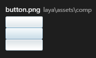
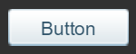
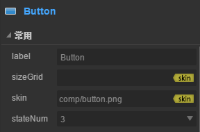
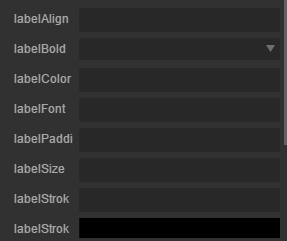
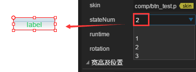

# Button 组件参考


## 一、通过LayaAirIDE创建Button组件

###        	1.1 创建Button

 	Button 组件可以用来表示常用的多态按钮，当用户点击时，Button 会有状态变化。另外，设置 Button 的属性 toggle 的值为 true 时，可以用来表示状态切换按钮。Button 组件的图像资源的 skin 属性值为按钮的图像资源。
​        点击资源面板里的 Button组件，拖放到页面编辑区，即可添加 Button组件到页面上。
​        Button 组件的脚本接口请参考 [Button API](http://layaair.ldc.layabox.com/api/index.html?category=Core&class=laya.ui.Button)。

​        Button 组件的资源示例：

​        <br/>
​    （图1）

​        设置 Button 的stateNum 属性的值为3后，显示效果如下：

​        <br/>
​    （图2）


### 1.2 Button 组件的常用属性

​        <br/>
​    （图3）

| **属性**   | **功能说明**                                 |
| -------- | ---------------------------------------- |
| label    | 按钮的标签文本内容字符串。                            |
| selected | 按钮的选中状态。                                 |
| toggle   | 表示按钮是否为切换按钮。                             |
| sizeGrid | 按钮图像资源的有效缩放网格数据。                         |
| skin     | 按钮的皮肤资源。                                 |
| stageNum | 按钮的状态值，以数字表示。 默认值为3。此值决定皮肤资源图片的切割方式。 取值： 1：单态。图片不做切割，按钮的皮肤状态只有一种。 2：两态。图片将以竖直方向被等比切割为2部分，从上向下，依次为 弹起状态皮肤、 按下和经过及选中状态皮肤。 3：三态。图片将以竖直方向被等比切割为2部分，从上向下，依次为 弹起状态皮肤、 经过状态皮肤、 按下和选中状态皮肤。 |

 

 

### 1.3 Button 标签文本相关属性

​        可以通过设置 Button 标签文本的的相关属性，实现按钮各状态的标签文本的不同显示效果。

​        <br/>
​    （图4）

| **属性**           | **功能说明**       |
| ---------------- | -------------- |
| labelAlign       | 按钮标签文本的对齐方式。   |
| labelBold        | 按钮标签文本是否加粗显示。  |
| labelColors      | 按钮各状态下的标签文本颜色。 |
| labelFont        | 按钮标签文本的字体名称。   |
| labelPadding     | 按钮标签文本的边距。     |
| labelSize        | 按钮标签文本的字体大小。   |
| labelStroke      | 按钮标签文本的描边宽度。   |
| labelStrokeColor | 按钮标签文本的描边颜色。   |

 


##  二、通过代码创建Button组件

​	在我们进行书写代码的时候，免不了通过代码控制UI，在代码中导入`laya.ui.Button`的包，创建UI Button,并通过代码设定Button相关的属性。

**示例代码：**

```javascript
package 
{
	import laya.display.Stage;
	import laya.ui.Button;
	import laya.utils.Handler;
	import laya.webgl.WebGL;
	
	public class UI_Button
	{
		private const COLUMNS:int = 2;
		private const BUTTON_WIDTH:int = 147;
		private const BUTTON_HEIGHT:int = 165 / 3;
		private const HORIZONTAL_SPACING:int = 200;
		private const VERTICAL_SPACING:int = 100;

		private var xOffset:int;
		private var yOffset:int;

		private var skins:Array;

		public function UI_Button()
		{
			// 不支持WebGL时自动切换至Canvas
			Laya.init(800, 600, WebGL);

			Laya.stage.alignV = Stage.ALIGN_MIDDLE;
			Laya.stage.alignH = Stage.ALIGN_CENTER;

			Laya.stage.scaleMode = Stage.SCALE_SHOWALL;
			Laya.stage.bgColor = "#232628";

			skins = [
				"res/ui/button-1.png", "res/ui/button-2.png", "res/ui/button-3.png", 
				"res/ui/button-4.png", "res/ui/button-5.png", "res/ui/button-6.png"
				];

			// 计算将Button至于舞台中心的偏移量
			xOffset = (Laya.stage.width - HORIZONTAL_SPACING * (COLUMNS - 1) - BUTTON_WIDTH) / 2;
			yOffset = (Laya.stage.height - VERTICAL_SPACING * (skins.length / COLUMNS - 1) - BUTTON_HEIGHT) / 2;

			Laya.loader.load(skins, Handler.create(this, onUIAssetsLoaded));
		}
		
		private function onUIAssetsLoaded(e:*=null):void
		{
			for(var i:int = 0, len : int = skins.length; i < len; ++i)
			{
				var btn:Button = createButton(skins[i]);
				var x:Number = i % COLUMNS * HORIZONTAL_SPACING + xOffset;
				var y:Number = (i / COLUMNS | 0) * VERTICAL_SPACING + yOffset;
				btn.pos(x, y);
			}
		}

		private function createButton(skin:String):Button
		{
			var btn:Button = new Button(skin);
			Laya.stage.addChild(btn);
			return btn;
		}
	}
}
```

**运行结果:**
​	<br/>
​	(图5)通过代码创建Button

​	Button的其他属性也可以通过代码来设置，上述示例演示了如何通过代码创建不同皮肤（样式）的Button，

有兴趣的读者可以自己通过代码设置button，创建出符合自己需要的按钮。