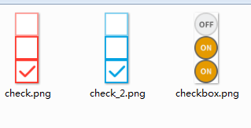
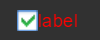
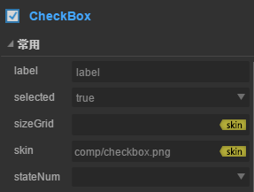
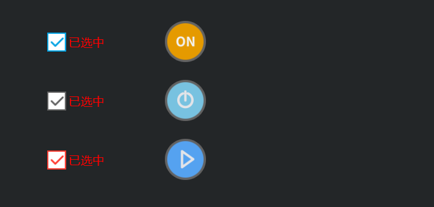

# CheckBox 组件参考


## 一、通过LayaAirIDE创建CheckBox组件

###1.1 创建CheckBox
​        CheckBox （多选框）经常被用于游戏中需要进行多项选择的一些功能设置显示。可以设置 CheckBox 的标签文本内容来表示此选项的描述。用户操作后，程序可以通过获取属性 selected 的值，来得知是否勾选了 CheckBox。
​        点击选择资源面板里的 CheckBox 组件，拖放到页面编辑区，即可添加 CheckBox 组件到页面上。
​        CheckBox 的脚本接口请参考 [CheckBox API](http://layaair.ldc.layabox.com/api/index.html?category=Core&class=laya.ui.CheckBox)


CheckBox 组件的图片资源示例：

​        <br/>
​    （图1）

设置 CheckBox 的 selected 属性的值为 true 后，显示效果如下：

​        <br/>
​    （图2）


### 1.2 CheckBox 的常用属性

​        <br/>
​    （图3）

 

| **属性**   | **功能说明**                    |
| -------- | --------------------------- |
| label    | 选择框的标签文本内容字符串。              |
| selected | 布尔值，表示选择框是否被勾选。             |
| sizeGrid | 选择框的图像资源的有效缩放网格数据。          |
| Skin     | 选择框的图像资源。                   |
| stateNum | 选择框的状态值。可以选择单态：1、两态：2、三态：3。 |

##  二、通过代码创建CheckBox组件

 	在我们进行书写代码的时候，免不了通过代码控制UI，在代码中导入`laya.ui.CheckBox`的包，创建UI CheckBox,并通过代码设定CheckBox相关的属性。

**示例代码：**

```javascript
package
{
	import laya.display.Stage;
	import laya.ui.CheckBox;
	import laya.utils.Handler;
	import laya.webgl.WebGL;
	
	public class UI_CheckBox
	{
		private const COL_AMOUNT:int = 2;
		private const ROW_AMOUNT:int = 3;
		private const HORIZONTAL_SPACING:int = 200;
		private const VERTICAL_SPACING:int = 100;
		private const X_OFFSET:int = 100;
		private const Y_OFFSET:int = 50;
		
		private var skins:Array;
		

		public function UI_CheckBox()
		{
			// 不支持WebGL时自动切换至Canvas
			Laya.init(800, 600, WebGL);

			Laya.stage.alignV = Stage.ALIGN_MIDDLE;
			Laya.stage.alignH = Stage.ALIGN_CENTER;

			Laya.stage.scaleMode = Stage.SCALE_SHOWALL;
			Laya.stage.bgColor = "#232628";

			skins = ["res/ui/checkbox (1).png", "res/ui/checkbox (2).png", "res/ui/checkbox (3).png", "res/ui/checkbox (4).png", "res/ui/checkbox (5).png", "res/ui/checkbox (6).png"];
			
			Laya.loader.load(skins, Handler.create(this,onCheckBoxSkinLoaded));
		}
		
		private function onCheckBoxSkinLoaded(e:*=null):void 
		{
			var cb:CheckBox;
			for (var i:int = 0; i < COL_AMOUNT; ++i)
			{
				for (var j:int = 0; j < ROW_AMOUNT; ++j)
				{
					cb = createCheckBox(skins[i * ROW_AMOUNT + j]);
					cb.selected = true;
					
					cb.x = HORIZONTAL_SPACING * i + X_OFFSET;
					cb.y += VERTICAL_SPACING * j + Y_OFFSET;
					
					// 给左边的三个CheckBox添加事件使其能够切换标签
					if (i == 0)
					{
						cb.y += 20;
						cb.on("change", this, updateLabel, [cb]);
						updateLabel(cb);
					}
				}
			}
		}
		
		private function createCheckBox(skin:String):CheckBox
		{
			var cb:CheckBox = new CheckBox(skin);
			Laya.stage.addChild(cb);

			cb.labelColors = "white";
			cb.labelSize = 20;
			cb.labelFont = "Microsoft YaHei";
			cb.labelPadding = "3,0,0,5";
			
			return cb;
		}
		
		private function updateLabel(checkBox:CheckBox):void 
		{
			checkBox.label = checkBox.selected ? "已选中" : "未选中";
		}
	}
}
```

**运行结果:**
​	<br/>
​	(图4)通过代码创建CheckBox

​	CheckBox的其他属性也可以通过代码来设置，上述示例演示了如何通过代码创建不同皮肤（样式）的CheckBox，

通过判定点击状态改变文字区的文字，以及改变3态的图片。有兴趣的读者可以自己通过代码设置CheckBox，创建出符合自己需要的多选框。