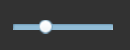

# HSlider 组件参考

## 1、了解HSlider组件

### 1.1 HSlider的作用与效果演示

​	HSlider与VSlider组件都是Slider组件的子类，它们分别表示横向滑动条与纵向滑动条。用户可以通过在滑块轨道之间移动滑块来选择值。常用于如播放器进度控制、音量大小控制，一些UI上的数值调整等。

​      HSlider 组件采用水平方向。滑块轨道从左向右扩展，而显示滑动块位置数值的标签位于轨道的上部，可隐藏。

​       
​    （图1）

### 1.2 HSlider组件的皮肤（skin）规范

​	HSlider资源命名规以hsliser为前缀名，它的默认资源总共3个，分别为滑块资源`hslider$bar.png`、进度条资源`hslider$progress.png` 及底图资源`hsliser.png`。

​	资源至少应当有两个，一个底图资源，一个滑块资源，否则无法实现滑动功能。缺少了进度条资源组件不会报错，只是不显示进度。

 	tips：进度条资源`vslider$progress.png`可以与底图资源`vsliser.png`互换，互换后进度可以反向显示。

 
​    （图2）

### 1.3 HSlider组件的API介绍

HSlider的API介绍请参考 [http://layaair.ldc.layabox.com/api/index.html?category=Core&class=laya.ui.HSlider](http://layaair.ldc.layabox.com/api/index.html?category=Core&class=laya.ui.HSlider)。

## 2、通过LayaAirIDE创建HSlider组件

### 1.1 创建HSlider

​        点击选择资源面板里的 HSlider 组件资源，拖放到页面编辑区，即可添加 HSlider 组件到页面上。

​       HSlider 拖放到编辑器区后，设置sizeGrid九宫格属性，使之放大后不会拉伸，缩放后显示效果如下：

​         
​    （图2）

### 1.2 HSlider 组件常用属性

​        设置 HSlider 的属性 max 的值为 20、属性 min 的值为0、属性 value 的值为5后，显示效果如下：

​         
​    （图3）

**max：**HSlider滑块拖动到最右边时的最大值，默认数值为100；

**min：**Hslider滑块拖动到最左边时的最小值，默认为0；

**value：**滑块目前所处的数值，应当等于max或min，或在它们之间的值。

​         
​    （图4）

​        发布后编译运行，显示效果如下，可以拖动滑块来选择值：

​         
​    （图5）

### 1.3 HSlider 组件特殊其他属性

 通用其他属性在”属性设置器“中已有详细介绍，下列为关于HSlider组件相关的特殊属性。

| **属性**         | **功能说明**                          |
| -------------- | --------------------------------- |
| allowClickBack | 一个布尔值，指定是否允许通过点击滑动条改变 value 属性值。  |
| showLabel      | 一个布尔值，指定是否隐藏在滑块上方显示value值的标签。     |
| tick           | 滑动条的刻度值，是指滑块每次拖动的value值改变量。默认值为1。 |

 
