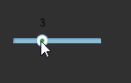
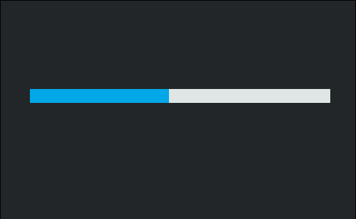

# HSlider 组件参考


## 一、通过LayaAirIDE创建HSlider组件

### 1.1 创建HSlider

​        使用 HSlider 控件，用户可以通过在滑块轨道的终点之间移动滑块来选择值。
​        HSlider 组件采用水平方向。滑块轨道从左向右扩展，而标签位于轨道的顶部或底部。

​        点击选择资源面板里的 HSlider 组件，拖放到页面编辑区，即可添加 HSlider 组件到页面上。
​        HSlider 组件的脚本接口请参考 [HSlider API](http://layaair.ldc.layabox.com/api/index.html?category=Core&class=laya.ui.HSlider)。

​        HSlider 组件的图像资源示例：

​        <br/>
​    （图1）
​        <br/>
​    （图2）

​        HSlider 拖放到编辑器区后，显示效果：

​        <br/>
​    （图3）

​        设置 HSlider 的属性 max 的值为 10、属性 min 的值为0、属性 value 的值为3后，显示效果如下：

​        <br/>
​    （图4）

​        在程序中运行时，可以拖动滑块来选择值：

​        <br/>
​    （图5）


### 1.2 HSlider 组件常用属性

​        <br/>
​    （图6）

 

| **属性**         | **功能说明**                         |
| -------------- | -------------------------------- |
| allowClickBack | 一个布尔值，指定是否允许通过点击滑动条改变 value 属性值。 |
| max            | 获取或设置表示最高位置的数字。 默认值为100。         |
| min            | 获取或设置表示最低位置的数字。 默认值为0。           |
| showLabel      | 一个布尔值，指定是否显示标签。                  |
| sizeGrid       | 滑动条背景图资源的有效缩放网格数据（九宫格数据）。        |
| skin           | 滑动条的图像资源地址。                      |
| tick           | 滑动条的刻度值。默认值为1。                   |
| value          | 滑块位置的数字值。                        |

 

## 二、通过代码创建HSlider组件 

​	在我们进行书写代码的时候，免不了通过代码控制UI，在代码中导入`laya.ui.HSlider`的包，创建UI HSlider,并通过代码设定HSlider相关的属性。

**示例代码：**

```javascript
package
{
	import laya.display.Stage;
	import laya.ui.HSlider;
	import laya.utils.Handler;
	import laya.webgl.WebGL;
	
	public class UI_Slider
	{
		public function UI_Slider()
		{
			// 不支持WebGL时自动切换至Canvas
			Laya.init(550, 400, WebGL);

			Laya.stage.alignV = Stage.ALIGN_MIDDLE;
			Laya.stage.alignH = Stage.ALIGN_CENTER;

			Laya.stage.scaleMode = Stage.SCALE_SHOWALL;
			Laya.stage.bgColor = "#232628";
				
			var skins:Array = [];
			skins.push("../../../../res/ui/hslider.png", "../../../../res/ui/hslider$bar.png");
			Laya.loader.load(skins, Handler.create(this, placeHSlider));
		}
		private function placeHSlider():void 
		{
			var hs:HSlider = new HSlider();
			hs.skin = "../../../../res/ui/hslider.png";
			
			hs.width = 300;
			hs.pos(50, 170);
			hs.min = 0;
			hs.max = 100;
			hs.value = 50;
			hs.tick = 1;
			
			hs.changeHandler = new Handler(this, onChange);
			Laya.stage.addChild(hs);
		}
		private function onChange(value:Number):void
		{
			trace("滑块的位置：" + value);
		}
	}
}
```

**运行结果:**
​	<br/>
​	(图5)通过代码创建HSlider

​	HSlider的其他属性也可以通过代码来设置，上述示例演示了如何通过代码创建不同皮肤（样式）的HSlider，

有兴趣的读者可以自己通过代码设置HSlider，创建出符合自己需要的HSlider。