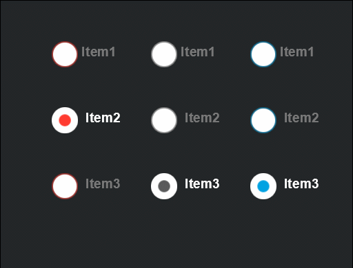

# RadioGroup 组件参考


## 一、通过LayaAirIDE创建RadioGroup组件

### 	1.1 创建RadioGroup

​        RadioGroup  是单选框组，通常被用于显示游戏中需要进行同类单项选择的一些功能设置显示。可以通过设置RadioGroup 的属性labels 来定义单选框组各项的文本描述。
​        点击选择资源面板里的 RadioGroup 组件，拖放到页面编辑区，即可添加 RadioGroup  组件到页面上。
​        RadioGroup 的脚本接口请参考 [RadioGroup API](http://layaair.ldc.layabox.com/api/index.html?category=Core&class=laya.ui.RadioGroup)。

​        RadioGroup 组件的图像资源示例：

​        <br/>
​    （图1）

​        设置 RadioGroup 的属性 labels 的值为 “radio1,radio2,radio3”，和属性 space 的值为 10 后，显示效果如下：

​        <br/>
​    （图2）

 

### 1.2 RadioGroup  组件的常用属性

​        <br/>
​    （图3）

 

| **属性**        | **功能说明**                                 |
| ------------- | ---------------------------------------- |
| skin          | 单选框图像资源。                                 |
| labels        | 单选框组的标签文本内容集合字符串，以逗号分隔。                  |
| space         | 单选框组的每个选项之间的间隔。                          |
| direction     | 单选框组的排列方向。取值：“horizontal”表示水平布局，“vertical”表示垂直布局。 |
| selectedIndex | 表示当前选择的单选框的索引。                           |


## 二、通过代码创建RadioGrounp组件

​	在我们进行书写代码的时候，免不了通过代码控制UI，在代码中导入`laya.ui.RadioGrounp`的包，创建UI RadioGrounp,并通过代码设定RadioGrounp相关的属性。

**示例代码：**

```javascript
package
{
	import laya.display.Stage;
	import laya.ui.RadioGroup;
	import laya.utils.Handler;
	import laya.webgl.WebGL;
	
	public class UI_RadioGroup
	{
		private const SPACING:int = 150;
		private const X_OFFSET:int = 200;
		private const Y_OFFSET:int = 200;
		
		private var skins:Array;
		
		public function UI_RadioGroup()
		{
			// 不支持WebGL时自动切换至Canvas
			Laya.init(800, 600, WebGL);

			Laya.stage.alignV = Stage.ALIGN_MIDDLE;
			Laya.stage.alignH = Stage.ALIGN_CENTER;

			Laya.stage.scaleMode = Stage.SCALE_SHOWALL;
			Laya.stage.bgColor = "#232628";
			
			skins = ["res/ui/radioButton (1).png", "res/ui/radioButton (2).png", "res/ui/radioButton (3).png"];
			Laya.loader.load(skins, Handler.create(this, initRadioGroups));
		}

		private function initRadioGroups(e:*=null):void
		{
			for (var i:int = 0; i < skins.length;++i)
			{
				var rg:RadioGroup = createRadioGroup(skins[i]);
				rg.selectedIndex = i;
				rg.x = i * SPACING + X_OFFSET;
				rg.y = Y_OFFSET;
			}
		}
		
		private function createRadioGroup(skin:String):RadioGroup
		{
			var rg:RadioGroup = new RadioGroup();
			rg.skin = skin;
			
			rg.space = 70;
			rg.direction = "v";
				
			rg.labels = "Item1, Item2, Item3";
			rg.labelColors = "#787878,#d3d3d3,#FFFFFF";
			rg.labelSize = 20;
			rg.labelBold = true;
			rg.labelPadding = "5,0,0,5";
			
			rg.selectHandler = new Handler(this, onSelectChange);
			Laya.stage.addChild(rg);

			return rg;
		}

		private function onSelectChange(index:int):void
		{
			trace("你选择了第 " + (index + 1) + " 项");
		}
	}
}
```

**运行结果:**
​	<br/>
​	(图5)通过代码创建RadioGrounp

​	Image的其他属性也可以通过代码来设置，上述示例演示了如何通过代码创建不同皮肤（样式）的RadioGrounp，

有兴趣的读者可以自己通过代码设置RadioGrounp，创建出符合自己需要的图片。