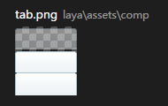
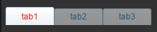
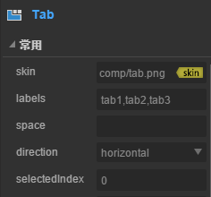
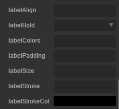
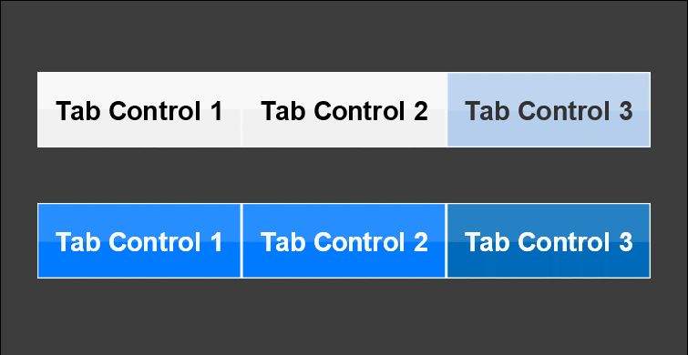

# Tab 组件参考


## 一、通过LayaAirIDE创建Tab组件

### 1.1 创建Tab        

​        Tab 组件用于显示多页面切换显示的选项卡按钮组。
​        点击选择资源面板里的 Tab 组件，拖放到页面编辑区，即可添加 Tab 组件到页面上。
​        Tab 组件的脚本接口参考 [Tab API](http://layaair.ldc.layabox.com/api/index.html?category=Core&class=laya.ui.Tab)。

​        Tab 组件的图像资源示例：

​        <br/>
​    （图1）

​        Tab 组件拖放到编辑器后，设置属性 selectedIndex 的值为0后，显示效果如下：

​        <br/>
​    （图2）

 

 

### 1.2 Tab 属性

 

​        <br/>
​    （图3）

​        <br/>
​    （图4）

 

| **属性**           | **功能说明**                                 |
| ---------------- | ---------------------------------------- |
| skin             | 选项卡按钮图像资源。                               |
| labels           | 选项卡的标签文本内容集合字符串，以逗号分隔。                   |
| space            | 选项卡的每个项之间的间隔。                            |
| direction        | 选项卡的排列方向。取值：“horizontal”表示水平布局，“vertical”表示垂直布局。 |
| selectedIndex    | 表示当前选择的项的索引。                             |
| labelAlign       | 选项卡按钮标签文本的对齐方式。                          |
| labelBold        | 选项卡按钮标签文本是否加粗显示。                         |
| labelColors      | 选项卡按钮各状态下的标签文本颜色。                        |
| labelFont        | 选项卡按钮标签文本的字体名称。                          |
| labelPadding     | 选项卡按钮标签文本的边距。                            |
| labelSize        | 选项卡按钮标签文本的字体大小。                          |
| labelStroke      | 选项卡按钮标签文本的描边宽度。                          |
| labelStrokeColor | 选项卡按钮标签文本的描边颜色。                          |

 

## 二、通过代码创建Tab组件

​	在我们进行书写代码的时候，免不了通过代码控制UI，在代码中导入`laya.ui.Tab`的包，创建UI Tab,并通过代码设定Tab相关的属性。

**示例代码：**

```javascript
package 
{
	import laya.display.Stage;
	import laya.ui.Tab;
	import laya.utils.Handler;
	import laya.webgl.WebGL;
	
	public class UI_Tab
	{
		private var skins:Array = ["res/ui/tab1.png", "res/ui/tab2.png"];
		
		public function UI_Tab()
		{
			// 不支持WebGL时自动切换至Canvas
			Laya.init(550, 400, WebGL);

			Laya.stage.alignV = Stage.ALIGN_MIDDLE;
			Laya.stage.alignH = Stage.ALIGN_CENTER;

			Laya.stage.scaleMode = Stage.SCALE_SHOWALL;
			Laya.stage.bgColor = "#232628";
			
			Laya.stage.bgColor = "#3d3d3d";
			Laya.loader.load(skins, Handler.create(this, onSkinLoaded));
		}
		
		private function onSkinLoaded(e:*=null):void
		{
			var tabA:Tab = createTab(skins[0]);
			tabA.pos(40, 120);
			tabA.labelColors = "#000000,#d3d3d3,#333333";
			
			var tabB:Tab = createTab(skins[1]);
			tabB.pos(40, 220);
			tabB.labelColors = "#FFFFFF,#8FB299,#FFFFFF";
		}
		
		private function createTab(skin:String):Tab
		{
			var tab:Tab = new Tab();
			tab.skin = skin;
			
			tab.labelBold = true;
			tab.labelSize = 20;
			tab.labelStrokeColor = "#000000";
			
			tab.labels = "Tab Control 1,Tab Control 2,Tab Control 3";
			tab.labelPadding = "0,0,0,0";
			
			tab.selectedIndex = 1;
			
			onSelect(tab.selectedIndex);
			tab.selectHandler = new Handler(this, onSelect);
			
			Laya.stage.addChild(tab);
			
			return tab;
		}
		
		private function onSelect(index:int):void
		{
			trace("当前选择的标签页索引为 " + index);
		}
	}
}
```

**运行结果:**
​	<br/>
​	(图5)通过代码创建Tab

​	Tab的其他属性也可以通过代码来设置，上述示例演示了如何通过代码创建不同皮肤（样式）的Tab，

有兴趣的读者可以自己通过代码设置Tab，创建出符合自己需要的单选框。