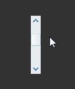
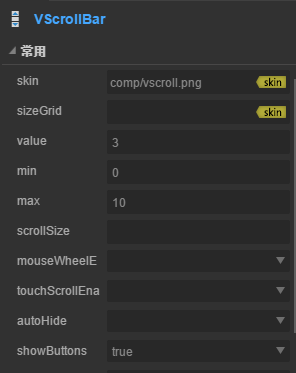
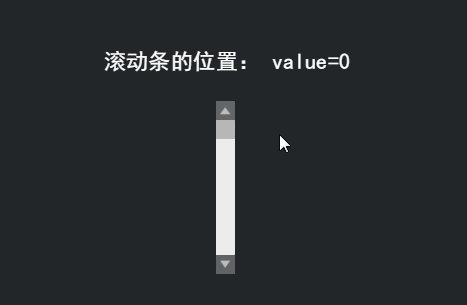

# VScrollBar 组件参考


## 一、通过LayaAirIDE创建VScrollBar 组件

### 1.1 创建VScrollBar 

 

​        VScrollBar 组件是一个垂直方向滚动条组件。
​        当数据太多以至于显示区域无法容纳时，最终用户可以使用 VScrollBar 组件控制所显示的数据部分。
​        滚动条由四部分组成：一个轨道图、一个滑块按钮和两个箭头按钮。
​        点击选择资源面板里的 VScrollBar 组件，拖放到页面编辑区，即可添加 VScrollBar 组件到页面上。
​        VScrollBar 组件的脚本接口请参考 [VScrollBar API](http://layaair.ldc.layabox.com/api/index.html?category=Core&class=laya.ui.VScrollBar)。
​        VScrollBar 组件的图像资源示例：

​        <br/>
​    （图1）

​        <br/>
​    （图2）
​        <br/>
​    （图3）

​        <br/>
​    （图4）

 

​        VScrollBar 拖放到编辑器区后，显示效果：

​        <br/>
​    （图5）

​        设置 VScrollBar 的属性 max 的值为 10、属性 min 的值为0、属性 value 的值为3后，显示效果如下：

​        <br/>
​    （图6）

​        在程序中运行时，可以拖动滑块或点击箭头按钮控制进度条的值：

​        <br/>
​    （图7）

​        设置 VScrollBar 的属性 showButtons 的值为 false时的显示效果：

​        <br/>
​    （图8）

​        在程序里运行时的效果：

​        <br/>
​    （图9）

### 1.2 VScrollBar 组件常用属性

​        <br/>
​    （图10）

 

| **属性**            | **功能说明**                            |
| ----------------- | ----------------------------------- |
| skin              | 滚动条的图像资源地址。                         |
| sizeGrid          | 滚动条轨道图资源的有效缩放网格数据（九宫格数据）。           |
| value             | 表示当前滚动位置的数字。                        |
| min               | 表示最低滚动位置的数字。                        |
| max               | 表示最高滚动位置的数字。                        |
| scrollSize        | 表示按下滚动条轨道时页面滚动的增量。                  |
| mouseWheelEnable  | 一个布尔值，指定是否滑轮滚动，默认值为true。            |
| touchScrollEnable | 一个布尔值，指定是否开启触摸，默认值为true。            |
| autoHide          | 一个布尔值，指定是否自动隐藏滚动条(无需滚动时)，默认值为false。 |
| showButton        | 一个布尔值，指定是否显示向上、向下按钮，默认值为true。       |

 

 

##  二、通过代码创建VScrollBar组件 

​	在我们进行书写代码的时候，免不了通过代码控制UI，创建`UI_ScrollBar` 类，在代码中导入`laya.ui.VScrollBar `的包，并通过代码设定VScrollBar 相关的属性。

**运行示例效果:**
​	<br/>
​	(图11)通过代码创建VScrollBar 

​	VScrollBar 的其他属性也可以通过代码来设置，下述示例代码演示了如何通过代码创建的VScrollBar ，有兴趣的读者可以自己通过代码设置VScrollBar ，创建出符合自己需要的滚动条。

**示例代码：**

```javascript
package
{
	import laya.display.Stage;
	import laya.display.Text;
	import laya.ui.HScrollBar;
	import laya.ui.ScrollBar;
	import laya.ui.VScrollBar;
	import laya.utils.Handler;
	import laya.webgl.WebGL;

	public class UI_ScrollBar
	{
		/***垂直滚动条资源**/
		private var skins:Array=["../../../../res/ui/vscroll.png", 
								"../../../../res/ui/vscroll$bar.png", 
								"../../../../res/ui/vscroll$down.png",
								"../../../../res/ui/vscroll$up.png"];
		/***提示信息文本框**/
		private var promptText:Text;		
		/****垂直滚动条****/
		private var vScrollBar:VScrollBar;
		
		
		public function UI_ScrollBar()
		{
			// 不支持WebGL时自动切换至Canvas
			Laya.init(800, 600, WebGL);
			//画布垂直居中对齐
			Laya.stage.alignV = Stage.ALIGN_MIDDLE;
			//画布水平居中对齐
			Laya.stage.alignH = Stage.ALIGN_CENTER;
			//等比缩放
			Laya.stage.scaleMode = Stage.SCALE_SHOWALL;
			//背景颜色
			Laya.stage.bgColor = "#232628";
			
			//加载资源
			Laya.loader.load(skins, Handler.create(this, onSkinLoadComplete));
		}

		/***加载资源完成***/
		private function onSkinLoadComplete(e:*=null):void
		{
			//创建垂直滚动条
			createVScroller();
		}
		
		/***创建垂直滚动条***/
		private function createVScroller():void 
		{
			//实例化水平滚动条
			vScrollBar= new VScrollBar();
			//加载皮肤资源（其他资源根据规范命名后，会自动加载）
			vScrollBar.skin = "../../../../res/ui/vscroll.png";
			//设置高度
			vScrollBar.height = 200;
			//设置位置
			vScrollBar.pos(400, 200);
			//最低滚动位置数字
			vScrollBar.min = 0;
			//最高滚动位置数字
			vScrollBar.max = 100;
			//滚动变化事件回调
			vScrollBar.changeHandler = new Handler(this, onChange);
			//加载到舞台
			Laya.stage.addChild(vScrollBar);
			
			//创建提示信息
			createPromptText(vScrollBar)
		}

		/***创建提示信息***/
		private function createPromptText(scrollBar:ScrollBar):void
		{
			//实例化提示信息
			promptText=new Text();
			//提示框字体
			promptText.font="黑体";
			//提示框字体大小
			promptText.fontSize=26;
			//提示框字体颜色
			promptText.color="#FFFFFF";
			//提示框初始文本
			promptText.text="您的选择是： ";
			//加载到舞台
			Laya.stage.addChild(promptText);
			//设置提示框位置
			promptText.pos(scrollBar.x-130,scrollBar.y-60);
			
		}
		
		/***滚动条位置变化回调***/
		private function onChange(value:Number):void 
		{
			promptText.text= "滚动条的位置： value=" + value;
		}
	}
}
```

