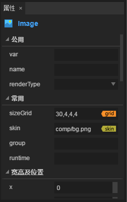
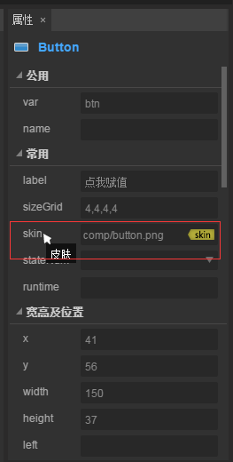

# 属性设置器

​         属性设置器是我们查看并编辑当前选中组件属性的工作区域。在场景编辑器或层级管理器中选中组件，就会在属性设置器中显示该组件的属性以供查询和编辑。

属性设置器面板如图1所示，从上到下通常为： 组件或节点名、**公用**属性、**常用**属性、**宽高及位置**、**旋转及缩放**、**其他**等等。

​         
​        	（图1）属性面板分组

## 1、`公用`属性介绍

公用属性中通常是`var`、`name`、`renderType`。如图2-1所示。

   (图2-1)

### 1.1 设置全局变量名称

`Var` ：声名一个唯一的全局变量名称，用于在项目的代码中根据这个名称来调用这个组件。

### 1.2 设置组件标识名称

`name`： 是组件的标识名称，通常用于层级管理器中区分其它组件，他的父容器也可以通过这个名称找到这个组件。

### 1.3 设置组件的节点功能类型

`renderType`：节点功能类型，分别有mask、hit、unHit、render、instance五种。

#### 1.3.1 设置为遮罩

　　当组件被设置为`mask`时，该组件为遮罩，其**父级组件**只有mask遮罩区域为可见，效果如动图2-2所示。

　　   （动图2-2）

#### 1.3.2 设置点击区域与非点击区域

　　当组件被设置为`hit`时，该组件所在的父级组件区域可以被点击。当组件被设置为`unHit`时，该组件所在的父级组件区域为非点击区域。**如果点区域hit的组件与非点击区域unHit的组件叠加时**，非点击区域unHit优先级更高。如图2-3所示，绿色圆所在的非点击区域（unHit），包括被叠加的嘴巴区域都不可以被点击。只有头部的红色半月区域可以被点击。

　　  (图2-3)

#### 1.3.3 设置为List的render

　　当该组件被设置为`render`时，该组件可重复渲染，用于列表List的制作。在制作列表的思路上，需要先将多个组件全选后通过ctrl+B设置为box容器。并将该容器的renderType属性设置为render。然后再使用ctrl+B将该box设置为List。如动图2-4所示。

  (动图2-4)

#### 1.3.4 设置为单例instance

　　当该组件被设置为`instance`时，该组件为单例组件，当多处重复使用的时候，单例组件仅会被实例化一次。节约性能开销。

　　

## 2、`常用`属性介绍

在常用属性里，有一些操作是通用的。这里我们分别介绍一下。

### 2.1 九宫格操作

九宫格是通过四条直线将UI分隔成9块，如果出现对UI的拉伸操作，中间区域为计算填充，其它区域会保持原有设计，无论UI如何拉伸都会保持不变。是游戏开发中常用的功能。

常用属性中的`sizeGrid`属性正是九宫格设置，通过点击属性输入栏右侧的`grid`按钮，可以进入九宫格设置的可视化操作面板。如图3-1所示。

   (图3-1)

当打开九宫格设置后，左侧为效果预览区、右侧为九宫格可视化操作区。通过鼠标拖拽的方式改变九宫格填充区域，即时获得预览效果，调整完点击确定即可。操作如动图3-2所示。

   (动图3-2)

#### 2.2 皮肤设置

`skin`属性可以设置改变组件的皮肤。除了手动在属性栏内输入皮肤的路径外，还可以从资源管理器中直接拖动资源到`skin`属性输入栏，快速实现皮肤的切换。另外，点击属性输入栏右侧的`skin按钮`，可以从众多的资源中，快速定位到当前的资源。操作如动图3-3所示。

   (动图3-3)

#### 2.3 强大的runtime属性

`runtime`是属性管理器中非常强大的一个组件扩展功能。通过在runtime属性中设置逻辑类，实例时创建的不再是组件的可视类，而是runtime属性中指定的逻辑类。该属性中需要指定逻辑类的全路径，例如“game.user.player”。

#### 2.4 可视化颜色设置

在color的属性设置时，可以手动输入颜色值，也可以点击右侧的颜色设置按钮，在颜色设置面板中指定颜色，然后点击面板外的任意区域即可完成可视化颜色设置，如动图3-4所示。

  （动图3-4）

#### 2.5 数字的拖拉调节

如果属性值是数字的话，输入框边上会有一个拖拉调节面板。很多开发者没有注意到这个小技巧，通过鼠标左键点击调节面板，然后向上拖动或向下拉，即可对数字进行微调，场景编辑器中的对应组件也会产生即时的可视化变化。如动图3-5所示。

   (动图3-5)

## 3、其它说明

属性管理器中有很多属性是每个组件的独特属性，非公共的属性使用介绍可以参考IDE组件属性详解的文档。也可以通过属性的提示快速理解作用，如图4所示。当鼠标放置到属性名称的上方，会自动弹出属性对应中文说明。

 （图4）

