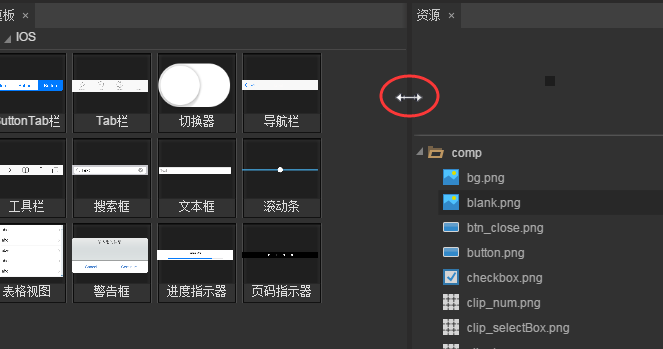
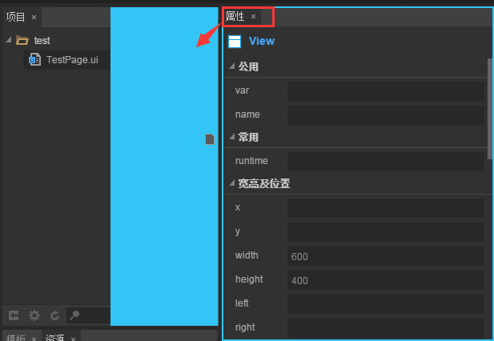
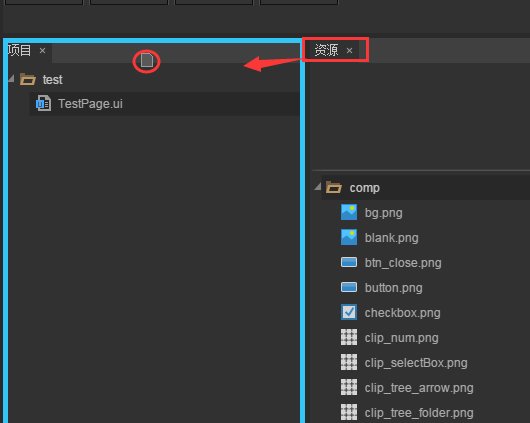
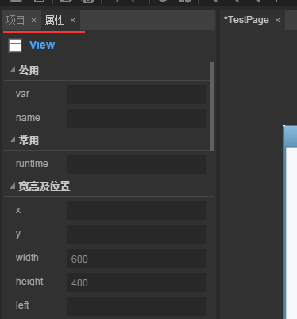
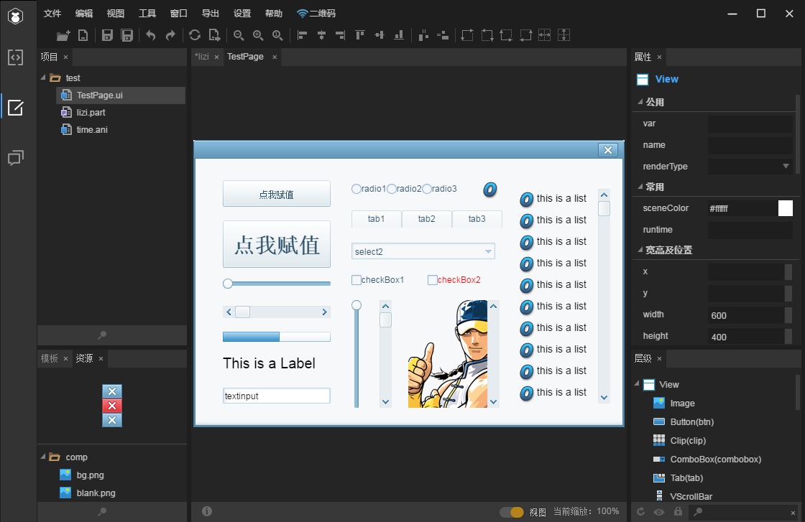

# 自定义界面布局与恢复

> 编辑器布局是指LayaAirIDE里各个面板的位置、大小和层叠情况。 
>
> 这里主选菜单里的【窗口】菜单，可以将不小心关闭的视图恢复，以及一键恢复初始面板样式（快捷键F3）。在预设布局的基础上，您也可以继续对各个面板的位置和大小进行调节。对布局的修改会自动保存。 
>

### 一、调整面板大小：

​        将鼠标悬浮到两个面板之间的边界线上，看到鼠标指针发生变化后，就可以按下鼠标来修改相邻两个面板的大小。

​	 
​	（图1）

### 二、移动面板：

​        点击面板的标签栏并拖拽，可以将面板整个移动到编辑器窗口中的任意位置。下图中红框便是可拖拽的标签栏区域，箭头表示拖拽方向：

​	 
​	（图2）

 

### 三、层叠面板：

​        除了移动面板位置，拖拽标签栏的时候还可以移动鼠标到另一个面板的标签栏区域

​	 
​	（图3）

​        在目标面板的边框出现深蓝色外框显示时松开鼠标，就能够将两个面板层叠在一起，同时只能显示一个面板：

​	 
​	（图4）

​        层叠面板在桌面分辨率不足，或排布使用率较低的面板时非常的实用。层叠中的面板可以随时拖拽出来，恢复永远在最上的显示。 

 

### 四、恢复面板：

​        如果您需要将面板布局恢复至最初模式，可以通过快捷键 F3 对面板布局一键恢复至默认面板布局。

​	  
​	（图5）面板初始化

 