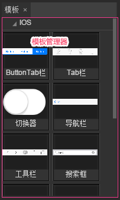
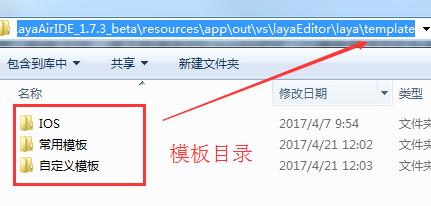

# 模板库

>  本篇采用LayaAirIDE 1.7.3 bate 截图，如有不同，请下载最新的LayaAirIDE，以最新版本IDE为准。

​        

模板库是我们用来存放和使用模板的工作区域。使用模板可以大大的提升工作人员的效率需求。  

### 一、默认的IOS风格模板

​        LayaAirIDE默认提供了一批IOS风格的常用UI模板，如图1所示。

​         
​        （图1）

​    

### 二、创建常用模板和自定义模板

在`项目管理器`中的UI文件，可以直接右键转换成`常用模板`或者是`自定义模板`。如动图2所示。

   (动图2)

转换成功后会自动刷新面板，如是是首次使用模板转换功能，会自动创建对应的模板目录，如图3所示，我们可以看到`IOS`、`常用模板`、`自定义模板`三个分类目录。

   (图3)

模板的目录位于`IDE根目录\resources\app\out\vs\layaEditor\laya\template`目录中，如图4所示，

  (图4)

*Tips: 创建的UI模板是可以用于其它项目的通用模板。*

