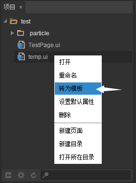
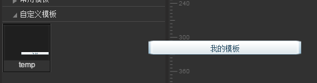

# 模板管理器

 

​        模板管理器是我们用来使用和管理模板的工作区域。在进行工作时，使用模板可以大大的提升工作人员的效率需求。  

### 一、界面介绍

​        模板管理器 将项目模板文件夹中的内容以树形缩略图的形式展示出来，开发者可以自己创建模板来保存，模板是全局通用的。LayaAirIDE第一次运行时已创建了一批IOS的模型。

​         
​        （图1）

 

### 二、创建模板

​        在 项目管理器 中我们可以自己定义出一个模板 View 然后转换成模板保存。

​        首先，我们需要创建一个新的页面，并配置好我们的模板样式。设置好样式之后，我们需要将场景大小设置成与模板大小一样，否则在以后的使用中可能会出现坐标系不准确的错误。

​          
​        （图2）

​        在 项目管理器 中我们选中模板页面，点击鼠标右键，在弹出的菜单中选择转为模板。

​          
​        （图3）

​        在弹出的窗口中我们来设置需要转换成自定义模板或常用模板。

​          
​        （图4）

​        点击新增按钮，我们就可以在 模板管理器 中看到我们创建出来的模板了。

​         
​        （图5）