# 时间轴动画编辑器详解

> 时间轴动画编辑器最是LayaAirIDE中的核心模块，通过对时间轴上的关键帧制作，自动生成运动中的动画帧，可快捷的实现游戏中alpha透明度渐变、位移、旋转、缩放等动画效果。节省了制作人员的大部份时间，提高了开发效率。本篇从创建时间轴动画至编码运用，全面介绍时间轴动画编辑器的功能及使用。
>


# 1. 创建时间轴动画

　　**时间轴动画有两种创建方式**。一种是创建`.ani`文件的时间轴动画，另一种是在UI页面（`.ui`文件）内创建时间轴动画。

　　两种文件制作时间轴动画的方式完全相同，**区别**仅在于`.ani`文件内创建的时间轴动画可被其它UI页面使用，而在UI页面内创建的时间轴动画，仅可在当前的UI页面内使用。

　　对于通用的时间轴动画，建议在.ani文件内创建。本篇以.ani文件方式为示例。

### 1.1 创建时间轴动画文件ani

**步骤一**：在项目管理器中，`右键`菜单里， 选择 `新建` -> `动画`，如图1所示。

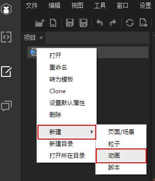<br />（图1）


**步骤二**：左键点击`动画`后，将弹出时间轴动画创建面板，如图2所示。输入`动画名称`，点击`确定`，即完成了`TimeLine.ani`动画文件的创建，如图3所示。

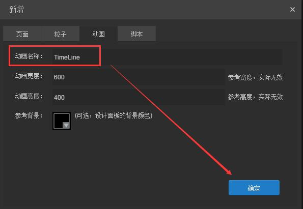<br /> （图2）

*Tips: 面板中的各栏目说明，请参考文档《UI页面、粒子、动画、脚本新增面板详解》*


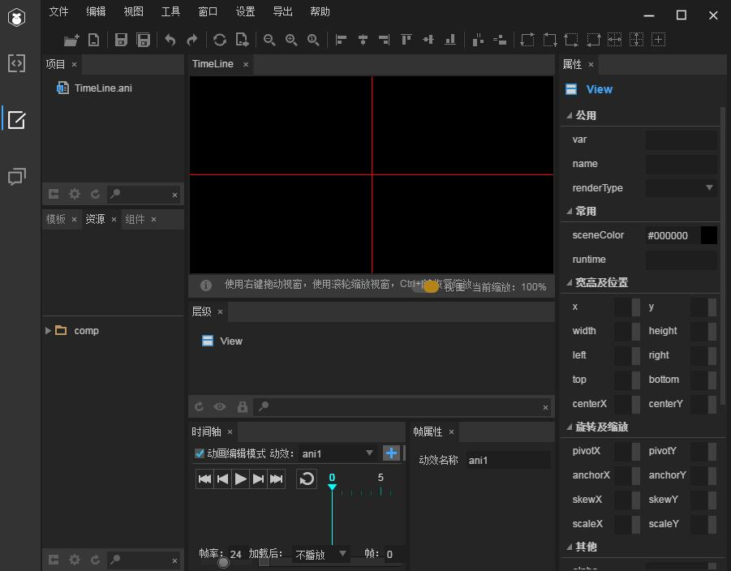<br />（图3）

**Tips:**

　　打开`.ani`或`.ui`文件，`时间轴`面板与`帧属性`面板默认位于IDE的下方，制作时间轴动画这两个面板需要配合使用，如果找不到或不小心关掉了，可以按快捷键`F3`恢复为默认面板布局。

　　在`.ani`文件中，场景编辑区的起始坐标（`0,0`）点位于两条红线交叉的中心点。与UI文件的左上角有所不同，大家需要注意。

### 

### 1.2 时间轴面板功能介绍

#### 1.2.1 动画效果编辑控制工具

​	<br/>
​	（图3）

动画编辑模式：勾选后可以对当前的动画效果进行编辑。

动效选择框：一个页面里可以有多个动效。在动效下拉选框中选择当前要编辑的动效。

加号按钮：新建一个动画效果。

垃圾桶按钮：删除当前动画效果。


### 创建时间轴动画


#### 1.2.1 导入位图资源


　　

时间轴动画编辑器面板：

　　


LayaAir IDE 的时间轴动画编辑功能。可以有效的实现页面显示的效果多样性，使得开发者可以方便快捷的在页面添加动画效果。

　　时间轴动画编辑器面板默认位于编辑区的下方。时间轴面板和帧属性面板通常需要配合使用。如果界面里不显示帧属性面板，可以在菜单栏->窗口选项列表中点击“帧属性面板”或“恢复面板设置”来显示帧属性面板。

​	<br/>
​	（图1）

　　时间轴动画的作用对象是页面里的显示对象节点。一个动画里可以包含一个或多个当前页面里的显示节点。一个页面里可以包含一个或多个动画。在时间轴面板里不勾选“动画编辑模式”时，可在编辑区编辑当前页面里的所有显示对象的属性。在时间轴面板里勾选“动画编辑模式”后显示动画编辑相关的功能界面。

​	<br/>
​	（图2）

 

*Tip：时间轴动画的逻辑实现类是 laya.ui包下的 FrameClip 类，如果在1.0.0及更高版本中打开1.0.0版本以下的 LayaAirIDE 项目进行时间轴动画的编辑应用时需要更新项目中使用的引擎版本，因为在低版本引擎中没有实现 FrameClip 类。*

 

### 一、界面功能介绍

 

#### 1.1

 

#### 1.2播放控制工具

​	<br/>
​	（图4）

时间轴动画编辑器面板上的播放控制工具，用于控制当前编辑中的动画的播放。从左向右依次为：首帧按钮、前一帧按钮、播放停止按钮、下一帧按钮、最后一帧按钮和是否循环播放按钮。

首帧按钮：点击后播放指针移动到时间轴的首帧。

前一帧按钮：点击后播放指针移动到当前所在帧的前一帧。如果当前帧是首帧，则播放指针移动到最后一帧。

播放停止按钮：点击后从播放指针开始播放动画效果。在播放状态下点击后停止播放动画。播放指针跟随动画播放移动到对应的帧。

下一帧按钮：点击后播放指针移动至当前所在帧的下一帧。如果当前帧是最后一帧，则播放指针移动到首帧。

最后一帧按钮：点击后播放指针移动到时间轴的最后一帧。 

循环播放选项按钮：选中后再进行动画播放时，将会循环播放。

 

#### 1.3帧属性面板

​	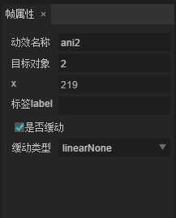<br/>
​	（图5）
​	<br/>
​	（图6）

 

在时间轴上选中一个帧时，在帧属性面板里显示了当前帧的帧属性。

动效名称：当前编辑的动画效果的引用名。

目标对象：当前帧所处节点的id。

当前帧所控制的属性名：属性值。出现条件：选择的是属性层的帧。

标签label：当前关键帧的帧标签。出现条件：当前选择的是属性层的关键帧。

是否缓动：当前属性层关键帧的属性值向下一个关键帧设定的属性值过渡时是否使用缓动效果。出现条件：当前选择的是属性层的关键帧。

缓动类型：用于设定当前属性层关键帧的属性值向下一个关键帧设定的属性值过渡时使用的缓动类型。出现条件：勾选了是否缓动选项。

 

#### 1.4时间轴

​	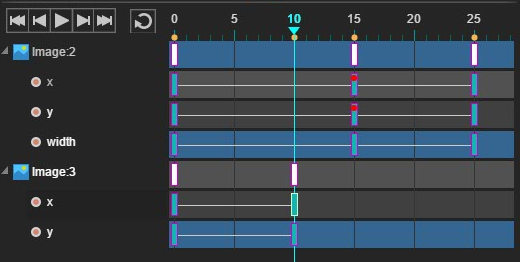<br/>
​	（图7）

 

在时间轴中制作动画需要明白两个基本概念：显示节点层和节点属性层。

在时间轴的左侧显示层控制列表，在层列表中以树状结构显示了显示对象节点层和包含在显示节点内的节点属性层，点击节点层的折叠/展开按钮（小三角形）对节点所包含的属性层进行折叠显示和展开显示操作。

时间轴动画的实现是基于时间轴上的层和层上的关键帧。每一层的节点属性在不同的关键帧上设置了不同的值，在同一节点的同一属性的相邻两个关键帧之间实现属性值的过渡切换效果。

新增关键帧：在时间轴上拖拽移动播放指针到某一帧后，在页面编辑区中改变某个显示节点的属性值（例如位置信息x、y）后，则在当前帧会新建一个关键帧，此关键帧记录了节点在当前帧的属性值。只要相应帧数下存在关键帧，时间轴标尺上便会显示一个黄色实心圆。

删除层：在时间轴左侧的层控制列表，右键单击层会弹出删除按钮，点击删除按钮可以删除当前层。如果删除的是显示节点层，则会删除此节点的所有属性层。

右键单击关键帧会弹出删除帧、删除Tween或批量删除帧选项。其中的删除帧和删除Tween 是针对节点属性层上的关键帧。 点击删除帧会删除当前层的关键帧。点击删除Tween 将会关闭此关键帧上的缓动效果，可在帧属性中看到取消勾选了“是否缓动”选项。批量删除帧是针对节点层的关键帧，点击后将会删除此节点当前帧下的所有关键帧。

在时间轴里，蓝色红边框的方块是节点属性的关键帧，节点属性关键帧在选中时显示为绿色白边框方块。白色红边框方块是节点层的关键帧，选中的节点关键帧显示为白色绿边框方块。设置了帧标签的关键帧上会显示一个红色实心圆点。

时间轴内节点所在的层(如图Image:2所在的层)关键帧是白色的，在这个节点的属性层添加关键帧后，节点层便会出现白色的方块，表示当前帧下某属性层存在关键帧。

节点层关键帧可在当前节点层拖拽移动。移动节点层关键帧时，此节点当前关键帧下的所有关键帧跟随移动。属性层关键帧可在当前属性层拖拽移动。

 

 

#### 1.5时间轴移动缩放工具

​	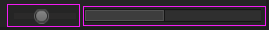<br/>
​	（图8）

时间轴移动缩放工具位于时间轴面板的最底部，靠右侧排列。从左向右依次为缩放时间轴工具和移动时间轴工具。

缩放时间轴工具：拖动缩放滑动条控制时间轴的缩放。

移动时间轴工具：拖动滑块移动时间轴。

 

#### 1.6帧与播放设置

​	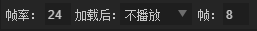<br/>
​	（图9）

帧率：默认值是24fps，可以编辑。用于设定每一秒动画的帧数。

帧：当前帧，播放指针所在的帧。拖动播放指针或播放动画时，当前帧的数值跟随变化。

加载后：在程序运行中，动画的初始播放状态设定。默认为不播放。可选值有：不播放、播放一次、循环播放。

  

 

### 二、制作时间轴动画

 接下来我们来制作一个简单的时间轴动画。以ActionScript3.0类型的项目为例，JavaScript 和 TypeScript 项目和此同理。

使用 LayaAir IDE新建一个ActionScript3.0类型的空项目。点击模式切换按钮，切换至UI编辑模式下。

1.新建页面，设置页面名称为 TimeLineExample，页面宽度为800，页面高度为600。点击确定按钮创建并在编辑区打开此页面。

​	<br/>
​	（图10）

2.导入资源。在项目的laya/assets 目录下放入页面使用的资源，然后在编辑区 F5刷新，在资源面板里显示了刚刚导入的资源。 

3.在页面 TimeLineExample内拖入一个背景图bg.png 并设置它的属性 x 和 y 的值都为0。

​	<br/>
​	（图11）

4.从资源面板里选中Image组件1.png并拖放到页面内，设置此图片的属性x 值为560，y值为50。从资源面板里选择并拖拽Image 组件2.png 放到页面内，设置它的属性 x值为366，y值为250。 

5.在时间轴面板里，勾选“动画编辑模式”选项，显示时间轴动画编辑功能区。默认会创建一个名为 ani1 的动画效果，此名称可在帧属性中修改。

​	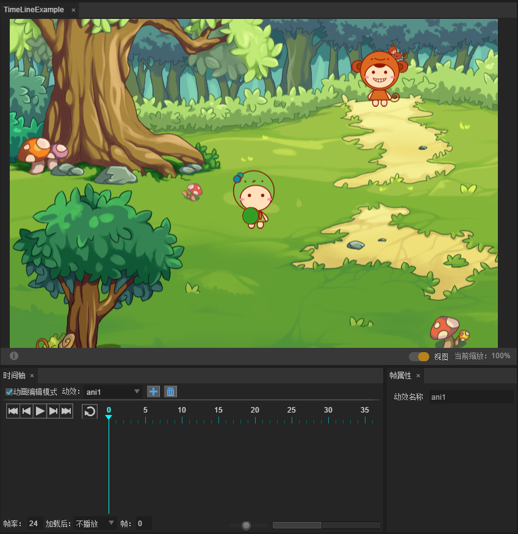<br/>
​	（图12）

6.拖拽帧指针移动到30帧，在资源面板面里选中Image 组件 1.png 并拖拽到页面上，设置它的属性x值为170、属性y 的值为490。

​	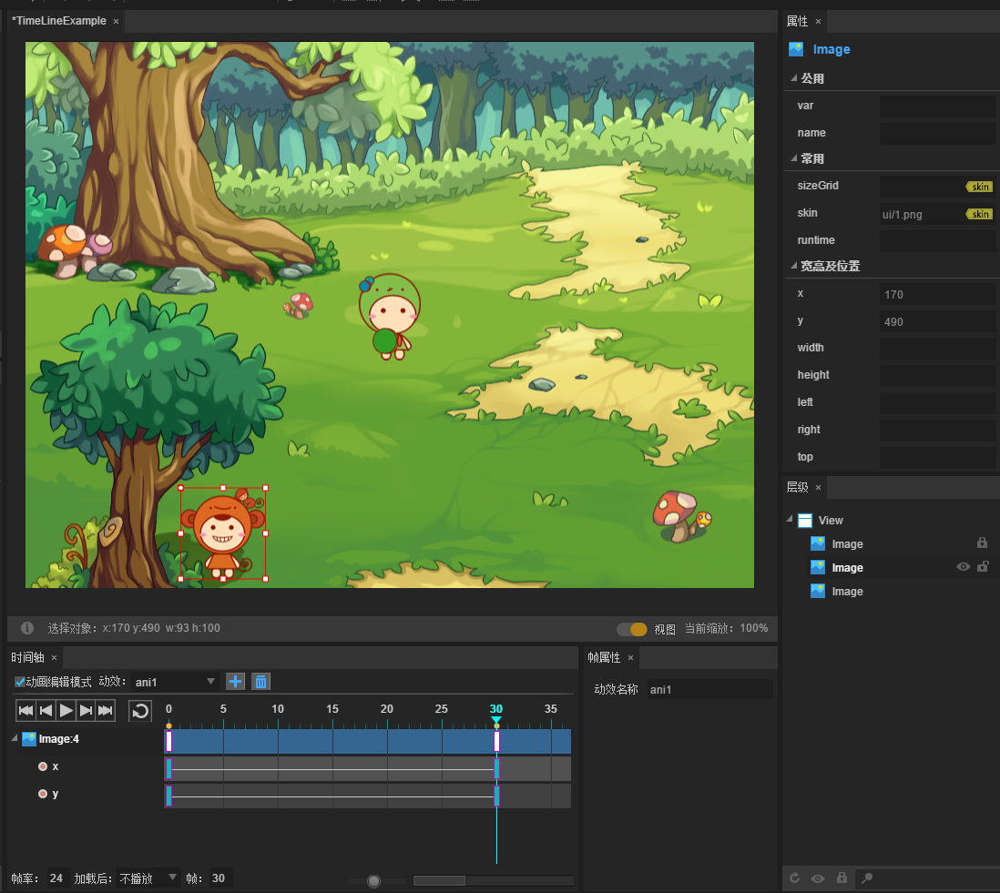<br/>
​	（图13）

拖拽帧指针移动到60帧，在页面里选中Image 组件 1.png，设置它的属性x 值为560，y值为50。

​	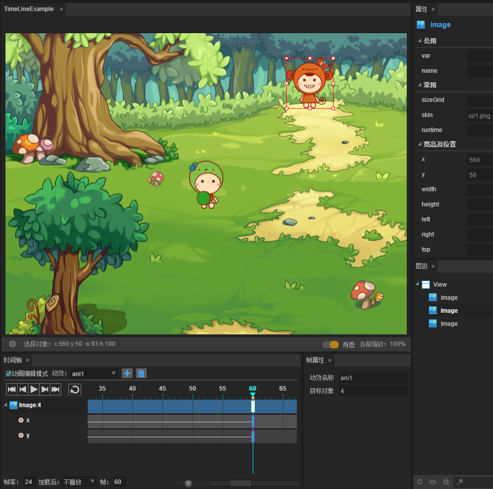<br/>
​	（图14）

然后点击播放控制工具栏中的播放按钮，可以在编辑区中查看动画效果。图片1.png 从页面的右上角移动到左下角后再移动到右上角的动画效果。 

​	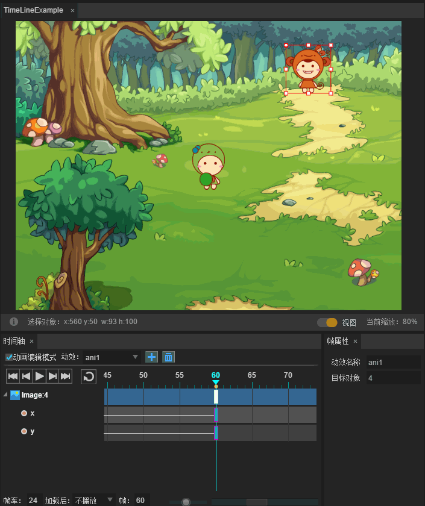<br/>
​	（图15）

7.拖拽帧指针移动到40帧，在页面里选中 Image 组件 2.png，设置它的属性scaleX、scaleY的值为0.5。

​	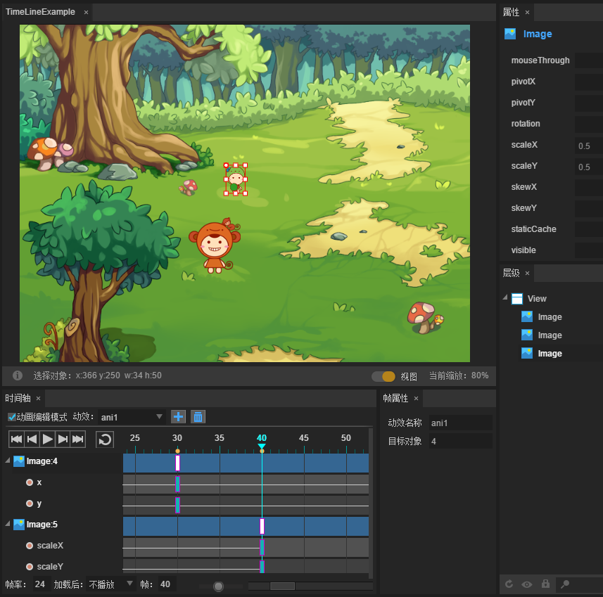<br/>
​	（图16）

拖拽帧指针移动到60帧，在页面里选中2.png，设置它的属性scaleX、scaleY的值为1。

​	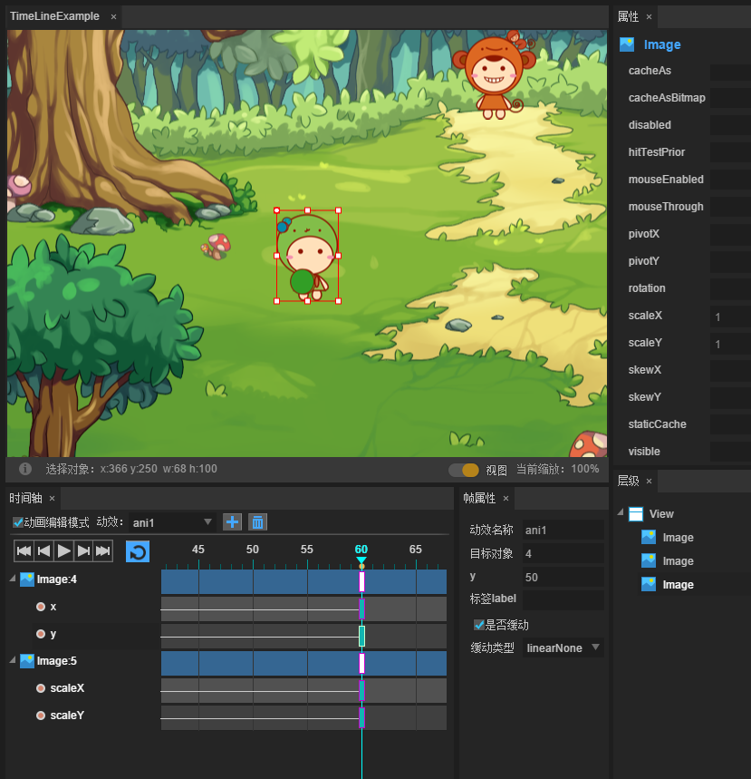<br/>
​	（图17）

然后点击播放控制工具栏中的播放按钮，可以在编辑区中查看动画效果。图片2.png 逐渐变小再逐渐变大的动画效果。

​	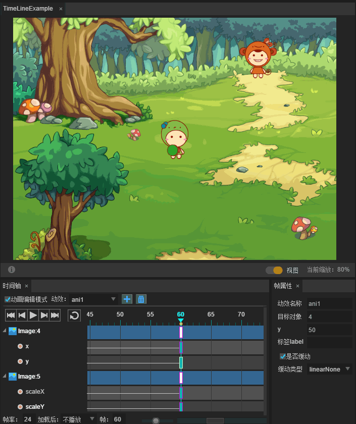<br/>
​	（图18）

8.从资源面板里选中拖拽一个 Image 组件logo.png 放到页面里，设置它的属性 var 的值为“logo”。

注意：如果当前已勾选 “动画编辑模式”选项，则需要先取消勾选“动画编辑模式”，再拖拽组件添加到页面。在动画编辑模块开启状态下，不可以对页面里的元素进行添加和移除操作。

​	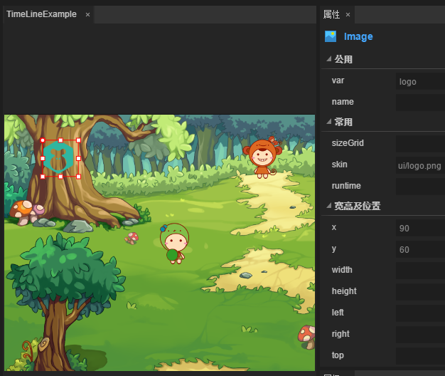<br/>
​	（图19）

9.点击导出或按下快捷键F12执行导出工作。

（1）执行导出工作后会将编辑好的所有页面生成页面代码文件，默认存放于src/ui 目录下。

（2）执行导出工作后会将资源文件以文件夹为单元打包成图集。

 

### 三、动画导出后在程序中的使用

1.在UI编辑中执行导出工作后，在 src/ui 目录下生成了UI页面 TimeLineExample 对应的类文件 TimeLineExampleUI.as。

2.在src目录下新建一个类 Example 继承自类TimeLineExampleUI，用于对已创建的页面 TimeLineExample 进行逻辑控制。

给 Image 组件logo添加点击事件侦听，在侦听处理函数内控制播放动画效果ani1。

代码如下：

```javascript
package
 
{
 
 import laya.events.Event;
 
 import ui.TimeLineExampleUI; 
 
 public class Example extends TimeLineExampleUI
 
 {
 
  public function Example()
 
  {
 
   super();   
 
   //给图片logo 添加点击事件侦听
 
   this.logo.on(Event.CLICK, this, onClick);
 
  }  
 
  private function onClick():void
 
  {
 
   //播放动画 ani1
 
   this.ani1.play(0, false);
 
  }
 
 }
 
}
```

3.在文档类中加载页面所需的资源文件，在加载完成函数内示例化UI界面TimeLineExample 的逻辑类 Example 并添加到舞台显示。

```javascript
package
{
 import laya.net.Loader;
 import laya.utils.Handler;
  
 public class Main
 {
  public function Main()
  {
   //初始化引擎
   Laya.init(1136, 640);
    
   //加载资源
   var res:Array = [];
   res.push({url: "res/atlas/ui.json", type: Loader.ATLAS});
   res.push({url: "ui/bg.png", type: Loader.IMAGE});
   Laya.loader.load(res, Handler.create(this, onComplete));
  }
   
  private function onComplete():void
  {
   //实例化类 Example，并添加到舞台显示。
   var ep:Example = new Example();
   Laya.stage.addChild(ep);
  }
 }
}
```

4.点击工具栏中的调试运行按钮或按下快捷键 F5 进行项目的调试运行效果查看。
点击游戏画面中的 logo，控制动画效果ani1的播放。

​	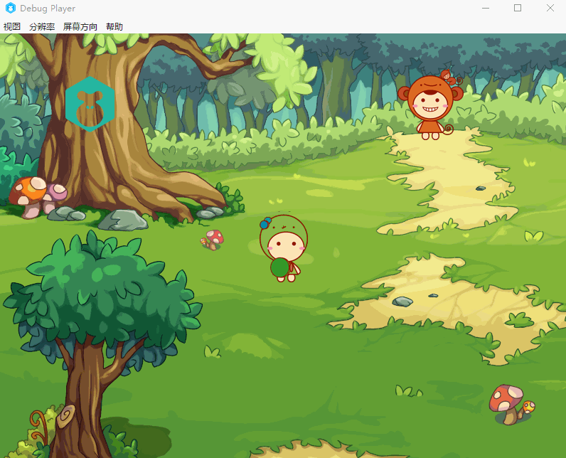<br/>
​	（图20）


本示例代码下载：[AniExample-AS.zip](http://ldc.layabox.com/uploadfile/file/20160708/1467976015203352.zip)

 

  

 