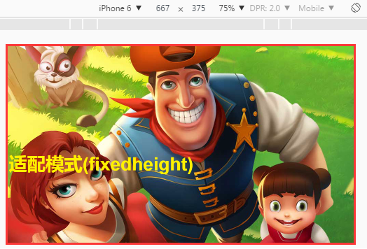

# 屏幕适配的缩放模式详解


​         缩放模式是屏幕适配的重点内容，本篇从基础概念到参数说明，并结合代码实例帮助大家理解LayaAir引擎的屏幕缩放模式。在 API文档中，我们搜索laya.display.Stage，可以看到关于缩放模式的方法scleMode共有七种参数，用于实现各种屏幕适配的缩放需求，参数说明如图1所示：

​        <br/>
​        （图1）LayaAir引擎关于缩放模式scaleMode的参数说明


**简单概览一下参数说明，我们先了解一些本篇涉及的基础概念：**

**1、设计宽高：** 

​        在项目代码中项目代码中初始化舞台Laya.init()中定义的宽高即为设计宽高。

**2、Stage宽高：**

​        stage宽高为游戏舞台实际大小的宽高。

**3、适配宽高：**

​       通过引擎的适配模式对设计宽高进行缩放改变后的宽高，为了便于区分理解，我们称为适配宽高。

**4、画布宽高：**

​        画布宽高是指HTML5中canvas节点的宽高，游戏中所有可见的内容都在画布区域内。

**5、屏幕宽高：**

​        屏幕宽高是指手机浏览器屏幕的宽高，例如iphone6竖屏时的屏幕宽高为`375*667`。LayaAir引擎可以通过laya.utils.Browser.clientWidth和laya.utils.Browser.clientHeight来获取屏幕的宽与高。

**6、物理宽高：**

​        关于设备屏幕的物理宽高，我们需要先了解像素密度的概念。在PC电脑上，通常一个像素位置上就是一个物理像素。在移动设备高速发展的今天，手机的屏幕上通常是一个像素位置上拥有2个或3个像素。例iphone6竖屏时的物理宽高为750*1334。LayaAir引擎可以通过laya.utils.Browser.width和laya.utils.Browser.height来获取设备屏幕屏幕的物理宽高。


### 一、exactfit模式

​        exactfit模式是一种不考虑内容的原始比例，直接通过非等比缩放填满整个浏览器屏幕的模式。在这种模式下，画布宽高与stage宽高都等于设计宽高，且不会发生改变。但是当物理宽高与设计宽高不等时，这种非等比的缩放模式可能会导致原有设计明显变形。效果如图2、图3所示。

​        <br/>
​        （图2）设计宽高为`1136*640`，物理宽高为`1334*750`的exactfix模式运行效果

​        <br/>
​        （图3）设计宽高为`1136*640`，物理宽高为`750*1334`的exactfit模式运行效果


**exactfit模式示例代码：**

```javascript
(function()
{
    var Stage  = Laya.Stage;
    var Text   = Laya.Text;
    var Image  = Laya.Image;
 
        //适配模式
        var modes = "exactfit";
         
        //全局文本信息
        var txt;
 
    (function()
    {
        //初始化舞台大小
 
       Laya.init(1136,640);
         
        //设置适配模式
        Laya.stage.scaleMode = modes;
 
 
        //设置舞台背景色
        Laya.stage.bgColor  = "#ffff99";
 
 
        //实例一个背景
        var bg = new Image();
        bg.skin = "res/img/loadingBg.jpg";
        Laya.stage.addChild(bg);
 
 
 
        //实例一个文本
        txt = new Text();
        txt.text = "适配模式("+modes+") ";
        txt.bold = true;
        txt.pos(10, 350);
        txt.fontSize = 60;
        txt.color   = "#fff000";
        Laya.stage.addChild(txt);
    })();
 
})();
```


### 二、fixedheight模式

​        fixedheight 模式下，画布与stage的高保持设计高度不变，画布与stage的宽等于适配宽度（适配宽度=设计高度*屏幕宽高比），最后按屏幕宽高进行全屏缩放适配，该模式是主流的适配模式之一。

​        例如：iPhone6横屏时，屏幕宽高为`667*375`，设计高度为640，那么采用fixedheight模式后，`适配宽度=(667/375)*640`，适配宽度计算结果取整后的1138即为画布的宽度。示例拉伸适配全屏效果如图4所示：

​         <br/>
​        （图4）画布宽高为`1067*640`，物理宽高为`1334*750`的fixedheight模式运行效果

​        同理，iPhone6竖屏时`适配宽度=(375/667)*640`，适配宽度计算结果取整后的360即为画布的宽度。如果我们是按横屏设计的，那需要在使用该模式的时候，设置为自动横屏，否则画布之外的部分是不被显示的。fixedheight模式示例拉伸适配全屏效果如图5所示：

​        <br/>
​        （图5）画布宽高为`360*640`，物理宽高为`750*1334`的fixedheight模式运行效果


**fixedheight模式示例代码：**

```javascript
(function()
{
    var Stage  = Laya.Stage;
    var Text   = Laya.Text;
    var Image  = Laya.Image;
 
        //适配模式
        var modes = "fixedheight";
         
        //全局文本信息
        var txt;
 
    (function()
    {
        //初始化舞台大小
 
       Laya.init(0, 640);
         
        //设置适配模式
        Laya.stage.scaleMode = modes;
 
 
        //设置舞台背景色
        Laya.stage.bgColor  = "#ffff99";
 
 
        //实例一个背景
        var bg = new Image();
        bg.skin = "res/img/loadingBg.jpg";
        Laya.stage.addChild(bg);
 
 
 
        //实例一个文本
        txt = new Text();
        txt.text = "适配模式("+modes+") ";
        txt.bold = true;
        txt.pos(10, 350);
        txt.fontSize = 60;
        txt.color   = "#fff000";
        Laya.stage.addChild(txt);
    })();
 
})();

```


### 三、fixedwidth模式

​        fixedwidth模式下，画布与stage的宽保持设计宽度不变，画布与stage的高等于适配高度（`适配高度=设计宽度*屏幕高宽比`），最后按屏幕宽高进行全屏缩放适配，该模式是主流的适配模式之一。

​        例如：iPhone6横屏时，屏幕宽高为`667*375`，设计宽度为1136，那么采用fixedwidth模式后，`适配高度=(375/667)*1136`，适配高度计算结果取整后的639即为画布的高度。示例拉伸适配全屏效果如图6所示：

​        <br/>
​        （图6）画布宽高为`1136*639`，物理宽高为`1334*750`的fixedwidth模式运行效果

​        同理，iPhone6竖屏时适配高度=(667/375)*1136，适配高度计算结果取整后的2021即为画布的高度。如果我们是按横屏设计的，那需要在使用该模式的时候，设置为自动横屏，否则适配宽高超出屏幕宽高，再等比缩放至屏幕宽高进行全屏显示时，通常不是我们想要的效果。fixedwidth模式示例拉伸适配全屏效果如图6所示：

​        <br/>
​        （图6）画布宽高为`1136*2021`，物理宽高为`1334*750`的fixedwidth模式运行效果


**fixedwidth模式示例代码：**

```javascript
(function()
{
    var Stage  = Laya.Stage;
    var Text   = Laya.Text;
    var Image  = Laya.Image;
 
        //适配模式
        var modes = "fixedwidth";
         
        //全局文本信息
        var txt;
 
    (function()
    {
        //初始化舞台大小
 
       Laya.init(1136, 0);
         
        //设置适配模式
        Laya.stage.scaleMode = modes;
 
 
        //设置舞台背景色
        Laya.stage.bgColor  = "#ffff99";
 
 
        //实例一个背景
        var bg = new Image();
        bg.skin = "res/img/loadingBg.jpg";
        Laya.stage.addChild(bg);
 
 
 
        //实例一个文本
        txt = new Text();
        txt.text = "适配模式("+modes+") ";
        txt.bold = true;
        txt.pos(10, 350);
        txt.fontSize = 60;
        txt.color   = "#fff000";
        Laya.stage.addChild(txt);
    })();
 
})();
```


### 四、full模式

​        full模式下，stage与画布的宽高会无视设计宽高，直接等于物理宽高，因此这也是游戏画质精度最高的主流缩放模式。在该模式下，设计内容不会被缩放，保持1：1原始比例的基础上，将舞台与浏览器屏幕左上角对齐，原设计内容超出屏幕的部分会被裁切。示例效果如图7、图8所示。
​        
​     （图8）设计宽高与物理宽高同为`1136*640`的full模式横屏运行效果

​        
​        （图9）设计宽高为`1136*640`，物理宽高为`960*640`的full模式横屏运行效果


**ful模式示例代码：**

```javascript
(function()
{
    var Stage  = Laya.Stage;
    var Text   = Laya.Text;
    var Image  = Laya.Image;
 
        //适配模式
        var modes = "full";
         
        //全局文本信息
        var txt;
 
    (function()
    {
        //初始化舞台大小
 
       Laya.init(0, 0);
         
        //设置适配模式
        Laya.stage.scaleMode = modes;
 
 
        //设置舞台背景色
        Laya.stage.bgColor  = "#ffff99";
 
 
        //实例一个背景
        var bg = new Image();
        bg.skin = "res/img/loadingBg.jpg";
        Laya.stage.addChild(bg);
 
 
 
        //实例一个文本
        txt = new Text();
        txt.text = "适配模式("+modes+") ";
        txt.bold = true;
        txt.pos(10, 350);
        txt.fontSize = 60;
        txt.color   = "#fff000";
        Laya.stage.addChild(txt);
    })();
 
})();
```

**Tips：**

​        1、尽管该模式是一种高精度适配模式，但是对游戏性能的压力也比其它模式要高，是否选择该模式要结合游戏整体情考量。

​        2、由于画布和stage的宽高是直接取自于屏幕的物理宽高，Laya.init()时的宽高值可以直接设为0。


### 五、noscale模式

​        noscale模式是不缩放模式，画布与stage的宽高等于设计宽高。保持1：1原始设计比例的基础上，将舞台与浏览器屏幕左上角对齐。当屏幕宽高小于内容时将进行裁切，当屏幕宽高大于内容时会出现黑边。该模式运行效果如图9、图10所示。

​        <br/>
​        （图10）屏幕宽高都大于设计宽高时效果

​        <br/>
​        （图11）设计内容超出屏幕宽度，屏幕高度大于设计高度的效果


**noscale模式示例代码如下：**

```javascript
(function()
{
    var Stage  = Laya.Stage;
    var Text   = Laya.Text;
    var Image  = Laya.Image;
 
        //适配模式
        var modes = "noscale";
         
        //全局文本信息
        var txt;
 
    (function()
    {
        //初始化舞台大小
 
       Laya.init(1136, 640);
         
        //设置适配模式
        Laya.stage.scaleMode = modes;
 
 
        //设置舞台背景色
        Laya.stage.bgColor  = "#ffff99";
 
 
        //实例一个背景
        var bg = new Image();
        bg.skin = "res/img/loadingBg.jpg";
        Laya.stage.addChild(bg);
 
 
 
        //实例一个文本
        txt = new Text();
        txt.text = "适配模式("+modes+") ";
        txt.bold = true;
        txt.pos(10, 350);
        txt.fontSize = 60;
        txt.color   = "#fff000";
        Laya.stage.addChild(txt);
    })();
 
})();

```


### 六、noborder模式

​        noborder模式下，画布宽高等于设计宽高。缩放时，按照屏幕宽高与设计宽高最大比率的一方进行缩放，比如设计尺寸为`1136*640`，屏幕的物理宽高为`750*1334`。计算得到宽的比率`（750/1136）`为0.66，高的比率`（1334/640）`为2.08。那么采用noborder模式缩放时，按最大的比率一方（高），将适配高度拉伸至物理高度的1334，适配宽度等比拉伸（`1334/640*1136`）为2368。当然，超过屏幕宽度的部分会被裁切掉。效果如图11所示。

​        <br/>
​        （图12）画布宽高保持设计尺寸`1136*640`时，适配宽高以最大比率一方拉伸至全屏


**noborder模式示例代码如下：**

```javascript
(function()
{
    var Stage  = Laya.Stage;
    var Text   = Laya.Text;
    var Image  = Laya.Image;
 
        //适配模式
        var modes = "noborder";
         
        //全局文本信息
        var txt;
 
    (function()
    {
        //初始化舞台大小
 
        Laya.init(1136, 640);
         
        //设置适配模式
        Laya.stage.scaleMode = modes;
 
 
        //设置舞台背景色
        Laya.stage.bgColor  = "#ffff99";
 
 
        //实例一个背景
        var bg = new Image();
        bg.skin = "res/img/loadingBg.jpg";
        Laya.stage.addChild(bg);
 
 
 
        //实例一个文本
        txt = new Text();
        txt.text = "适配模式("+modes+") ";
        txt.bold = true;
        txt.pos(10, 350);
        txt.fontSize = 60;
        txt.color   = "#fff000";
        Laya.stage.addChild(txt);
    })();
 
})();
```


### 七、showall模式

​        showall模式下，stage与画布的宽高等于缩放后的适配宽高，而缩放按照屏幕宽高与设计宽高最小比率的一方进行等比缩放。

​          比如设计尺寸为`1136*640`，屏幕的物理宽高为`750*1334`。计算得到宽的比率（`750/1136`）为0.66，高的比率（`1334/640`）为2.08。那么采用showall模式缩放时，按最小的比率一方（宽），画布宽度会被缩放为屏幕的物理宽度750，适配高度等比缩放（`750/1136*640`）为423。此时由于423远小于屏幕物理高度1334，因此会出现大量留黑的空屏。效果如图12所示。

​        <br/>
​        （图13）画布宽高被缩放至`750*423`，在物理宽高为`750*423`的屏幕上出现大量留黑空屏


**showall模式示例代码如下：**

```javascript
(function()
{
    var Stage  = Laya.Stage;
    var Text   = Laya.Text;
    var Image  = Laya.Image;
 
        //适配模式
        var modes = "showall";
         
        //全局文本信息
        var txt;
 
    (function()
    {
        //初始化舞台大小
 
         Laya.init(1136, 640);
         
        //设置适配模式
        Laya.stage.scaleMode = modes;
 
 
        //设置舞台背景色
        Laya.stage.bgColor  = "#ffff99";
 
 
        //实例一个背景
        var bg = new Image();
        bg.skin = "res/img/loadingBg.jpg";
        Laya.stage.addChild(bg);
 
 
 
        //实例一个文本
        txt = new Text();
        txt.text = "适配模式("+modes+") ";
        txt.bold = true;
        txt.pos(10, 350);
        txt.fontSize = 60;
        txt.color   = "#fff000";
        Laya.stage.addChild(txt);
    })();
 
})();
```


**结束总结：**

​        full模式完全按物理像素渲染，屏幕有多大，适配的画面就有多大，是高画质常用的适配模式，但是在不同尺寸的屏幕里，显示内容的大小会有所不同，同时对于HTML5游戏的性能压力要高于其它适配模式。

​        showall和noborder是等比缩放模式，会保持画面不变形。showall按照屏幕与设计宽高最小比率缩放，保证画面能完全显示出来，但会导致有空屏黑边。noborder刚好相反，按照屏幕与设计宽高最大比率缩放，不会出现空屏黑边，但会导致宽或高的部分内容无法显示出来。

​        fixedwidth与fixedheight更像showall和noborder的变种，同样也是等比缩放模式，但是指定了一边不动，另外一边进行缩放，是当前HTML5游戏中比较常用的主流适配模式。

​        本篇中为了重点介绍缩放模式的不同参数区别。并未结合屏幕自动旋转等其它屏幕适配设置，开发者可以查看相关的其它技术文档。

示例代码中所用的背景图片：

[loadingBg.jpg](http://ldc.layabox.com/uploadfile/file/20170223/1487816895380055.jpg)(点击打开或另存`1136×640`像素背景原图)