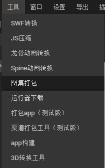
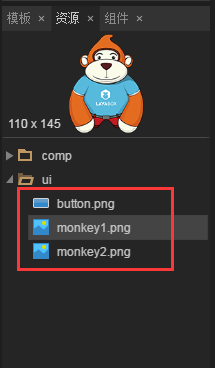
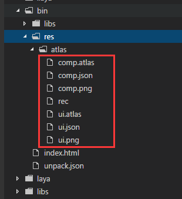
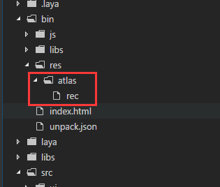

# 使用LayaAir制作图集并加载显示

*【注意】本篇教程采用LayaAitIDE1.7.3beta版本，文中如有不同请以最新LayaAirIDE版本为准。*

图集(Atlas)是游戏开发中常见的一种美术资源，通过工具将多张图片合并成一张大图，并通过atlas与json等格式的文件存放原始图片资源信息。图1就是采用LayaAirIDE打包好的一张png图集资源。

<br/>(图1)


## 1.为什么要使用图集资源

**在游戏中使用多张图片合成的图集资源作为美术资源，有以下优势：**

#### 1.1优化内存

合成图集时会去除每张图片周围的空白区域，加上可以在整体上实施各种优化算法，合成图集后可以大大减少游戏包体和内存占用。

#### 1.2 减少CPU运算

多个`Sprite`如果渲染的是来自同一张图集的图片时，这些`Sprite`可以使用同一个渲染批次来处理，大大的减少CPU的运算时间，提高运行效率。


## 2.支持图集打包的格式

LayaAirIDE支持对PNG与JPG两种资源格式打包为图集。但是图集打包的原始资源，推荐使用PNG，因为JPG的体积会较大。

*Tips：需要注意的是，PNG原始资源的位深度不能超过32，否则打包出来的图集会出现花屏。另外，PNG与JPG资源不能是其它格式的资源改名为PNG与JPG格式的。*


## 3.用LayaAirIDE制作图集的方式

LayaAirIDE中打包图集的方式一共有两种。

#### 3.1 使用IDE的图集打包工具

在IDE导航的`工具`菜单中，点击`图集打包`打开图集打包工具面板，如图2、图3所示。

<br/>(图2)

<br/>(图3)


**图集打包工具面板说明**

**`资源根目录`**

`资源根目录`是指图集打包前，原始资源目录的父级目录，该目录下，每一个目录对应一个图集文件，多个目录会生成多个图集文件。（打包后的图集文件以资源根目录下的子目录名命名，如图4、图5所示）

<br/>(图4)

<br/>(图5)

直接拖拽目录到`资源根目录`输入框，或者点击`浏览`获得目录路径的同时，会在`输出目录`自动填写与`资源根目录`相当的路径。

**`输出目录`**

`输出目录`是指打包后的图集资源存放目录。

默认与资源根目录相同，可以点击`浏览`或手动在`输出目录`输入框内更改路径。

*Tips：更改输出目录不能采用目录拖拽的方式，否则会影响到资源根目录的路径。*

**`图集最大宽\高度`**

默认值为`2048×2048`，该值决定单个图集的最大尺寸。如果原始图片过多，超过单个图集最大宽高时，则会在打包时生成新的图集文件（多个图集）。

**`单图最大宽\高度`**

默认值为`512×512`，超过这个尺寸的单图将不会被打包到图集中。

*Tips：超过512×512的单图不建议打包到图集中，可以单独预加载此图，但是，加载单图也不能超过1024×1024，否则会对性能有影响。*

**`2的整次幂`**

如果勾选，则生成的图集图片宽高将会是2的整次幂。

**`空白裁剪`**选项

如果勾选，则生成的图集图片会自动把原始图片中空白区域裁剪掉。


#### 3.2 资源管理器内自动打包图集

如图6所示，在资源管理器目录内的资源，当按F12或者Ctrl+F12导出时，会**自动打包为图集**。

<br/>(图6)

导出到项目后，自动打包好的图集位于“`项目根目录/bin/res/atlas/`”目录下，图集命名与打包工具中的图集命名一样，以目录名为图集名称，如图7所示。

<br/>(图7)


## 4.打包生成的图集文件介绍

#### 4.1 打包生成的文件

打包后，会生成图集专用资源（分别是同名的`.atlas`文件、`.json`文件、`.png`文件），以及图集打包程序用的`rec`文件（*这个rec文件打包软件使用，开发者不用管*），如上文的图7所示。

#### 4.2 atlas与json的区别

`.atlas`与`.json`文件彼此独立，都是png图集的配置信息。他们的区别在于：

`.atlas`是LayaAirIDE特有的图集配置信息，仅用于图集，所以在加载`.atlas`时不需要填写类型，和加载普通的单图方式一样，更加方便，是推荐的图集加载方式。atlas方式加载图集的示例代码为：

```javascript
//atlas方式图集使用示例
Laya.loader.load("res/atlas/ui.atlas",Laya.Handler.create(this,onLoaded));
```

`.json`是一种兼容第三方的图集配置方式，由于`.json`文件应用广泛，不仅仅用于图集，所以为了识别是否为图集配置信息，在加载`.json`文件的图集时，需要填写类型进行区分。json方式加载图集的示例代码为：

```javascript
//json方式图集使用示例
Laya.loader.load([{ url: "res/atlas/ui.json", type: Laya.Loader.ATLAS }], Laya.Handler.create(this, onLoaded));
```


## 5.打包图集常见的错误

#### 5.1 图集打包工具中的资源目录设置错误

使用`图集打包工具`时，如果开发者的`资源根目录`并未设置为图集`原始资源目录的父目录`时，打包工具并不会报错，仍然像正常打包一样，生成了图集资源，如图8、图9所示。然而，这种图集在项目中是无法使用的。

<br/>(图8)

<br/>(图9)


#### 5.2 删除图集文件后，无法重新导出的问题

当用户手动删除了图集文件，但并未删除rec文件时，如图10所示。在这种情况下，**如果原始资源没有发生改变，直接使用F12是无法重新导出图集文件的。**

此时，可以通过快捷键`Ctrl+F12`清理并导出。或者直接把rec文件也删除掉，再使用F12导出。即可正常导出图集。

<br/>(图10)


## 6. 如何在项目中使用图集中的小图

在项目中如果用到图集中的资源，则需先预加载图集资源，然后设置图片的皮肤（*skin*）属性值为“原小图目录名/原小图资源名.png”。

例如：上文中图6的资源打包后如图1所示，现在我们将图6中`ui`目录下的小图`monkey1.png`在项目中通过图集的方式显示出来，示例代码如下：

```javascript
// 程序入口
Laya.init(600, 400);
//预加载图集资源ui.atlas，然后执行回调方法onLoaded
Laya.loader.load("res/atlas/ui.atlas",Laya.Handler.create(this,onLoaded));
function onLoaded(){
    //示例Image
    var img = new Laya.Image();
    //设置皮肤（取图集中小图的方式就是 原小图目录名/原小图资源名.png）
    img.skin = "ui/monkey1.png";
    //添加到舞台上显示
    Laya.stage.addChild(img);
}
```

代码运行效果如下：

<br/>(图11)

如图11所示，我们成功的从图集中取出小图资源并应用到项目中，而代码中的`sink`值`ui/monkey1.png`，其实就是图集打包前对应的目录与资源名称和路径。

本篇至此结束，如有疑问请到社区提出：[http://ask.layabox.com](img/http://ask.layabox.com)