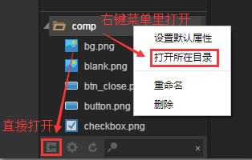

# 资源管理器介绍

>  本篇采用LayaAirIDE 1.7.3 bate 截图，如有不同，请下载最新的LayaAirIDE，以最新版本IDE为准。

​        资源管理器是我们用来访问和管理项目资源的工作区域。在开始工作时，添加资源到这里一般是必须的步骤。您通过初始界面就可以看到资源管理器中包含的一些基本资源类型。 

### 一、界面介绍

​        资源管理器将项目资源文件夹中的内容以树状结构展示出来，注意只有放在`项目根目录/laya/assets/`目录下的资源才会显示在这里。

​        下面我们介绍各个界面元素。

​         
​    		（图1）

​        资源预览界面：可以将选中的资源显示出来。

​        面板主体是资源文件夹的资源列表，可以在这里用右键对资源进行增删修改，或把资源拖拽至场景编辑器中使用。

​        下方的工具栏给予了便捷功能，在面板主体中也可以使用右键进行相关操作。

####  1.1工具栏功能介绍

​        打开所在目录：打开选中控件的所在文件夹。

​        设置默认属性：设置选中控件的默认属性，如大小、颜色等。

​        刷新资源树：对资源数进行一次刷新操作。

​        输入关键词过滤：将包含有该关键词的资源单独显示出来。

####  1.2资源列表

​        资源列表中可以显示资源文件夹下所有文件夹内的资源内容，文件夹在资源管理器中会以文件夹图标显示，点击图标就可以展开/折叠该文件夹中的内容。

​         除了文件夹之外列表中显示的都是资源文件，资源列表中的文件不会隐藏扩展名，一般都是采用图片方式来作为资源使用。

#### 1.3创建资源

​        您可以直接将资源文件拖拽到资源管理器中，拖拽完成并保存或刷新后资源管理器会自动同步资源，您还可以在工具中点击打开所在目录将资源置入。 

#### 1.4选择资源

​        您可以在资源列表中鼠标选中要使用的资源并拖放至场景编辑器中，这样就可以通过 IDE 自动设置资源属性。 

#### 1.5移动资源

​        选中资源后，按住鼠标拖拽至资源树中的文件夹上即可将资源移动到该文件夹。

####  1.6删除资源

​        对于已选中的资源，可以执行以下的操作进行删除：

​        1.右键点击，并选择弹出菜单的【删除】。

​        2.选中资源后直接按【Backspace（退格键）】。 

​        由于删除资源是不可撤销的操作，所以会弹出对话框要求用户确认，确认后资源就会被删除，删除的资源可以从回收站中找回，但删除资源时请一定要谨慎，做好版本管理或手动备份。 

#### 1.7其他操作

​        重命名：对资源进行重命名。

​        设置默认属性： 设置选中控件/资源的默认属性，如大小、颜色等。

​        查找引用： 在全局中查找使用了该资源的地方，可以进行一键替换，将使用该控件的地方进行替换。 

#### 1.8过滤资源

​        在资源管理器右下方的搜索框中输入文本，可以过滤出文件名包括输入文本的所有资源。也可以输入“.png”这样的文件扩展名，会列出所有特定扩展名的资源。

​          
​    		（图2）

 

### 二、添加资源

**资源管理器** 目前提供了两种项目中添加资源的方式： 

1. 打开资源文件夹，将外部资源拷贝加入到资源文件中。

2. 将资源文件直接拖拽至资源管理器中。

   ​

### 三、导入和同步资源

**资源管理器** 中的资源和操作系统文件管理器中看到的项目资源文件夹是同步的，在 **资源管理器** 中对资源的移动、重命名和删除，都会直接在用户文件系统中对资源内文件进行同步修改。同样的，在文件系统中添加或删除资源，再次打开或刷新后，也会对 **资源管理器** 中的资源进行更新。