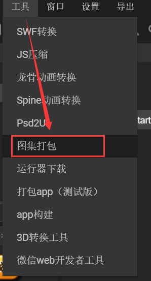
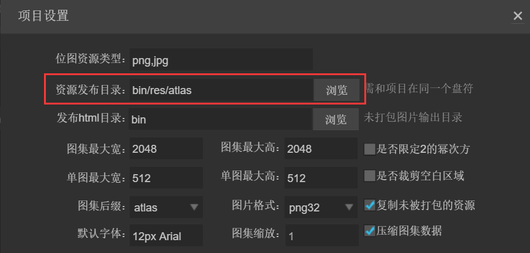

# 图集制作与使用详解

> author: charley     update: 2019.01.11

*【注意】本篇教程采用LayaAirIDE 1.7.17版本，文中如有不同请以最新LayaAirIDE版本为准。*

图集(Atlas)是游戏开发中常见的一种美术资源，通过工具将多张图片合并成一张大图，并通过atlas与json等格式的文件存放原始图片资源信息。图1就是采用LayaAirIDE打包好的一张png图集资源。

  

 (图1)


## 1.为什么要使用图集资源

**在游戏中使用多张图片合成的图集资源作为美术资源，有以下优势：**

#### 1.1优化内存

合成图集时会去除每张图片周围的空白区域，加上可以在整体上实施各种优化算法，合成图集后可以大大减少游戏包体和内存占用。

#### 1.2 减少CPU运算

多个`Sprite`如果渲染的是来自同一张图集的图片时，这些`Sprite`可以使用同一个渲染批次来处理，大大的减少CPU的运算时间，提高运行效率。


## 2.支持图集打包的格式

LayaAirIDE支持对PNG与JPG两种资源格式打包为图集。但是图集打包的原始资源，推荐使用PNG，因为JPG的体积会较大。

*Tips：需要注意的是，PNG原始资源的位深度不能超过32，否则打包出来的图集会出现花屏。另外，PNG与JPG资源不能是其它格式的资源改名为PNG与JPG格式的。*


## 3.用LayaAirIDE制作图集的方式

LayaAirIDE中打包图集的方式一共有两种。

### 3.1 使用IDE的图集打包工具

在IDE导航的`工具`菜单中，点击`图集打包`打开图集打包工具面板，如图2、图3所示。

      

(图2)

  

 （图3）

#### **图集打包工具面板说明**

#### **`资源根目录`**

`资源根目录`是指图集打包前，原始资源目录的父级目录，该目录下，每一个目录对应一个图集文件，多个目录会生成多个图集文件。（注：打包工具需要以`资源根目录`下的子目录名来命名图集文件，所以需要打包的原始资源必须放到`资源根目录`的子目录内，如图4、图5所示，）

  

 (图4)

　　 

(图5)

#### 操作提示：

直接拖拽目录到`资源根目录`输入框，或者点击`浏览`获得目录路径的同时，会在`输出目录`自动填写与`资源根目录`相当的路径。

#### **`输出目录`**

`输出目录`是指打包后的图集资源存放目录。

默认与资源根目录相同，可以点击`浏览`或手动在`输出目录`输入框内更改路径。

*Tips：更改输出目录不能采用目录拖拽的方式，否则会影响到资源根目录的路径。*

#### **`图集最大宽\高度`**

默认值为`2048×2048`，该值决定单个图集的最大尺寸。如果原始图片过多，超过单个图集最大宽高时，则会在打包时生成新的图集文件（多个图集）。

#### **`单图最大宽\高度`**

默认值为`512×512`，超过这个尺寸的单图将不会被打包到图集中。

*Tips：超过512×512的单图不建议打包到图集中，可以单独预加载此图，但是，加载单图也不能超过1024×1024，否则会对性能有影响。*

#### `缩放系数`

这里可以通过缩放减少图集体积，比如改为0.5，工具会按原图宽高分别乘0.5生成到图集中，显示的时候会保持会通过拉伸保持原图大小，这样处理后，虽然图集的尺寸会变小，但是显示的效果也会有所影响，可以视为一种图集的另类压缩方案。如果要保持设计时的图片精度，尽量不要调整默认值。

#### **`2的整次幂`**

如果勾选，则生成的图集图片宽高将会是2的整次幂。这里，建议美术在设计的时候，就按2的整次幂来设计，通过图集工具强行保持2的整次幂，肯定会导致图集的体积变大。所以，除非是面临某些强制要求按2的整次幂优化的Runtime环境，常规情况下无需勾选，尽量提要求给美术设计人员，按32、64、128、256等2的整次幂来设计图片的宽高。

#### **`空白裁剪`**

如果勾选，则生成的图集图片会自动把原始图片中空白区域裁剪掉。默认是是勾选状态，不要去掉。

#### `数据文件后缀`

数据文件后缀默认是atlas，也可以选择json。但是我们建议开发者在使用LayaAir引擎的时候采用atlas作为图集的后缀。


### 3.2 资源管理器内自动打包图集

#### 3.2.1 图集打包方式

**将全部资源打包**

在资源管理器目录内的全部资源，当按`F12`或者`Ctrl+F12`导出时，会**自动打包为图集**。如图6-1所示。

   

 (图6-1)

**不打包未使用资源**

`资源管理器`中的资源如果没有在`项目管理器`中被使用，通过菜单的 `导出`--> `发布` 功能，与F12的打包是相同的效果，但是可以不打包未使用的资源。由于这种打包方式需要遍历所有资源的使用状态，导致打包速度较慢，因此该方式通常只在发布线上版本的时候才使用。


**对单张资源设置不打包**

选中资源，右键`设置默认属性`，在属性设置面板中，将`打包类型`选项中设置为`不打包`类型。该资源就不会被打包到图集中。

  

（图6-2）

 

（图6-3）

　

#### 3.2.1 资源管理器中的图集导出路径

导出到项目后，自动打包好的图集默认位于“`项目根目录/bin/h5/res/atlas/`”目录下，图集命名与打包工具中的图集命名一样，以目录名为图集名称，如图7所示。

 

 (图7-1)

如果想要改变图集默认的导出目录，可以通过快捷键F9，在`项目设置`面板的`资源发布目录`处更改导出路径。也可以设置图集最大的宽高，以及不打包的单图宽高限制标准等，各参数的意义和上文中的图集工具介绍一样的。

   (图7-2)


## 4.打包生成的图集文件介绍

#### 4.1 打包生成的文件

打包后，会生成图集专用资源（分别是同名的`.atlas`文件、`.json`文件、`.png`文件），以及图集打包程序用的`rec`文件（*这个rec文件打包软件使用，开发者不用管*），如上文的图7所示。

#### 4.2 atlas与json的图集后缀区别

`.atlas`与`.json`文件都是png图集的配置信息文件。最早期LayaAir引擎默认使用json作为图集配置信息的格式，后来为了优化引擎的使用，默认改为了`.atlas`，但为了兼容旧的版本，所以生成图集的时候，很长一段时间的IDE版本两种格式都会存在，到如今的LayaAirIDE版本，默认只生成`.atlas`，如果想生成json要手动更改图集后缀的设置。

在使用的时候，这两种后缀的区别在于：

`.atlas`是LayaAirIDE特有的图集格式，仅用于图集，所以在加载`.atlas`时不需要填写类型，和加载普通的单图方式一样，更加方便，是推荐的图集加载方式。atlas方式加载图集的示例代码为：

```javascript
//atlas方式图集使用示例
Laya.loader.load("./res/atlas/ui.atlas", Handler.create(this, onLoaded));
```

`.json`是一种兼容第三方的图集格式，由于`.json`文件应用广泛，不仅仅用于图集，所以为了识别是否为图集配置信息，在加载`.json`文件的图集时，需要填写类型进行区分。json方式加载图集的示例代码为：

```javascript
//json方式图集使用示例
Laya.loader.load([{url: "res/atlas/ui.json", type: Laya.Loader.ATLAS}], Laya.Handler.create(this, onLoaded));
```

> Tips:建议使用atlas，最好不要用json的方式。
>


## 5.打包图集常见的错误

#### 删除图集文件后，无法重新导出的问题

当用户手动删除了图集文件，但并未删除rec文件时，如图10所示。在这种情况下，**如果原始资源没有发生改变，直接使用F12是无法重新导出图集文件的。**

此时，可以通过快捷键`Ctrl+F12`清理并导出。或者直接把rec文件也删除掉，再使用F12导出。即可正常导出图集。

 
 (图10)


## 6. 如何在项目中使用图集中的小图

在项目中如果用到图集中的资源，则需先预加载图集资源，然后设置图片的皮肤（*skin*）属性值为“原小图目录名/原小图资源名.png”。

例如：上文中图6的资源打包后如图1所示，现在我们将图6中`ui`目录下的小图`monkey1.png`在项目中通过图集的方式显示出来，示例代码如下：

```javascript
Laya.init(1334, 750);

//预加载图集资源ui.atlas，然后执行回调方法onLoaded
Laya.loader.load("res/atlas/ui.atlas",Laya.Handler.create(this,onLoaded));

function onLoaded(){
    //创建Image实例
    var img = new Laya.Image();
    //设置皮肤（取图集中小图的方式就是 原小图目录名/原小图资源名.png）
    img.skin = "ui/monkey1.png";
    //添加到舞台上显示
    Laya.stage.addChild(img);
}
```

代码运行效果如下：

  

（图11）

如图11所示，我们成功的从图集中取出小图资源并应用到项目中，而代码中的`sink`值`ui/monkey1.png`，其实就是图集打包前对应的目录与资源名称和路径。

本篇至此结束，如有疑问请到社区提出：[http://ask.layabox.com](img/http://ask.layabox.com)


## 本文赞赏

如果您觉得本文对您有帮助，欢迎扫码赞赏作者，您的激励是我们写出更多优质文档的动力。

 