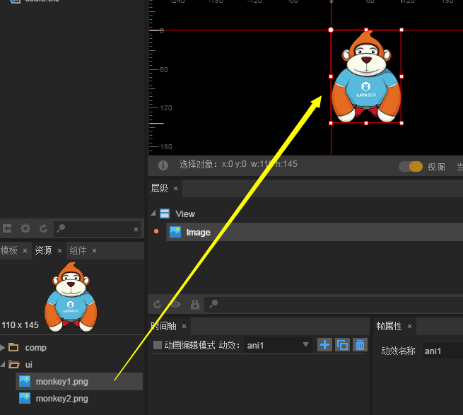
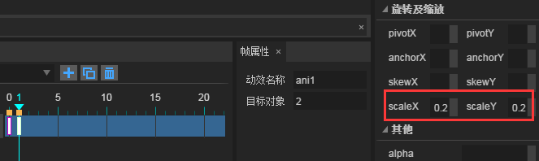
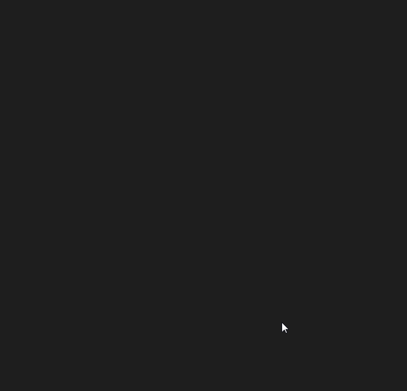

# 动画模板(EffectAnimation)

### 1、什么是动画模板

动画模板是基于时间轴的动画效果，通过预设动画效果，然后把效果附加给某个组件。使得组件无需编码却能轻松实现与编码相同的动画效果。动画模板不能独立显示，仅可作为动效模板让UI页面中的组件获得动画效果。


### 2、在IDE中制作与使用动画模板

#### 2.1创建EffectAnimation模板文件

在项目管理器中，鼠标`右键`-->选择`新建`-->`动画`。在新建动画的面板中，动画类型选为`EffectAnimation`。由于我们要创建一个缩放效果的动画模板，动画名称我们命名为scale，如图1所示。

<br/>(图1)

点击`确定`后，会创建一个`scale.efc`的动画模板文件，双击该文件，我们看到动画编辑场景如图2所示。

<br/>(图2)


#### 2.2创建动画模板

**目标：创建一个先缩小后恢复的动画效果模板。**

**步骤一：**我们从资源管理器中，将一个Image组件拖拽到`scale.efc`的场景编辑器中。如图3所示。

<br/>(图3)


**步骤二：**勾选`动画编辑模式`，然后选中`第1帧`和`Image`组件，在组件上右键创建关键帧。如图4所示。

<br/>(图4)


**步骤三：**选中`第1帧`，在属性管理器中，将旋转与缩放的`scaleX`与`scaleY`属性值都设为`0.2`。如图5所示。设置属性值之后，`Image`时间轴中会自动增加缩放属性`scaleX`与`scaleY`。（*由于我们这个动画模板不需要位移效果，之前创建关键帧自动生成的属性X直接删掉就可以了*）

<br/>(图5)

**Tips：**需要注意的是，动画模板与时间轴动画有一个重要的区别，那就是，如果对动画模板当前动画效果的首帧就设置动画效果是无效的。例如：我们想先缩小至0.2大小时，在时间轴动画里，在第0帧就可以先将动画组件直接缩小到0.2，而在动画模板里，不能在第0帧直接设置缩放效果，必须在其它帧（比如第1帧）设置缩放目标效果（0.2）。


**步骤四**：在第13帧创建关键帧（参照图4），设置scaleX与scaleY属性值为1，点击播放即可预览动画效果。

<br/>(图6)


#### 2.3在IDE中使用动画模板

**步骤一：**创建一个UI页面（本例为`EffectAnimation.ui`），然后拖拽一个Button组件到场景编辑器中，如图7所示（*注意：本例中的Button组件在ui目录下*）。

<br/>(图7)


**步骤二：**将制作的缩放动画模板（scale.efc）拖拽到Button组件下，如图8所示。

<br/>(图8)


**步骤三：**为实现居中缩放效果，以及让按钮看的更清楚一些。我们选中`Button`组件，在属性面板，设置轴心点属性`anchorX`与`anchorY`的值为`0.5`，然后设置`Button`宽高与轴心点的xy轴位置，如图9所示。

<br/>(图9)

*Tips：轴心点效果需要在UI中的组件属性中设置，在动画模板中设置轴心点效果对组件无效。*

**步骤四：**选中`Button`组件下的动画模板，在右侧属性面板中，设置触发播放的事件属性`playEvent`的值为`mousedown`。如图10所示，然后按F12导出UI页面，即可在项目中使用了。

<br/>(图10)


### 3、在项目中展示动画模板的效果

创建一个`Mian.js`文件，在index.html中引用。编写以下代码：

```javascript
//初始化引擎
Laya.init(1334,750);
//设置舞台背景色
Laya.stage.bgColor = "#ffffff";
//加载图集资源，加载成功后将UI界面添加到舞台上
Laya.loader.load("./res/atlas/comp.atlas",Laya.Handler.create(this,onLoaded));
function onLoaded(){
    //实例化导出的UI类
    var efc = new ui.TestPUI();
    //添加到舞台
    Laya.stage.addChild(efc);
}

```

运行后，按钮被按下时，动画效果如动图11所示：

<br/>(图11)


### 4、多个动画模板创建复杂动效

刚刚实现了按钮按下后，从小变大的动画效果，我们可以再制作一个动画模板，实现弹起时的缩小效果。从而实现按下和弹起快速切换状态的连续动画效果演示。

首先，我们再创建一个动画模板文件。这个动画模板由于是直接缩小，所以仅需两个关键帧即可，如图12所示，我们在`第12帧`将缩放属性`scaleX`与`scaleY`的值设置为`0.2`。

<br/>(图12)


然后，在UI页面中，将动画模板拖到`Button`组件下，并设置`playEvent`属性为`mouseup`。如图13所示。

<br/>(图13)


最后保存下，按F12导出UI，然后在项目中再次编译刚才的代码。运行效果如动图14所示，在连续按下和弹起的事件下，动画效果非常平滑。
<br/>(图14)


至此，EffectAnimation基础教程已结束，开发者可以用LayaAirIDE的动画模板功能，快捷的开发各种组件的动画效果。