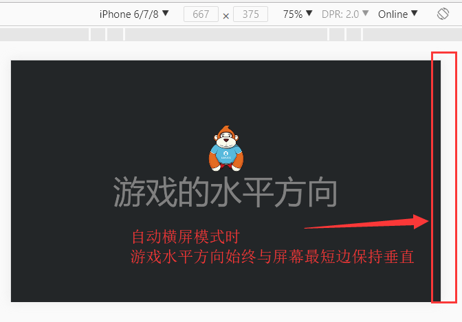

# 屏幕方向：自动横屏与自动竖屏的设置

> author:charley
>

### 1、屏幕方向设置的API概述

打开引擎的API文档，搜索laya.display.Stage，找到[screenMode属性](https://layaair.ldc.layabox.com/api/?category=Core&class=laya.display.Stage#screenMode)。如图1所示。 

(图1)

#### 1.1 默认值none或者不设置screenMode属性

默认值none或者不设置screenMode属性时，无论屏幕方向如何旋转，游戏的水平方向都不会产生跟随屏幕旋转的变化。

例如图2-1和图2-2的效果：

 

(图2-1)手机竖屏时，未设置screenMode的效果

 

(图2-2)手机横屏时，未设置screenMode的效果

#### 1.2 screenMode属性为horizontal时，自动横屏

```java
//自动横屏，游戏的水平方向始终与浏览器屏幕较短边保持垂直
Laya.stage.screenMode = "horizontal";
```

如果screenMode属性值设置为horizontal时，无论屏幕方向如何旋转，游戏的水平方向都会与屏幕最短的边始终保持垂直。如图3-1与图3-2所示。

 

(图3-1)手机竖屏时，screenMode属性为horizontal的效果

 

(图3-2)手机横屏时，screenMode属性为horizontal的效果


#### 1.3 screenMode属性为vertical时，自动竖屏

```java
//自动竖屏，游戏的水平方向始终与浏览器屏幕较长边保持垂直
Laya.stage.screenMode = "vertical";
```

如果screenMode属性值设置为vertical时，无论屏幕方向如何旋转，游戏的水平方向都会与屏幕较长的边始终保持垂直。如图4-1与图4-2所示。

 

(图4-1)手机竖屏时，screenMode属性为vertical的效果

  

(图4-2)手机横屏时，screenMode属性为vertical的效果


## 2、自动横屏与竖屏的示例源码

本节直接贴出来示例源码，开发者在本地可以体验更改Laya.stage.screenMode属性值带来的区别。

> 对于新手开发者，直接复制源码即可，无需关注与screenMode无关的代码。重点在于体验与理解screenMode属性不同值的差异。源码中涉及的图片资源可以用任意png资源替代，存放于`项目根目录/bin/res`目录下，注意要确保资源路径与资源名称正确。

####   screenModeDemo.ts 示例代码如下： 

```javascript
function showScreen(): void
{
//图片
var img:Laya.Image = new Laya.Image();
img.centerX = 0;
img.centerY = -70;
img.skin = "res/monkey2.png";
Laya.stage.addChild(img);

//文字
var text:Laya.Label = new Laya.Label();
text.text = "游戏的水平方向";
text.color = "gray";
text.fontSize = 100;
text.centerX = 0;
text.centerY = 50;
Laya.stage.addChild(text);
}

Laya.init(0, 0, Laya.WebGL);
Laya.stage.scaleMode = "full";
Laya.stage.bgColor = "#232628";

//自动横屏，游戏的水平方向始终与浏览器屏幕较短边保持垂直
Laya.stage.screenMode = "horizontal";
//自动竖屏，游戏的水平方向始终与浏览器屏幕较长边保持垂直
//Laya.stage.screenMode = "vertical;

showScreen();
```


#### 关于常量的写法：

如果开发者记不住screenMode的属性值，通过常量的方式，可以获得工具的代码提示。

screen常量值如图5所示：

 

(图5) 

示例写法：

```java
//自动横屏，游戏的水平方向始终与浏览器屏幕较短边保持垂直
Laya.stage.screenMode = Laya.Stage.SCREEN_HORIZONTAL;;
//自动竖屏，游戏的水平方向始终与浏览器屏幕较长边保持垂直
//Laya.stage.screenMode = Laya.Stage.SCREEN_VERTICAL;
```


示例中用到的图片资源 :

 

monkey2.png