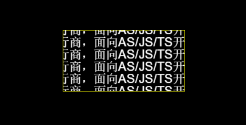

# 超出文本区域的处理&滚动文本

文本在添加内容的时候免不了超出我们所设置的文本区域，这时候我们要对文本进行处理，不处理的话内容有可能超出我们舞台。

Laya.display.text 中所使用的API 参数：

</br>

hidden:不显示超出文本域的字符。

visible:不进行任何裁切。

scroll:不显示文本域外的字符像素，并且支持scroll接口。

```typescript
class LayaSample {
    constructor() {
        //初始化引擎，不支持WebGL时自动切换到Canvas
        Laya.init(550,400,Laya.WebGL);
        this.setup();
    }
    private setup():void{
        var t1:Laya.Text = this.createText();
        //设置不进行任何裁剪
        t1.overflow = Laya.Text.VISIBLE;
        t1.pos(10,10);

        var t2:Laya.Text = this.createText();
        //设置不显示文本区域外的字符像素
        t2.overflow = Laya.Text.SCROLL;
        t2.pos(10,110);

        var t3:Laya.Text = this.createText();
        //设置不显示超出文本域的字符
        t3.overflow = Laya.Text.HIDDEN;
        t3.pos(10,210);
    }
    private createText():Laya.Text{
        var txt:Laya.Text = new Laya.Text();
        txt.text = "Layabox是HTML5引擎技术提供商与优秀的游戏发行商，面向AS/JS/TS开发者提供HTML5开发技术方案！\n" +
        "Layabox是HTML5引擎技术提供商与优秀的游戏发行商，面向AS/JS/TS开发者提供HTML5开发技术方案！\n" +
        "Layabox是HTML5引擎技术提供商与优秀的游戏发行商，面向AS/JS/TS开发者提供HTML5开发技术方案！";
        txt.borderColor = "#ffff00";
        //设置宽高以后的自动裁剪会按照这个区域裁剪
        txt.size(300,50);
        txt.fontSize = 20;
        txt.color = "#ffffff";
        Laya.stage.addChild(txt);
        return txt;
    }
}
new LayaSample();
```

</br>

可以看到3种方法的对文本处理的不同，每种处理都有各自的优缺点，性能比最高的还是hidden。

除了通过对文本区域设置overflow ，还可以通过使用scrollX和scrollY滚动文本视口，通过滚动文本来显示全部的文本内容。

要是想要实现滚动文本需要使用 overflow = Text.SCROLL 使用 Text.HIDDEN的话即时你设置了滚动也没有效果。

```typescript
class LayaSample {
    private txt:Laya.Text;
    private prevX:number = 0;
    private prevY:number = 0;
    constructor() {
        //初始化引擎，不支持WebGL时自动切换到Canvas
        Laya.init(Laya.Browser.clientWidth,Laya.Browser.clientHeight,Laya.WebGL);
        this.createText();
    }
    private createText():void{
        this.txt = new Laya.Text();
        this.txt.overflow = Laya.Text.SCROLL;
        this.txt.text = "Layabox是HTML5引擎技术提供商与优秀的游戏发行商，面向AS/JS/TS开发者提供HTML5开发技术方案！\n" +
        "Layabox是HTML5引擎技术提供商与优秀的游戏发行商，面向AS/JS/TS开发者提供HTML5开发技术方案！\n" +
        "Layabox是HTML5引擎技术提供商与优秀的游戏发行商，面向AS/JS/TS开发者提供HTML5开发技术方案！\n" +
        "Layabox是HTML5引擎技术提供商与优秀的游戏发行商，面向AS/JS/TS开发者提供HTML5开发技术方案！\n" +
        "Layabox是HTML5引擎技术提供商与优秀的游戏发行商，面向AS/JS/TS开发者提供HTML5开发技术方案！\n" +
        "Layabox是HTML5引擎技术提供商与优秀的游戏发行商，面向AS/JS/TS开发者提供HTML5开发技术方案！";
        this.txt.size(200,100);
        this.txt.x = Laya.stage.width - this.txt.width>>1;
        this.txt.y = Laya.stage.height - this.txt.height>>1;
        this.txt.borderColor = "#ffff00";
        this.txt.fontSize = 20;
        this.txt.color = "#ffffff";
        Laya.stage.addChild(this.txt);
        this.txt.on(Laya.Event.MOUSE_DOWN,this,this.startScrollText);
    }
    /*开始滚动文本*/
    private startScrollText():void{
        this.prevX = this.txt.mouseX;
        this.prevY = this.txt.mouseY;
        Laya.stage.on(Laya.Event.MOUSE_MOVE,this,this.scrollText);
        Laya.stage.on(Laya.Event.MOUSE_UP,this,this.finishScrollText);
    }
    /* 停止滚动文本 */
    private finishScrollText():void
    {
        Laya.stage.off(Laya.Event.MOUSE_MOVE, this, this.scrollText);
        Laya.stage.off(Laya.Event.MOUSE_UP, this, this.finishScrollText);
    }
    /* 鼠标滚动文本 */
    private scrollText():void
    {
        var nowX:number = this.txt.mouseX;
        var nowY:number = this.txt.mouseY;
        this.txt.scrollX += this.prevX - nowX;
        this.txt.scrollY += this.prevY - nowY;
        this.prevX = nowX;
        this.prevY = nowY;
    }
}
new LayaSample();
```

</br>

</br>

这里我们就通过滚动文本显示更多的文本内容，在实际编码中根据项目需要使用overflow的3种处理方式，还有自动换行和滚动文本可以对文本进行处理。