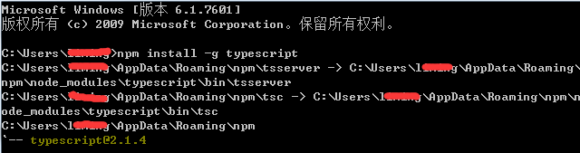

# 搭建开发环境（TS代码编译器）


### 1.1 Node.js下载

​        TypeScript开发HTML5需要Node.js环境，如果没有安装过的，请前往官方下载(建议LTS版本)，如图1，URL地址为：[https://nodejs.org/en/](https://nodejs.org/en/)

​        <br/>
​         图（1）

### 1.2 配置TypeScript编译环境

​        步骤一：安装Node.js，找到刚刚下载的Node.js安装包，一步一步的安装即可。如果已安装的，可以跳过此步骤。

​        <br/>
​         图（2）

 

​        步骤二：安装完Node.js后，接着就可以使用NPM来安装TypeScript Compiler，之后就能通过这个Compiler来将TypeScript编译成为JavaScript。在这个步骤里，开发者需要打开cmd命令行工具，输入指令“npm install -g typescript”，按回车键后，即可开始进行TypeScript Compiler的安装。

```typescript
npm install -g typescript
```

​        <br/>
​         图（3）


​         步骤三：如下图所示，当我们看到 “-- typescrip@ 版本号” 的时候，可以确认完成了 TypeScript Compiler的安装，此时，关闭命令行工具即可。 

​        <br/>
​         图（4）


###  1.3 检查TypeScript编译环境版本

在命令行输入“tsc -v” 命令可查看当前TypeScript编译的版本

```typescript
tsc -v
```

​       <br/>
​         图（5）