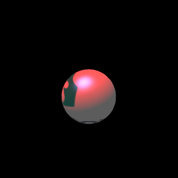

# LayaAir3D之光源

灯光在3D世界中很重要，三维物体产生立体光影变化、色彩色调变化、投影等可使用灯光设置方式达到。

## 灯光种类

灯光的种类有多种，不同的光源呈现的效果不同，可以设置不同的参数，在IDE创建的3D项目中我们可以修改代码查看不同类别的灯光效果。

### 点光（PointLight）

点光是向四面八方发射光线的光源，又称全向光或者球状光，现实中的点光源比如灯泡、蜡烛，可以感觉到光源是有强度、颜色和衰减半径属性。

```typescript
//创建点光
var light:Laya.PointLight = scene.addChild(new Laya.PointLight()) as Laya.PointLight;
//移动灯光位置
light.transform.translate(new Laya.Vector3(-3,5,0));
//设置点光照亮范围
light.range = 6;
//设置点光的衰减
light.attenuation = new Laya.Vector3(0.01,0.01,0.03);
```

range为设置点光源的范围，相当于点光的照射范围，数值越大，光照范围越大，图1中因光照范围设置不大，因此没被光照的地方为黑色，图2中光照范围超出了灯光与模型的距离，因此全部被照亮。

(图1)(图2)</br>


attenuation为设置点光源的衰减，数值越小，衰减越少，因此光照范围内的物体亮度更高。


### 平行光（DirectionLight）

平行光与点光区别较大，它有固定的一个方向，可通过弧度值设定，并且也没有衰减和光照范围，会对全场景所有模型进行照亮。3D世界中经常用来模拟固定方向的太阳光。

```typescript
//创建平行光
var light:Laya.DirectionLight = scene.addChild(new Laya.DirectionLight()) as Laya.DirectionLight;
//设置平行光的方向
light.direction = new Laya.Vector3(0.5, -1, 0);
```


### 聚光（SpotLight）

聚光指的是从特定光源方向射出的光，比如手电筒，舞台筒灯等。光照区域根据距离因素逐渐放大，同事光照区域边缘也有衰减现象。

```typescript
//添加聚光
var light : Laya.SpotLight = scene.addChild(new Laya.SpotLight()) as Laya.SpotLight;
//设置聚光的位置
light.transform.position = new Laya.Vector3(0,5,0);
//设置聚光的衰减
light.attenuation = new Laya.Vector3(0.1, 0, 0.1);
//设置聚光的方向
light.direction=new Laya.Vector3(0, -1, 0);
//设置聚光范围
light.range = 5;
//设置聚光值
light.spot = 5;
```

attenuation为聚光的衰减，设置的值越小，聚光光圈的模糊越小，反之光圈越大。

direction为聚光的方向，方向的值设置方式与平行光一致。

range为聚光的照射范围，与点光类似，区别只是聚光有方向，而点光无方向。

spot为聚光值，数值越小，光照越强，反之越弱。图3中聚光值为5，图4中聚光值为50，开发者可以根据需求自行调整。

(图3)(图4)</br>


## 光色要素

场景中使用了灯光后，在灯光范围内的所有3D模型都将产生影响，LayaAir3D引擎中的灯光包括了以下要素，用于调节场景中的亮度、颜色等。

### 环境颜色（ambientColor）

**Tips：引擎1.7.9版后取消了灯光的环境颜色设置，老版本照常可使用。环境颜色可到材质中去设置。**

环境色可以简单的理解为场景的气氛颜色。对于场景中的模型，它们的亮面与暗面会同时被环境色影响，环境色越亮模型的整体亮度越高。当然，环境色也常用语色调处理，可以通过环境色调整出红橙黄绿青蓝紫等气氛。

代码设置环境色如下，产生了黄色的环境光照，模型整体罩上了一层黄色（图5）。

在之前的课程中我们介绍了三维向量可以用来设置颜色值，我们再次回顾一下，向量中三个元素分别代表了红、绿、蓝颜色，由它们来组合成千变万化的色彩，每种颜色的最高值为1，超过后将产生曝光效果。

```javascript
//设置灯光的环境色为纯黄色（计算机中，红+绿=黄）
light.ambientColor = new Laya.Vector3(1,1,0);
```

(图5)</br>


### 漫反射颜色（diffuseColor）

**Tips：引擎1.7.9版后增加了color灯光颜色属性设置，与diffuseColor作用相同。**

也称为光源颜色，是灯光对模型受光面的亮度及色彩影响，比如模拟蜡烛光，可对光源进行偏黄调整，那么模型受光面会加入黄色的色调。

下列代码中，我们设置了光源颜色为纯红色，那么模型受到光照的部分就会产生红色的影响，因为我们之前设置了环境光为（材质环境光色或老版本灯光环境光色）黄色，所以受光面为红+黄=橙色的混合颜色（图6）。

```javascript
//设置灯光的漫反射色为纯红色
//light.diffuseColor = new Laya.Vector3(1,0,0);
//设置灯光颜色为纯红色(与diffuseColor作用相同)
light.color = new Laya.Vector3(1,0,0);
```

(图6)</br>

关闭环境光，我们可以看到（图7）效果，因为没有黄色的环境色影响，模型的受光面就全部变成了光源色。因此在项目开发过程中，我们得综合考虑灯光的多种光色属性的混色影响。

(图7)</br>


### 高光颜色（specularColor）

**Tips：引擎1.7.9版后取消了灯光的高光颜色设置，老版本照常可使用。高光颜色可到材质中去设置。**

对于模型来说，正对着光源方向，并且角度较尖锐光滑的地方会产生高光，高光的亮度与颜色可通过灯光的高光颜色进行调整，默认的高光颜色为纯白色。

调整模型的高光色有两种方法，一种是在灯光上设置调光颜色，一种是在材质上设置高光贴图，大多情况是直接在材质上调整高光色，处理起来更方便，效果更真实。

因为box模型无法产生高光，我们用比较光滑的球体模型来观察，图8-1中未代码中为设置高光颜色，引擎默认值为纯白色，因此显示除了白色调光。而下列代码中，我们设置高光颜色为蓝色，图8-2中为可以清晰的看到，球面上产生了蓝色的高光，因为与漫反射红色相加形成了紫色。

```javascript
//设置高光颜色为蓝
light.specularColor = new Laya.Vector3(0.5,0.5,1);
```

(图8-1)(图8-2)</br>


### 投影（shadow）

投影是灯光照射模型时产生的即时阴影，可随着灯光角度、灯光强度、模型位置等变化而变化。投影是3D世界最重要的因素之一，能产生更加强烈的立体感。

即时阴影非常损耗性能，不能用得太多，特别是游戏场景，模型量较大，一般我们不使用即时投影，而使用静态的光照贴图。

要让场景中产生投影，我们需了解灯光的以下属性：

**shadow：**是否开启投影，布尔值，设置为true后生效。

**shadowDistance：**产生投影的范围，范围是指摄像机到模型的距离，单位为米。大于这个范围模型将不会接受投影与产生投影，开发者可以根据场景大小进行设置。

**shadowPSSMCount：**产生阴影贴图的数量，数量越高，阴影越细腻，性能损耗越大。

**shadowResolution：**投影的质量，投影范围中的阴影大小。通过数值设置质量，数值越大，投影质量越高，性能损耗也会随之加高。投影的质量值是以2的N次幂为单位设置，默认为512，可以设置成1024、2048.....等。

**shadowPCFType：**阴影模糊等级0-3，模糊值越大，阴影越柔和，效果越好，但更耗性能。


只开启和设置灯光的属性还不够，还需在模型上修改投影属性，分别为：

**receiveShadow：**是否接受投影，当模型此属性为true时，计算出的投影会在此模型上显示出来。在游戏中，我们可以把场景的地面，及场景中可走动区域中的模型castShadow属性设置为true。

**castShadow：**是否产生投影，当模型此属性为true时，灯光根据产生阴影的模型位置、模型网格形状大小、与灯光的角度等进行投影计算，然后在接受阴影的模型上产生投影。比如场景中的角色、NPC等活动游戏元素可以开启此属性。

为了能很好的理解投影，我们在下列示例代码中使用平行光，并创建盒子box模型及球体sphere模型加载到场景中，球体用于产生阴影，盒子上接受投影。

```typescript
// 程序入口
class LayaAir3D {
    constructor() {
        //初始化引擎
        Laya3D.init(0, 0, true);

        //适配模式
        Laya.stage.scaleMode = Laya.Stage.SCALE_FULL;
        Laya.stage.screenMode = Laya.Stage.SCREEN_NONE;

        //开启统计信息
        Laya.Stat.show();

        //添加3D场景
        var scene = Laya.stage.addChild(new Laya.Scene());
        //创建摄像机（纵横比，近距裁剪，远距裁剪）
        var camera:Laya.Camera = new Laya.Camera(0,0.1,100);
        //加载到场景
        scene.addChild(camera);
        //移动摄像机位置
        camera.transform.translate(new Laya.Vector3(0, 4, 8));
        //旋转摄像机角度
        camera.transform.rotate(new Laya.Vector3( -30, 0, 0), true, false);
        //创建方向光
        var light:Laya.DirectionLight = scene.addChild(new Laya.DirectionLight()) as Laya.DirectionLight;
        //移动灯光位置
        light.transform.translate(new Laya.Vector3(0,5,0));
        //设置灯光方向
        light.direction = new Laya.Vector3(0.3, -1, 0);
        //设置灯光漫反射颜色
        light.diffuseColor = new Laya.Vector3(1, 0, 0);
        //设置灯光高光色
        light.specularColor = new Laya.Vector3(0, 0.5, 0.5);
        //添加灯光投影
        light.shadow=true;
        //产生投影的范围（如过小将不会产生投影）
        light.shadowDistance=45;
        //生成阴影贴图数量
        light.shadowPSSMCount = 1;
        //模糊等级,越大越高,效果更好，更耗性能
        light.shadowPCFType=1;
        //投影质量
        light.shadowResolution=2048;
        //创建盒子模型
        var box:Laya.MeshSprite3D = scene.addChild(new Laya.MeshSprite3D(new Laya.BoxMesh(1.5,1.5,1.5))) as Laya.MeshSprite3D;
        //自身y座标旋转
        box.transform.rotate(new Laya.Vector3(0,45,0),true,false);
        //接受阴影
        box.meshRender.receiveShadow=true;
        //创建球体模型
        var sphere:Laya.MeshSprite3D = scene.addChild(new Laya.MeshSprite3D(new Laya.SphereMesh())) as Laya.MeshSprite3D;
        //按父空间移动球体
        sphere.transform.translate(new Laya.Vector3(0,1.5,0),false);
        //产生阴影
        sphere.meshRender.castShadow=true;
        //创建材质
        var material:Laya.StandardMaterial = new Laya.StandardMaterial();
        //材质加载漫反射贴图
        material.diffuseTexture = Laya.Texture2D.load("res/layabox.png");
        //为模型赋材质（单个材质可赋给多个模型）
        sphere.meshRender.material = material;
        box.meshRender.material = material;
    }
}
new LayaAir3D();
```

(图9)(图10)</br>

以上两图为开启投影前与开启投影后的效果，注意：需要在灯光与模型上都设置以上介绍的相关属性，缺了任意环节都无法产生阴影。