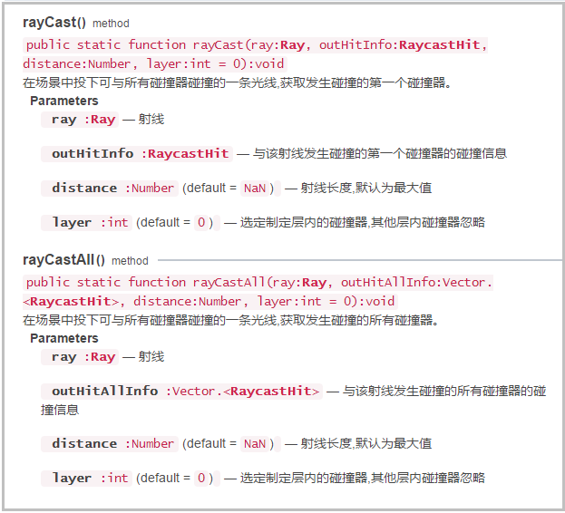

# LayaAir3D之鼠标交互

### 鼠标交互概述

在LayaAir2D引擎中，2D显示对象都有鼠标事件供我们使用，编写逻辑简单方便。在LayaAir 3D引擎中并未实现这种功能，3D空间更为复杂，显示对象在空间中有纵深远近、层叠、裁剪、父子等关系，并且空间还在不断变换。因此3D引擎采用了碰撞器、层与物理射线检测、碰撞信息的方式进行鼠标判断，下面先让我们来先了解它们的概念与作用。


### 碰撞器Collider

碰撞器是一种物理组件，可以添加到3D显示对象上，主要用于3D空间中的物体进行碰撞检测，根据3D显示对象的形状不同，也分为了不同的类型。

LayaAir3D引擎现支持的碰撞器有三种类型，分别是**球型碰撞器SphereCollider**，**盒型碰撞器BoxCollider**，**网格碰撞器MeshCollider**。从**碰撞检测精确度**和**消耗性能**从低到高依次为SphereCollider—BoxCollider—MeshCollider；可以根据游戏中开发需求，选择适合的碰撞器。

3D显示对象添加碰撞器组件的方法如下：

Tips：碰撞器必须添加到MeshSprite3D类型的显示对象上，不能添加到Sprite3D对象上，否则会失效。

```typescript
/**
* 给3D精灵添加碰撞器组件
* BoxCollider    : 盒型碰撞器
* SphereCollider : 球型碰撞器
* MeshCollider   : 网格碰撞器
*/
meshSprite3d1.addComponent(Laya.MeshCollider);
meshSprite3d2.addComponent(Laya.SphereCollider);
meshSprite3d3.addComponent(Laya.BoxCollider);
```


### 层Layer

默认场景中有32层，你可以选择把3D精灵扔在任意层内。用在摄像机上，摄像机可以根据层级进行裁剪；**用在碰撞检测上，可以控制碰撞什么层，不碰撞什么层**。

指定3D精灵层的方法如下：

```typescript
//指定3D精灵的层
meshSprite3d1.layer = Layer.getLayerByNumber(10);
meshSprite3d2.layer = Layer.getLayerByNumber(13);
```


### 射线Ray

射线是一个数据类型，并不是显示对象，它有原点origin、方向direction的属性。

在游戏中，因为视图空间经常变化，为了模拟鼠标的在3D空间中的位置，LayaAir3D引擎提供了摄像机Camera创建射线的方法，它产生了一条与屏幕垂直的一条射线。

摄像机创建射线方法如下：

```typescript
//射线初始化（必须初始化）
var ray:Laya.Ray = new Laya.Ray(Laya.Vector3.ZERO,Laya.Vector3.ZERO);
//获取鼠标在屏幕空间位置
var point:Laya.Vector2 = new Laya.Vector2();
point.elements[0] = Laya.stage.mouseX;
point.elements[1] = Laya.stage.mouseY;
//详设计产生射线方法，通过2D坐标获取与屏幕垂直的一条射线
camera.viewportPointToRay(point, ray);
```


### 物理射线检测

当我们为场景中3D显示对象创建了碰撞器，为它们设置了层（默认在第0层），并创建了射线后，就可以用物理射线碰撞来进行是否相交检测了，开发者可以根据需求进行自己的逻辑判断，比如鼠标拾取、选择、创建等。

物理射线检测我们使用了Physics物理类，它提供了我们两个方法，检测获取发生碰撞的第一个碰撞器信息方法rayCast()，和检测获取发生碰撞的所有碰撞器信息rayCastAll()方法，它们都是静态方法，开发者可以根据需求选择使用，API如（图1）

(图1)</br>


### 碰撞信息RayCastHit

射线检测的碰撞信息在检测前必须初始化，如果射线与3D显示对象相交了，可以从碰撞信息RayCastHit属性中获得相交对象、相交的空间位置、相交的三角面顶点等各种信息。

sprite3D即是相交的3D显示对象，如果未有相交对象则为null。

position为射线与模型相交的点的空间位置。

trianglePositions属性为相交的三角面顶点位置数组，当然，需有个前提是碰撞器的类型必须为MeshCollider，否则顶点位置属性为0。


### 鼠标拾取示例

根据以上的概念和方法，我们来制作一个鼠标拾取的示例，按以下步骤进行：

1、在unity场景中创建几个3D物品，以三辆汽车为例，通过导出导出插件使用。

2、建立场景Scene的子类GameScene，并在加载3D资源时就构建成GameScene类，需要设置参数为clas:GameScene。

2、在场景中为3D物品添加碰撞器，并设置层，创建射线、碰撞信息等。

3、重写场景渲染后处理方法lateRender()，这也是建立子类的原因。在方法中可以根据射线原点画一条矢量参考直线进行观察，并判断射线与3D物品是否相交。

Tips：也可使用帧循环方法，但画的参考线会在模型之后，看不到鼠标点击位置的参考线，所以使用了渲染后方法lateRender()，意思是渲染完场景后再绘制矢量参考线。

4、加入鼠标点击事件，如果点击了鼠标且又与3D物品相交，那么我们就让3D物品消失并提示获取信息。

主类代码如下：

```typescript
class LayaAir3D_MouseInteraction {
    /*自定义场景*/
    private gameScene:GameScene;
    /*提示信息文本框*/
    public static txt:Laya.Text;
    constructor() {
        //初始化引擎
        Laya3D.init(1000,500,true);
        //适配模式
        Laya.stage.scaleMode = Laya.Stage.SCALE_FULL;
        Laya.stage.screenMode = Laya.Stage.SCREEN_NONE;
        Laya.Stat.show();
        /*加载3D资源
        （注：在加载场景.ls文件时，我们用了clas:GameScene参数来构建场景Scene的子类，）
        如果不加此参数，创建后的类还为Scene,将丢失GameScene中的属性和方法）
        */
        Laya.loader.create([{url:"LayaScene_collider3D/collider3D.ls",clas:GameScene}],Laya.Handler.create(this,this.onComplete));

        //创建信息提示框
        LayaAir3D_MouseInteraction.txt = new Laya.Text();
        LayaAir3D_MouseInteraction.txt.text = "还未获得汽车！！";
        LayaAir3D_MouseInteraction.txt.color = "#ffcccc";
        LayaAir3D_MouseInteraction.txt.bold = true;
        LayaAir3D_MouseInteraction.txt.fontSize = 30;
        LayaAir3D_MouseInteraction.txt.pos(100,50);
        Laya.stage.addChild(LayaAir3D_MouseInteraction.txt);
    }
    private onComplete():void{
        //添加3D场景
        this.gameScene = Laya.loader.getRes("LayaScene_collider3D/collider3D.ls");
        //初始化场景（摄像机、碰撞相关对象、添加碰撞器等）
        this.gameScene.init();
        Laya.stage.addChild(this.gameScene);
    }
}
new LayaAir3D_MouseInteraction();
```

场景子类GameScene代码如下：

注意在加载资源时就创建了GameScene对象，这时场景中的模型与材质并未加载成功，无法获取子对象添加碰撞器，如果将添加碰撞器的逻辑放放到构造函数中，程序将出现bug。因此在类中运用了init()方法，需要初始化。

```typescript
class GameScene extends Laya.Scene {
    public scene:Laya.Scene;
    /*3D摄像机*/
    private camera:Laya.Camera;
    /*用于鼠标检测的射线*/
    private ray:Laya.Ray;
    /*画矢量线的3D显示对象*/
    private phasorSprite3D:Laya.PhasorSpriter3D;
    /*碰撞信息*/
    private rayCastHit:Laya.RaycastHit;
    /*获得的物品*/
    private nameArray:Array<any>=[];
    constructor() {
        super();
    }
    /*初始化场景（摄像机、碰撞相关对象、添加碰撞器等）*/
    public init():void{
        //创建摄像机（纵横比，近距裁剪，远距裁剪）
        this.camera = new Laya.Camera(0,0.1,1000);
        this.camera.transform.position = new Laya.Vector3(1,7,10);
        this.camera.transform.rotate(new Laya.Vector3(-30,0,0),false,false);
        //加载到场景
        this.addChild(this.camera);
        //加入摄像机移动控制脚本
        this.camera.addComponent(CameraMoveScript);

        //创建一条射线
        this.ray = new Laya.Ray(new Laya.Vector3(),new Laya.Vector3());
        //创建矢量3D精灵
        this.phasorSprite3D = new Laya.PhasorSpriter3D();
        //创建碰撞信息
        this.rayCastHit = new Laya.RaycastHit();
        //为场景中3D对象添加组件
        for(var i:number = this.numChildren-1;i>-1;i--)
        {
            var meshSprite3D:Laya.MeshSprite3D = this.getChildAt(i) as Laya.MeshSprite3D;
            //添加网格型碰撞器组件
            meshSprite3D.addComponent(Laya.BoxCollider);
        }            
        //鼠标点击事件回调
        Laya.stage.on(Laya.Event.MOUSE_DOWN,this,this.onMouseDown);
    }
    /****覆盖场景渲染后更新方法（相当于场景渲染完成后的帧循环）****/
    public lateRender(state:Laya.RenderState):void
    {
        //画参考线、时行碰撞检测
        //根据鼠标屏幕2D座标修改生成射线数据 
        this.camera.viewportPointToRay(new Laya.Vector2(Laya.stage.mouseX,Laya.stage.mouseY),this.ray);        
        //射线检测，最近物体碰撞器信息，最大检测距离为300米，默认检测第0层
        Laya.Physics.rayCast(this.ray,this.rayCastHit,300);            
        //摄像机位置
        var position:Laya.Vector3 = new Laya.Vector3(this.camera.position.x, 0, this.camera.position.z);
        //开始绘制矢量3D精灵，类型为线型
        this.phasorSprite3D.begin(Laya.WebGLContext.LINES, this.camera);
        //根据射线的原点绘制参考直线（为了观察方便而绘制，但矢量线并不是射线真正的路径）
        this.phasorSprite3D.line(this.ray.origin, new Laya.Vector4(1,0,0,1), position , new Laya.Vector4(1,0,0,1));    
        //结束绘制
        this.phasorSprite3D.end();
    }
    private onMouseDown():void{
        //如果碰撞信息中的模型不为空,删除模型
        if(this.rayCastHit.sprite3D)
        {
            //从场景中移除模型
            this.scene.removeChild(this.rayCastHit.sprite3D);
            //将模型名字存入数组
            this.nameArray.push(this.rayCastHit.sprite3D.name);
            //文件提示信息
            LayaAir3D_MouseInteraction.txt.text = "你获得了汽车"+this.rayCastHit.sprite3D.name+"!，现有的汽车为："+this.nameArray;
            //销毁物体(如不销毁还能被检测)
            this.rayCastHit.sprite3D.destroy();
        }   
    }
}
```

编译上示代码，可以得到以下效果（图2），鼠标点击获得汽车，并从场景中移除汽车模型。

(图2)</br>


### 鼠标创建放置物体

在游戏中我们还经常使用鼠标控制放置游戏物品，比如养成类游戏在地面放置建筑、角色、道具等。

鼠标放置物体与拾取物体大致方法差不多，同样需要使用碰撞器、射线、射线检测、碰撞信息等3D元素与方法。

而创建物品时，点击模型射线与之相交后，我们可以通过碰撞信息rayCastHit.position获得点击的位置，然后将创建的物品放置此处。并且，创建物品时我们使用了克隆的方式，开发者们注意其方法。

在拾取示例中我们使用了盒型碰撞器BoxCollider，在创建示例中我们使用网格碰撞器MeshCollider，它更精确，可以获取模型上的相交三角面顶点，方法为rayCastHit.trianglePositions，根据顶点位置我们可以把它画出来用于观察！

主类代码修改如下：

创建货车模型，并为货车车身添加网格碰撞器组件。

```typescript
class LayaAir3D_MouseInteraction {
    /*自定义场景*/
    private gameScene:GameScene;
    /*提示信息文本框*/
    public static txt:Laya.Text;
    constructor() {
        //初始化引擎
        Laya3D.init(1000,500,true);
        //适配模式
        Laya.stage.scaleMode = Laya.Stage.SCALE_FULL;
        Laya.stage.screenMode = Laya.Stage.SCREEN_NONE;
        Laya.Stat.show();
        //加载3D资源
        Laya.loader.create([{url:"LayaScene_truck/truck.lh"},
                            {url:"LayaScene_box/box.lh"}],Laya.Handler.create(this,this.onComplete));

        //创建信息提示框
        LayaAir3D_MouseInteraction.txt = new Laya.Text();
        LayaAir3D_MouseInteraction.txt.text = "还未获得汽车！！";
        LayaAir3D_MouseInteraction.txt.color = "#ffcccc";
        LayaAir3D_MouseInteraction.txt.bold = true;
        LayaAir3D_MouseInteraction.txt.fontSize = 30;
        LayaAir3D_MouseInteraction.txt.pos(100,50);
        Laya.stage.addChild(LayaAir3D_MouseInteraction.txt);
    }
    private onComplete():void{
        //创建3D场景
        var gameScene:GameScene = new GameScene();
        //初始化场景（摄像机、碰撞相关对象、添加碰撞器等）
        gameScene.init();
        Laya.stage.addChild(gameScene);

        //创建货车模型，加载到场景中
        var truck3D:Laya.Sprite3D = Laya.loader.getRes("LayaScene_truck/truck.lh");
        gameScene.addChild(truck3D);
        //获取货车的车身（车头不进行装货）
        var meshSprite3D:Laya.MeshSprite3D = truck3D.getChildAt(0).getChildByName("body") as Laya.MeshSprite3D;
        //添加网格型碰撞器组件
        meshSprite3D.addComponent(Laya.MeshCollider);
    }
}
new LayaAir3D_MouseInteraction();
```

场景子类代码修改如下：

```typescript
class GameScene extends Laya.Scene {
    public scene:Laya.Scene;
    /*3D摄像机*/
    private camera:Laya.Camera;
    /*用于鼠标检测的射线*/
    private ray:Laya.Ray;
    /*画矢量线的3D显示对象*/
    private phasorSprite3D:Laya.PhasorSpriter3D;
    /*碰撞信息*/
    private rayCastHit:Laya.RaycastHit;
    /*鼠标点击创建的3D对象*/
    public static box:Laya.Sprite3D;
    /*获得的物品*/
    private nameArray:Array<any>=[];
    constructor() {
        super();
    }
    /*初始化场景（摄像机、碰撞相关对象、添加碰撞器等）*/
    public init():void{
        //创建摄像机（纵横比，近距裁剪，远距裁剪）
        this.camera = new Laya.Camera(0,0.1,1000);
        this.camera.transform.position = new Laya.Vector3(1,7,10);
        this.camera.transform.rotate(new Laya.Vector3(-30,0,0),false,false);
        //加载到场景
        this.addChild(this.camera);
        //加入摄像机移动控制脚本
        this.camera.addComponent(CameraMoveScript);

        //创建一条射线
        this.ray = new Laya.Ray(new Laya.Vector3(),new Laya.Vector3());
        //创建矢量3D精灵
        this.phasorSprite3D = new Laya.PhasorSpriter3D();
        //创建碰撞信息
        this.rayCastHit = new Laya.RaycastHit();
        
        //鼠标点击需要创建的物品，用于克隆使用（火车上的货物）
        GameScene.box = Laya.loader.getRes("LayaScene_box/box.lh");
    
        //鼠标点击事件回调
        Laya.stage.on(Laya.Event.MOUSE_DOWN,this,this.onMouseDown);
    }
    /****覆盖场景渲染后更新方法（相当于场景渲染完成后的帧循环）****/
    public lateRender(state:Laya.RenderState):void
    {
        //画参考线、时行碰撞检测
        //根据鼠标屏幕2D座标修改生成射线数据 
        this.camera.viewportPointToRay(new Laya.Vector2(Laya.stage.mouseX,Laya.stage.mouseY),this.ray);        
        //射线检测，最近物体碰撞器信息，最大检测距离为300米，默认检测第0层
        Laya.Physics.rayCast(this.ray,this.rayCastHit,300);            
        //摄像机位置
        var position:Laya.Vector3 = new Laya.Vector3(this.camera.position.x, 0, this.camera.position.z);
        //开始绘制矢量3D精灵，类型为线型
        this.phasorSprite3D.begin(Laya.WebGLContext.LINES, this.camera);
        //根据射线的原点绘制参考直线（为了观察方便而绘制，但矢量线并不是射线真正的路径）
        this.phasorSprite3D.line(this.ray.origin, new Laya.Vector4(1,0,0,1), position , new Laya.Vector4(1,0,0,1));    

        //如果与物品相交，画三面边线
        if(this.rayCastHit.sprite3D){
            //从碰撞信息中获取碰撞处的三角面定点
            var trianglePositions:Array<any> = this.rayCastHit.trianglePositions;
            //矢量绘制三角面边线
            this.phasorSprite3D.line(trianglePositions[0], new Laya.Vector4(1,0,0,1), trianglePositions[1], new Laya.Vector4(1,0,0,1));
            this.phasorSprite3D.line(trianglePositions[1], new Laya.Vector4(1,0,0,1), trianglePositions[2], new Laya.Vector4(1,0,0,1));
            this.phasorSprite3D.line(trianglePositions[2], new Laya.Vector4(1,0,0,1), trianglePositions[0], new Laya.Vector4(1,0,0,1));
        }
        //结束绘制
        this.phasorSprite3D.end();
    }
    private onMouseDown():void{
        //如果点击时有相交的3D物体，则创建物体
        if(this.rayCastHit.sprite3D)
        {
            //克隆一个货物模型
            var cloneBox:Laya.Sprite3D = Laya.Sprite3D.instantiate(GameScene.box);
            //为货物模型添加碰撞器（可以在货物上继续放放置货物）
            (cloneBox.getChildAt(0) as Laya.MeshSprite3D).addComponent(Laya.MeshCollider);                    
            this.scene.addChild(cloneBox);
            //修改位置到碰撞点处
            cloneBox.transform.position = this.rayCastHit.position;
            //更新提示信息
            this.nameArray.push(cloneBox.name);
            LayaAir3D_MouseInteraction.txt.text = "您在货车上装载了 "+this.nameArray.length+" 件货物!";
        }   
    }
}
```

编译运行上示代码，我们可以看见可以通过鼠标点击创建物体了（图3），并且射线与模型相交时显示了模型相交处的三角面。

(图3)</br>