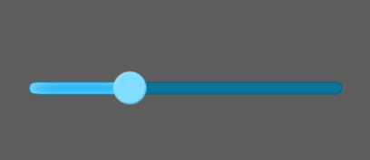
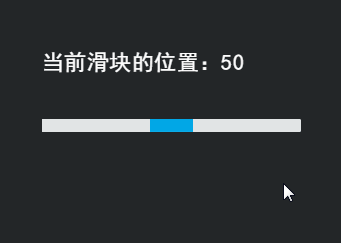

# HSlider 组件参考


## 一、通过LayaAirIDE创建HSlider组件

### 1.1 创建HSlider

​        使用 HSlider 控件，用户可以通过在滑块轨道的终点之间移动滑块来选择值。
​        HSlider 组件采用水平方向。滑块轨道从左向右扩展，而标签位于轨道的顶部或底部。

​        点击选择资源面板里的 HSlider 组件，拖放到页面编辑区，即可添加 HSlider 组件到页面上。
​        HSlider 组件的脚本接口请参考 [HSlider API](http://layaair.ldc.layabox.com/api/index.html?category=Core&class=laya.ui.HSlider)。

​        HSlider 组件的图像资源示例：

​        <br/>
​    （图1）
​        <br/>
​    （图2）

​        HSlider 拖放到编辑器区后，显示效果：

​        <br/>
​    （图3）

​        设置 HSlider 的属性 max 的值为 10、属性 min 的值为0、属性 value 的值为3后，显示效果如下：

​        <br/>
​    （图4）

​        在程序中运行时，可以拖动滑块来选择值：

​        <br/>
​    （图5）


### 1.2 HSlider 组件常用属性

​        <br/>
​    （图6）

 

| **属性**         | **功能说明**                         |
| -------------- | -------------------------------- |
| allowClickBack | 一个布尔值，指定是否允许通过点击滑动条改变 value 属性值。 |
| max            | 获取或设置表示最高位置的数字。 默认值为100。         |
| min            | 获取或设置表示最低位置的数字。 默认值为0。           |
| showLabel      | 一个布尔值，指定是否显示标签。                  |
| sizeGrid       | 滑动条背景图资源的有效缩放网格数据（九宫格数据）。        |
| skin           | 滑动条的图像资源地址。                      |
| tick           | 滑动条的刻度值。默认值为1。                   |
| value          | 滑块位置的数字值。                        |

 

## 二、通过代码创建HSlider组件 

​	在我们进行书写代码的时候，免不了通过代码控制UI，创建`UI_Slider`类，在代码中导入`laya.ui.HSlider`的包，并通过代码设定HSlider相关的属性。

**运行示例效果:**
​	<br/>
​	(图5)通过代码创建HSlider

​	HSlider的其他属性也可以通过代码来设置，下述示例代码演示了如何通过代码创建不同皮肤（样式）的HSlider，

有兴趣的读者可以自己通过代码设置HSlider，创建出符合自己需要的HSlider。

**示例代码：**

```javascript
package
{
	
	import laya.display.Stage;
	import laya.display.Text;
	import laya.events.Event;
	import laya.ui.HSlider;
	import laya.ui.Slider;
	import laya.ui.VSlider;
	import laya.utils.Handler;
	import laya.webgl.WebGL;
	
	public class UI_Slider
	{
     	 /***滑块图片资源**/
		private var skins:Array = ["../../../../res/ui/hslider.png", 			     												  "../../../../res/ui/hslider$bar.png"];
		
		/***提示信息文本框**/
		private var promptText:Text;
		/***水平滑动条**/
		private var hs:HSlider
		
		public function UI_Slider()
		{
			// 不支持WebGL时自动切换至Canvas
			Laya.init(800, 600, WebGL);
			//画布垂直居中对齐
			Laya.stage.alignV = Stage.ALIGN_MIDDLE;
			//画布水平居中对齐
			Laya.stage.alignH = Stage.ALIGN_CENTER;
			//等比缩放
			Laya.stage.scaleMode = Stage.SCALE_SHOWALL;
			//背景颜色
			Laya.stage.bgColor = "#232628";
			
			//加载资源
			Laya.loader.load(skins, Handler.create(this, onLoadComplete));
		}
		
		/***加载资源完成***/
		private function onLoadComplete(e:*=null):void
		{
			//从父类中设置滑块数值变化文字体本颜色（默认为黑色）
			Slider.label.color="#FFFFFF";
			//从父类中设置滑块数值变化文本字体大小
			Slider.label.fontSize=16;
			
			//创建水平滑动条
			createHSlider();
		}
		
		/****创建水平滑动条****/
		private function createHSlider():void 
		{
			//实例化水平滑动条
			hs = new HSlider();
			//更换或加载皮肤资源
			hs.skin = "../../../../res/ui/hslider.png";			
 			
			//设置滑块宽度
			hs.bar.width=50;
			//设置整体宽度
			hs.width = 300;
			//设置位置
			hs.pos(50, 170);
			//最小滑动位置数字
			hs.min = 0;
			//最大滑动位置数字
			hs.max = 100;
			//默认滑块位置
			hs.value = 50;
			//最小滑动量
			hs.tick = 2;
			//滑动数据变化回调方法
			hs.changeHandler = new Handler(this, onChange);
			//加载到舞台
			Laya.stage.addChild(hs);
			
			//创建提示信息
			createPromptText(hs);
			//显示默滑块位置信息
			onChange(hs.value)
		}		
		
		/***创建提示信息***/
		private function createPromptText(slider:Slider):void
		{
			//实例化提示信息
			promptText=new Text();
			//提示框字体
			promptText.font="黑体";
			//提示框字体大小
			promptText.fontSize=26;
			//提示框字体颜色
			promptText.color="#FFFFFF";
			//加载到舞台
			Laya.stage.addChild(promptText);
			//设置提示框位置
			promptText.pos(slider.x, slider.y-80);
		}
		
		/***拖动滑块数据变化回调方法***/
		private function onChange(value:Number):void
		{
			promptText.text="当前滑块的位置：" + value;
		}
	}
}
```

