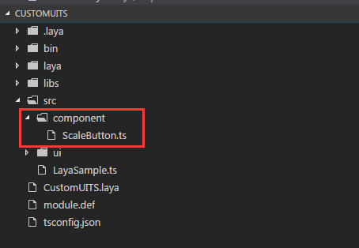
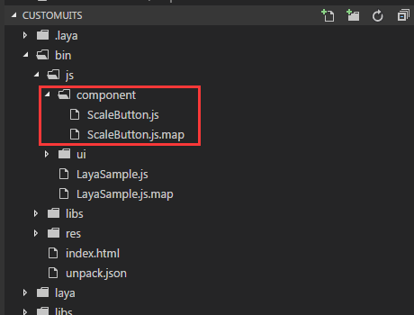

# 自定义组件的制作与使用
　　LayaAir IDE提供多种常用UI组件以满足基本的需求，然而实际开发中开发者往往需要自定义的UI组件以满足其特殊需求。LayaAir提供自定义组件的接口，开发者可以根据需要修改或添加组件，新的组件能够被LayaAirIDE识别、使用。本篇以缩放按钮为例，介绍如何添加一个新的组件，以及如何在LayaAirIDE中使用这个组件。

## 1、了解组件结构与规则

### 1.1组件目录结构

组件目录位于LayaAirIDE根目录下的“\resources\app\out\vs\layaEditor\renders”目录内。如图1所示：

 <br />
（图1）

**组件目录结构介绍**：

　　“custom”：该目录用于存放自定义组件的js与xml文件；

　　“laya.editorUI.js”：LayaAirIDE自带组件的功能实现代码；

　　“laya.editorUI.xml”：LayaAirIDE自带组件的配置信息；

### 1.2 组件的xml配置信息说明

　　一个完整的组件由js与xml两部分构成，其中js是组件的功能实现部分，xml是在IDE内的组件显示与调用部分，包括了组件图片资源名（区分大小写）、属性面板的选项与默认值等。

　　下面以laya.editorUI.xml中的TextArea组件为例进行介绍：

```xml
<TextArea className="laya.editorUI.TextArea" inherit="TextInput" defaultValue="text='TextArea'" skinLabel="skin" resName="area" icon="TextArea" groups="公用,常用,宽高及位置,旋转及缩放" drag="3">
	<prop name="vScrollBarSkin" tips="垂直滚动条皮肤" type="string" default="" accept="res" group="常用" />
	<prop name="hScrollBarSkin" tips="水平滚动条皮肤" type="string" default="" accept="res" group="常用" />
</TextArea>
```
**组件XML说明**：

"TextArea": TextArea标记作为组件的开始和结束。TextArea的命名可以与类别不同，但是要易于理解记忆，用于IDE中的组件名显示；

"classsName": 该组件的完整的类路径，如：laya.editorUI.TextArea；

"inherit": 继承的父类；

"defaultValue": 组件属性的默认值；

"skinLabel": 用于属性面板中的skin相关设置。skinLabel的值对应prop的name字段及相关设置，如果prop中没有，则不进行设置，TextArea组件内就没有这个设置；

"resName": 组件资源前缀（区分大小写），具有该前缀的资源才被识别为该组件；TextArea的配置area为TextArea的缩写模式，在IDE的组件面板会显示TextArea。关于组件命名方面，可以查看IDE组件基础的“组件资源命名规则”文档；

"icon":  组件在IDE中显示的图标名（区分大小写），图标的目录位于LayaAirIDE根目录下的"resources\app\out\vs\layaEditor\laya\icons\components"目录内，这里我们可以创建新的icon图标，也可以多个组件共同使用一个图标。如: TextArea将对应component目录内的TextArea.png

"groups": 用于属性面板的分组显示，以逗号分隔；

"drag": 拉伸取值参数：1：有两个点，只可以横向拉伸，如hscroll组件；2：有两个点，只可以竖向拉伸，如vscroll组件；3：有八个点，可以横向、竖向、放大、缩小拉伸；

"prop": prop内是属性面板中属性的设置，每一个prop标记对应一个组件属性；

"name": 属性的名字，会显示在属性面板中；

"tips": 鼠标停留在属性名上显示的tips提示信息；

"type": 输入框内的属性值类型；

"default": 该属性的默认值；

"accept": 该属性接收res与files两个值。res代表该属性栏可以拖入单个资源；files代表该属性栏可以拖入多个资源；

"group": 该属性所在的分组；对应groups中的分组，不存在的归属于“其他”分组；


### 2、导入LayaAirIDE组件库

#### 2.1下载LayaAirIDE组件库（本篇为TS版）

　　TS版下载地址：[https://layabox.github.io/layaair-doc/resources/2D/Component/layaeditor.d.zip](https://layabox.github.io/layaair-doc/resources/2D/Component/layaeditor.d.zip)

#### 2.2创建项目并导入到项目的目录内

　　先用LayaAirIDE创建一个TS项目（创建项目请查看相关教程，本篇不再详解）。然后将下载的zip包解压，把layaeditor.d.ts文件放在libs目录下。如图2所示：

 <br />
（图2）


### 3、制作一个自定义组件

#### 3.1创建一个组件类

　　 先创建一个组件目录(包)"component"，方便未来其它组件的分类，然后在component目录下创建一个缩放按钮类ScaleButton.ts，如图3所示：

<br />
（图3）

创建完成后，我们开始编写缩放组件的代码如下：

```typescript
import Button = laya.editorUI.Button;
//缩放时间，单位为
var scaleTime:number = 100;
module component{
    //继承editorUI.Button
    export class ScaleButton extends Button {
        constructor(skin:string=null,label:string=""){
            super(skin, label);
            /* 设置按钮为单态按钮
			** 取值：
			** 1：单态。图片不做切割，按钮的皮肤状态只有一种。
			** 2：两态。图片将以竖直方向被等比切割为2部分，从上向下，依次为弹起状态皮肤、按下和经过及选中状态皮肤。
			** 3：三态。图片将以竖直方向被等比切割为2部分，从上向下，依次为弹起状态皮肤、经过状态皮肤、按下和选中状态皮肤
			*/
            this.stateNum = 1;
            //添加鼠标按下事件侦听。按时时缩小按钮。
            this.on(Laya.Event.MOUSE_DOWN, this, this.scaleSmall);
            //添加鼠标抬起事件侦听。抬起时还原按钮。
            this.on(Laya.Event.MOUSE_UP, this, this.scaleBig);
            //添加鼠标离开事件侦听。离开时还原按钮。
            this.on(Laya.Event.MOUSE_OUT, this, this.scaleBig);
        }
        private scaleSmall():void{
            //缩小至0.8的缓动效果
            Laya.Tween.to(this, {scaleX:0.8, scaleY: 0.8}, scaleTime);
        }
        private scaleBig():void{
            //变大还原的缓动效果
            Laya.Tween.to(this, {scaleX:1, scaleY:1}, scaleTime);
        }
    }
}
```

#### 3.2用分包功能编译组件JS文件

　　TS编译JS默认是整包编译的，也就是说把所有的逻辑代码与引擎库全都编译到一个JS文件里，对于自定义组件来说，这个JS需要复制到IDE的组件目录下，而大量的代码都是用不上的。所以，我们需要进行分包编译。（详细的分包教程请查看相关的官网文档，本篇仅对需要用到的步骤说明）

　　在项目的根目录创建一个分包配置文件module.def，打开该文件，并在文件内按分包规则编写编译生成的JS文件名“ScaleButton”和需要分包的编译路径“src/component”。参照如下：

```
module:"ScaleButton"  	//设置组件编译后的分包JS文件名
path:"src/component"      //设置需要分包的组件所在目录路径
```

　　分包规则编写完成并保存后，我们编译刚刚编写的ScaleButton.ts，可以看到js目录下有一个ScaleButton.js，如图4所示，打开这个js我们可以看到，对应了我们刚编写的ScaleButton.ts代码，这个js就是我们自定义组件的JS功能实现部分，而没有包含引擎库等其它代码。

<br />
(图4)

#### 3.3编写组件的xml配置文件

　　按照上文中讲到的xml配置说明，我们完成这个缩放按钮的xml配置，那这个自定义组件就算是制作完成了。缩放按钮的xml配置信息编写如下：

```xml
<?xml version="1.0" encoding="utf-8" ?>
<uiComp>
	<ScaleButton className="component.ScaleButton" inherit="Button" skinLabel="skin" 
	defaultValue="label=''" resName="sButton" icon="Box" groups="公用, 常用, 宽高及位置" drag="3">
		<prop name="scaleTime" tips="缩放使用的时间" type="number" default="100" group="常用" />
	</ScaleButton>
</uiComp>
```

Tips：xml的配置信息内容解释参照上文的组件xml说明。


### 4、添加与使用自定义组件

#### 4.1将组件添加到IDE的自定义组件目录

　　xml配置文件编写完成后，直接保存在自定义组件的目录（LayaAirIDE根目录下的“resources\app\out\vs\layaEditor\renders\custom”内），组件xml的命名需要与组件js保持一致，这里我们命名为ScaleButton.xml。然后我们将分包编译生成的ScaleButton.js（"项目根目录/bin/js"目录下，参照图4）复制到自定义组件的目录。如图5所示：

<br />
（图5）

#### 4.2在IDE组件面板中显示

　　打开IDE组件目录（LayaAirIDE根目录\resources\app\out\vs\layaEditor\laya\basics）新建一个自定义组件存放目录Custom，用于存放自义定的组件，如图6所示。

<br />
(图6)


　　然后在Custom目录内放一个以sButton命名的png 图标（建议尺寸为16*16），如图7所示，完成该步骤即可在IDE的组件面板中找到我们自己创建的缩放按钮组件，如图8所示。


<br />
（图7）图标命名对应组件xml中resName属性的值


<br />
（图8）IDE的组件名对应组件xml的标记名

**Tips:** 额外提醒的是，组件的icon图标并非是"LayaAirIDE根目录\resources\app\out\vs\layaEditor\laya\basics\Custom"目录中的sButton.png。icon图标位于LayaAirIDE根目录下的"resources\app\out\vs\layaEditor\laya\icons\components"目录内，对应xml中icon属性的值，上文中的xml说明已进行介绍。如果创建自己的icon图标，参照components目录内的icon尺寸标识制作，放到components目录内，然后在xml中设置对应的文件名即可。


#### 4.3在IDE资源面板中显示

　　资源面板中，默认在comp文件中放置了常用UI组件的skin资源，通过组件命名规则方便的将skin资源识别为组件使用（资源必须存放于"项目根目录\laya\assets"下才会被识别为组件）。与组件面板的组件属性skin值为空不同，资源面板中的组件属性skin默认值是"\laya\assets"目录下的相对路径。

　　为了方便项目使用带skin资源的组件，我们继续介绍如何在资源面板中显示组件。首先我们先准备一张skin资源，由于上文示例的自定义组件是缩放按钮，我们直接复制任意一张图片即可体验缩放按钮组件的缩放效果。图片资源复制到"项目根目录\laya\assets"目录下即可，图片资源命名为xml中resName的属性值sButton或以sButton为前缀，如图9所示。

<br />
(图9)


　　资源复制完成后，我们再次打开LayaAirIDE的资源管理面板，点击刷新资源树按钮即可看到刚刚复制的sButton_1.png，点击该图片，我们可以看到图片的预览。说明我们带skin默认值的自定义组件成功的添加到项目的资源管理面板中，如图10所示。


<br />
(图10)

　　Tips：资源面板中显示的组件仅用于当前项目，添加到组件面板中才是所有项目的通用组件。


#### 4.4使用自定义组件

　　在项目管理面板创建一个演示页面（该页仅用于组件的效果演示，不进行操作步骤的详细介绍），有两种方式使用我们自定义的缩放按钮组件。

##### 4.4.1从资源面板中使用

　　在资源管理面板中找到sButton为前缀的组件，直接拖拽到页面，点击可看到缩放效果，如图11。

<br />
（图11）

##### 4.4.2从组件面板中使用

　　在组件面板中找到ScaleButton组件，直接拖拽到页面，点击可看到缩放效果，如图12。

<br />
(图12)组件面板中不含图片资源，需要通过属性skin设置


### 5、组件的调试

　　根据上面的内容，我们已经完成了LayaAirIDE的组件制作与使用全部流程。但是，在正式的自定义组件的过程中，有一步非常重要的环节，为了简化流程，尽快实现自定义组件的目标而跳过了，这一步就是组件的调试。

　　跟着文档操作一帆风顺，缺少调试环节固然没有什么问题，然而在实际开发过程中，大多数人无法保障编码无任何错误。而将带着错误的组件添加到IDE，就不会像本篇文档中那么顺利了，并且在IDE里组件很难调试。因此，在这一小节里，我们补充上遗失的步骤，编写完组件后，先进行调试，然后再分包编译。

#### 5.1复制图片到项目的资源路径

　　复制一张图片到项目的资源路径"项目根目录/res/img"目录下，如图13所示。

<br />
(图13)

#### 5.2修改组件的类引用

　　打开上文编写的缩放按钮代码ScaleButton.ts，将原来的组件库引入“import Button = laya.editorUI.Button;”改为引擎的UI库引入“import Button = laya.ui.Button;”，其它保持不变。因为 laya.editorUI是用于LayaAirIDE的，而项目运行必须引用引擎库laya.ui。如图14所示：

<br />
(图14)

#### 5.3创建一个入口类

　　在“项目根目录/src”下创建一个入口类Main.ts，编码如下：

```typescript
class Main {
    constructor() {
        //初始化舞台
        Laya.init(600,400);
        //预加载资源，回调
        Laya.loader.load("res/img/monkey1.png",Laya.Handler.create(this,this.onLoaded),null,Laya.Loader.IMAGE)
    }
    private onLoaded():void{
        var scaleButton:component.ScaleButton = new component.ScaleButton();
        //组件skin的资源路径
        scaleButton.skin = "res/img/monkey1.png";
        //添加到舞台上
        Laya.stage.addChild(scaleButton);
    }
}
new Main();
```

　　将Main在index.html文件中设置为启动类，如图15所示。然后在浏览器中点击能够实现缩放效果时，如图16所示。说明这是有效的自定义组件，可以放心的添加到IDE中使用了。（注意：正常的步骤是调试在分包之前，而本篇先介绍的分包操作，如果直接调试会出现报错，所以在编译运行之前，需要先将分包配置文件module.def改名或删除）

<br />
(图15)

<br />
（图16）Tips：调试成功，准备发布组件时，不要忘记把分包配置文件module.def恢复。另外，发布分包的JS代码时，调试时import的laya.ui也要恢复为 laya.editor。


### 6、组件的注册

组件注册是把自定义的组件和某个类名关联起来，显示的时候按照注册映射进行实例。新增的自定义组件需要注册才能使用。

组件ScaleButton注册示例：

```typescript
View.regComponent("ScaleButton",component.ScaleButton);//注册组件
```


### 7、其他说明

如果自定义的组件是容器类组件，如果需要在项目中使用，则需要在LayaAir IDE 项目的编辑器模式下，按F9打开项目设置面板，在“容器列表”中添加自定义的容器组件类名（以逗号间隔），如图17所示。

<br />
(图17)

如果自定义的组件是页面类组件，如果需要在项目中使用，则需要在此LayaAir IDE 项目的编辑器模式下，打开项目设置面板，在“页面列表”中添加自定义的页面组件类名（以逗号间隔），如图18所示。

<br />
（图18）

本篇至此结束，如有疑问请到社区提出：http://ask.layabox.com