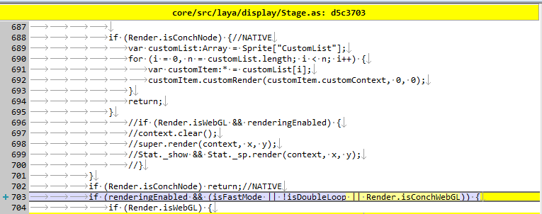

# LayaAir 1.7.19.1 beta代码更改

### 1.webGL/src/laya/webgl/atlas/AtlasWebGLCanvas.as

    
增加判断
```javascript
if (__JS__("bitmap !== ConchTextCanvas")) {
    ...
}
```
### 2.core/src/laya/net/Loader.as
   
判断改为
```javascript
if (Render.isConchApp && !Render.isConchWebGL) { 
    ...
}
```
### 3.core/src/laya/display/Text.as
   
增加代码
```javascript
if (Render.isConchApp && measureResult.width === 0 && measureResult.height === 0) {
	measureResult = Browser.context.measureText('W');
}
``` 
### 4.core/src/laya/display/Stage.as
   
判断增加Render.isConchWebGL
