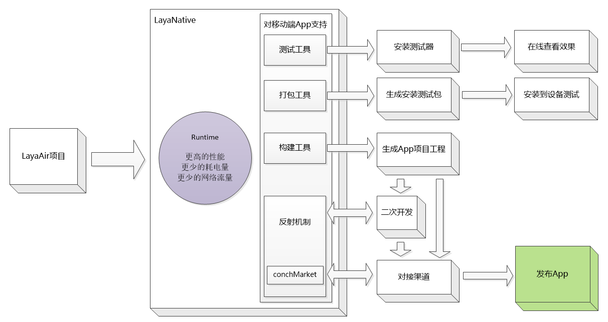

# LayaNative综述

　　LayaNative是LayaAir引擎针对移动端的一套完整的开发解决方案，包括Runtime、测试工具、打包工具、构建工具（安卓与IOS）、反射机制、渠道对接工具（conchMarket）；

  **LayaNative包含以下内容:**

#####1. 测试工具：#####
通过模拟浏览器的方式，在地址栏输入URL运行，帮助开发者快速在移动端看到运行效果, 节省大量反复打包测试的时间；
#####2. 安卓打包工具：#####
安卓打包工具可帮助开发者快速生成移动端的安卓系统apk安装包（该APK的icon、应用名称、是否打包资源等开发者可自由定制）；
#####3. 构建工具：#####
构建工具可帮助开发者快速构建移动端APP项目工程, 然后使用Android Studio、Eclipce、XCode 等开发工具打开->构建->运行；
#####4. 反射机制:#####
通过反射机制,开发者可以实现JavaScript与原生语言(Android/Java 或 iOS/Objective-C)的相互调用，通过反射机制开发者可以很方便的对应用程序进行二次扩展；
#####5. 渠道对接工具内(conchMarket):#####
渠道对接工具内嵌了渠道常用对接API，例如: 登录, 分享, 充值,好友关系链等；
#####6. Runtime：#####
Runtime是LayaAir引擎运行器，通过极致优化、保障LayaAir引擎2D与3D产品在打包APP后达到原生APP性能；

​	 
​	图（1）