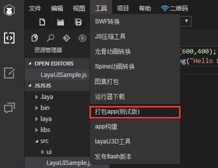
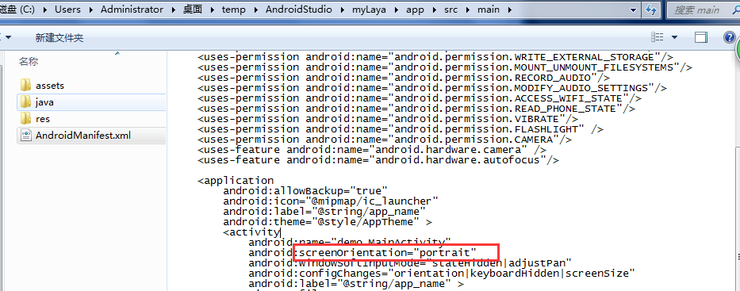

# 其它设置


## 1.LoadingView

### 1.1.进度条控制

##### 1.1.1.进度条的基本控制

​        默认打开APP运行游戏的时候，会有一个layabox设定好的loadingView界面，动画播放完成后，即可进入游戏，如下：

​  <br/>
​ 图（1）
​        开发者如果想要自己控制进度条的字体颜色、背景颜色、Tips等，可在资源目录下的config.js文件中修改，目前有2种设置方式可以实现：

######  a.打包APP设置高级选项

步骤一：打包app（测试版）

 <br/>
​ 图（2）

步骤二：点击高级选项，配置脚本以及启动LOGO

 <br/>
​ 图（3）

###### b.项目构建

开发者只需将自己的配置文件config.js拷贝到scripts目录下即可

```javascript
Android: assets/scripts/config.js//设置背景色、字体颜色、tips
IOS:esources/scripts/config.js
```

此时就会显示开发者自定义的背景色，字体色和tips文本<br/>

config.js内容如下所示：

```javascript
var loadingView=window.loadingView;
if(loadingView)
{
    loadingView.loadingAutoClose=true;//false:自定义进度条 ture：使用laya默认进度条
    loadingView.bgColor("#FFFFFF");//设置背景颜色
    loadingView.setFontColor("#000000");//设置字体颜色
    loadingView.setTips(["新世界的大门即将打开","敌军还有30秒抵达战场","妈妈说，心急吃不了热豆腐"]);//设置tips数组
}
```

​        loadingAutoClose变量默认是true，即播完动画即进入游戏界面，如果需要开发者想要自己控制进度，需要修改loadingAutoClose为false然后

```javascript
var per=0;
loadingView.loading(per);//per是0到100的整数
```

当数字等于100时进入游戏界面（但是必须播完一遍动画）;

​        setTips会根据数组内参数的个数，计算出百分比，加载到每个百分比节点的时候会自动显示不同的Tips文本，文本内容即数组内参数内容。<br/>

##### 1.1.2.制作酷炫进度条

​        在实际项目中，如果开发者想要做出自己喜欢的酷炫的进度条，LayaNative现有的方案是不够满足的，建议开发者快速加载LayaAir-JS引擎和必备的图片，通过LayaAir自己实现酷炫的进度条。


### 1.2.替换开发者自己的logo

​        如果开发者想使用自己的logo，可以通过2种方式实现

###### a、打包APP设置高级选项

​        如上1.1.1 步骤a所示

###### b、项目构建

​        开发者只需将自己的logo图logo.png 拷贝到logo目录下（格式png）

```javascript
Android: assets/logo/logo.png
IOS:resource/logo/logo.png
```

​        此时就不会加载layabox的动画而是居中显示logo.png,再通过上述的设置，设置背景色，字体颜色，tips。


### 1.3.后续白名单功能

​        后续LayaBox会有白名单机制，如果开发者购买了授权或者和LayaBox联合运营产品，便可以去掉LayaBox的logo，如果没有则需要强制增加LayaBox的logo。引擎内部会有检测机制，随机检测，如果检测不通过则无法进入游戏。


## 2、横竖屏设置

### 2.1.app中默认横竖屏的设置

**IOS：**

IOS中有一个config.ini，ini中有一个orientation参数，这个参数代表横竖屏，具体横竖屏的参数如下：

```javascript
orientation, ===2//竖屏：IOS home键在下
orientation, ===4//竖屏：IOS home键在上
orientation, ===8//横屏：IOS home键在左
orientation, ===16//横屏:IOS home键在右
```

这个config.ini中配置了默认的横竖屏值，还可以在启动的html中进行增加meta进行设置如下所示：

```java
<meta name='laya' screenorientation='landscape' /> 
```

可以设置的值有以下几种：

```javascript
"landscape","portrait","full_sensor","sensor_landscape","sensor_portrait","reverse_landscape","reverse_portrait "
```

如果config.ini设置了竖屏，但是启动的html中设置为横屏，最终会以html中的为准。

**Android：**

Android中有一个AndroidManifest.xml文件，在activity标签内有一个screenOrientation参数，默认是"portrait"竖屏，横屏将该参数设置为landscape即可

 <br/>
​ 图（4）

### 2.2.html中的横竖屏设置

   在启动文件xxx.html文件中head标签内添加一个meta标签

```javascript
<meta name='laya' logoimg='logo.png' logobkcolor='#ffffff' screenorientation='portrait' cacheid='fffffffff' />
```

`screenorientation='landscape'`为横屏，竖屏将该参数设置为portrait即可

​        小提示 : 发者自己打包APP项目，最好将app的默认设置与html下的设置保持一致，避免进入游戏后发生旋转。

<br/>

## **3、AssistiveTouch**

默认AssistiveTouch是显示的

 <br/>
​ 图（5）

不过，可以通过设置

```javascript
conch.showAssistantTouch(false);
```

将其隐藏，如下：

```javascript
if(Browser.window['conch'])
{
    __JS__('conch.showAssistantTouch(false)');
}
```

将其显示，如下：

```javascript
if(Browser.window['conch'])
{
    __JS__('conch.showAssistantTouch(true)');
}
```


## **4、IPV6**

苹果公司在2016年6月1日起，强制执行ipv6标准，所以开发者发布项目的时候，http请求和socket都必须使用域名的方式，不能使用ip地址。

如何测试ipv6网络下是否正常，请参考以下文档：

- [https://developer.apple.com/library/mac/documentation/NetworkingInternetWeb/Conceptual/NetworkingOverview/UnderstandingandPreparingfortheIPv6Transition/UnderstandingandPreparingfortheIPv6Transition.html#//apple_ref/doc/uid/TP40010220-CH213-SW1](https://developer.apple.com/library/mac/documentation/NetworkingInternetWeb/Conceptual/NetworkingOverview/UnderstandingandPreparingfortheIPv6Transition/UnderstandingandPreparingfortheIPv6Transition.html#//apple_ref/doc/uid/TP40010220-CH213-SW1)

- [http://www.pchou.info/ios/2016/06/05/ios-supporting-ipv6.html?utm_source=tuicool&utm_medium=referral](http://www.pchou.info/ios/2016/06/05/ios-supporting-ipv6.html?utm_source=tuicool&utm_medium=referral)


## **5、声音**

   背景音乐：支持MP3格式 ，一次性只支持播放一个MP3，如果同时播放声音A和声音B，B会把A顶替调。

​    特效： 支持wav（ 22050 单声道 16比特 ）、ogg 格式，同一时间内可播放多个音效。
