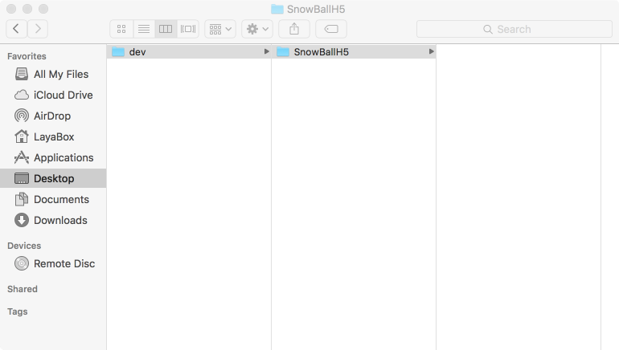
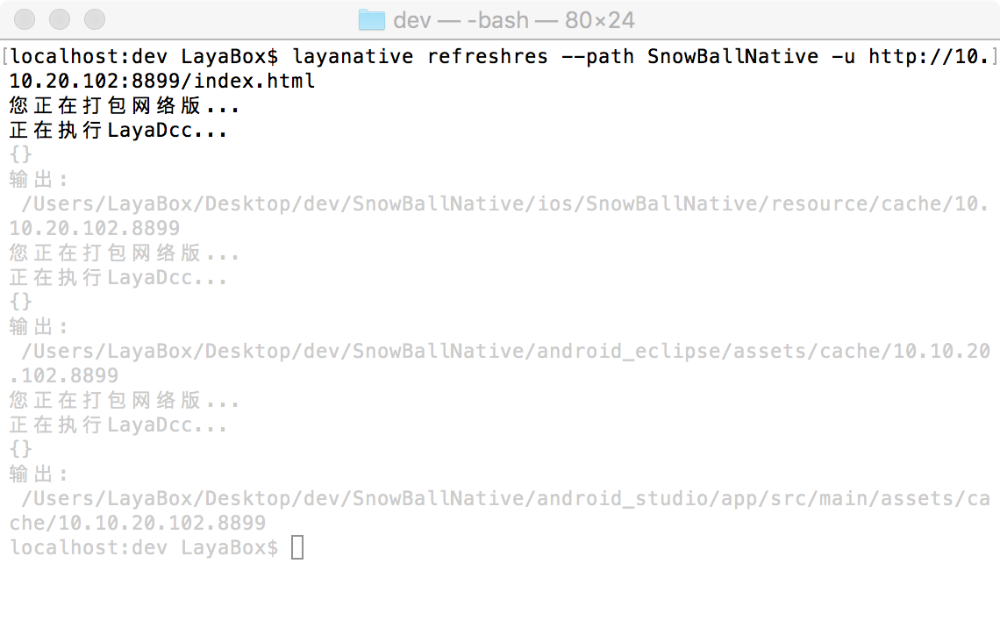

# LayaNative命令行工具
layanative命令行工具用来生成Android和iOS原生项目，以及项目的资源刷新功能， 方便项目迭代过程中的资源更新。
生成项目的功能对应IDE中的 `工具/app构建` 。
## 1.命令详解
### 1.安装layanative
windows
```   
$ npm install -g layanative  
```
mac
```   
$ sudo npm install -g layanative  
```
### 1.查看SDK版本信息
SDK就是native项目的模板。listversion命令会列出当前所有可用的SDK版本信息，在下面创建native项目的时候可以通过参数指定需要的版本。    
```   
$ layanative listversions  
```
### 2.创建native项目
createapp命令用于创建native项目  
可以先用下面的命令查看下命令createapp的帮助信息
```
$ layanative createapp --help
```
#### 用法:
    layanative createapp -f res_path [-s sdk_path | -v version] [-p all|ios|android_eclipse|android_studio] [-t 0|1|2] [-u url] [-n project_name] [-a app_name] [--package_name package_name]

#### 参数说明:

| 关键字 | 描述
| ------------ | ------------ 
| `--folder,-f` |    资源路径 说明：把游戏资源打包进客户端以减少网络下载,选择本地的游戏目录，例如启动index在d:/game/index.html下,那资源路径就是d:/game
| `--path` |       native项目输出目录 [默认值: "."]
| `--version，-v` |       SDK版本 说明：自动使用特定版本的SDK，系统会从服务器下载SDK并存放在特定位置。--version和--sdk互相矛盾不能同时指定，都不指定时默认使用最新版本的SDK
| `--platform, -p` |    项目平台 [可选值: all, ios, android_eclipse, android_studio][默认值: all]
| `--type, -t` |       创建类型 [0: 不打资源包 1: 打资源包 2: 单机版本] [默认值: 0]
| `--url, -u` |       游戏地址 [当t为0或者1的时候，必须填，当t为2的时候，不用填写]
| `--name, -n` |       项目名称 说明：native项目的名称 [默认值: LayaBox]
| `--app_name, -a` |      应用名称 说明：app安装到手机后显示的名称 [默认值: LayaBox]
| `--package_name` |       包名 [默认值: com.layabox.game]
| `--sdk,-s` |       SDK本地目录 说明：自定义的SDK目录，可选参数。断网情况下使用，一般情况下建议使用参数--version。
当type为1或2时会打资源包到native项目，为0时不打。打包资源底层实际是调用dcc的方法。打包资源dcc相关，参考 [LayaDcc工具](https://github.com/layabox/layaair-doc/tree/master/Chinese/LayaNative/LayaDcc_Tool)。  
可以用--path参数指定项目的输出路径，默认输出到当前路径下。

根据-v使用v0.9.5版本的SDK
```
$ layanative createapp -f SnowBallH5 -t -1 -n SnowBallNative -u http://10.10.20.102:8899/index.html -v v0.9.5
```

既没指定-v也没指定-s，使用最新版本的SDK
```
$ layanative createapp -f SnowBallH5 -t -1 -n SnowBallNative -u http://10.10.20.102:8899/index.html
```
用--version或者-v指定版本需要联网环境，断网情况下可以用--sdk或者-s指定SDK目录。[SDK下载地址](https://ldc.layabox.com/layadownload/?type=layaairnative-LayaAir%20Native%20SDK%200.9.6)
```
$ layanative createapp -f SnowBallH5 -t -1 -n SnowBallNative -u http://10.10.20.102:8899/index.html -s D:/v0.9.6
```
### 3.刷新native项目资源包
refreshres命令用于刷新native项目的资源包  
项目迭代过程中，h5项目有了修改，可以用refreshres命令，重新打包刷新资源和代码到native项目中。
#### 用法:
    layanative refreshres [-p all|ios|android_eclipse|android_studio] [--path path] [-u url]

#### 参数说明:

| 关键字 | 描述
| ------------ | ------------ 
| `--platform, -p` |    项目平台 [可选值: all, ios, android_eclipse, android_studio][默认值: all]
| `--path` |       native项目路径 [默认值: "."]
| `--url, -u` |       游戏地址


如果创建的项目是单机版，refreshres时不需要输入url。如果输入网络版url，打的是网络版的资源包，那么还需要更改项目代码，才能变成网络版的项目。  
如果创建的项目是网络版，refreshres时必须输入url。如果输入新的地址，那么还要更改项目中设置url的代码，才能完成URL的替换。如果输入单机版地址，打的是单机版的资源包，那么还需要更改项目代码，才能变成单机版的项目。    
手动切换单机版和网络版相关，参考 [LayaBox 构建工具](https://github.com/layabox/layaair-doc/tree/master/Chinese/LayaNative/build_Tool)。
### 4.删除native项目资源包
removeres命令用于删除native项目的资源包  
#### 用法:
    layanative removeres [--path path] 
#### 参数说明:

| 关键字 | 描述
| ------------ | ------------ 
| `--path` |       native项目路径 [默认值: "."]

## 3.应用实例
1.首先建立下图所示的目录结构。SnowBallH5是html5项目资源目录

  
2.查看SDK版本信息  
  
3.创建native项目  
  
4.生成下图所示目录结构。  
  
5.随时刷新资源包  
在dev目录下，通过--path指定native工程的目录    
       
进入native项目目录，不需要指定--path参数了  
   
5.如果不需要资源包，删除它    
在dev目录下，通过--path指定native工程的目录     
    
进入native项目目录，不需要指定--path参数了   
   