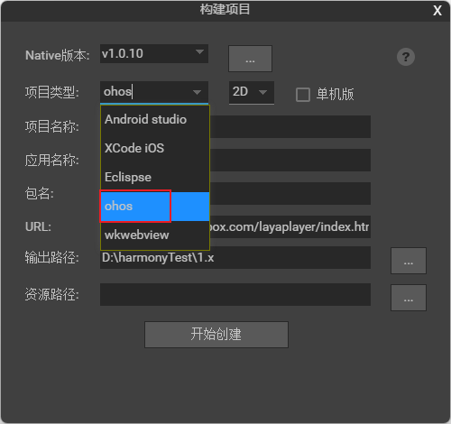
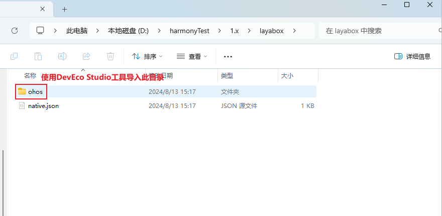
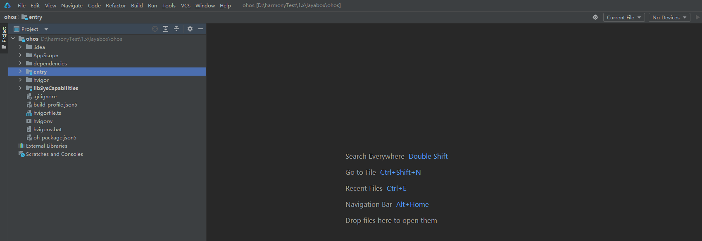

# 构建鸿蒙NEXT工程

自LayaAir1.8.16版本开始，增加支持发布鸿蒙NEXT项目。

## 1. 运行需求

### 1.1 基础开发环境

构建鸿蒙NEXT项目需要准备好开发环境。在构建鸿蒙NEXT工程中，我们需要准备鸿蒙App开发工具DevEco Studio；除此之外我们还需要注册好华为开发者账号进行认证。

参考链接：[HUAWEI DevEco Studio](https://developer.huawei.com/consumer/cn/deveco-studio/)

​                   [华为开发者账号](https://developer.huawei.com/consumer/cn/doc/start/introduction-0000001053446472)

## 2. 在LayaAirIDE中打开App构建

在[LayaBox官网](https://ldc.layabox.com/layadownload/?type=layaairide-LayaAir%20IDE%201.8.16)下载LayaAirIDE（需要LayaAirIDE1.8.16版本及以上），打开LayaAirIDE->工具->app构建，如图1所示：

 

(图1)

由于构建工具需的库文件比较大，因此并没有直接包含在LayaAirIDE中，在首次使用这个工具的时候，会先下载SDK包。文件比较大，等待文件下载完毕，再次点击App构建，会弹出构建对话框。

## 3. 项目构建

在LayaAirIDE的构建项目对话框中，选择为鸿蒙NEXT平台类型（对应ohos），如图2所示：

 

(图2)

构建项目设置中的其他参数与LayaNative的其他平台设置相同，开发者可直接发布。

参考链接：[IDE构建LayaNative工程](https://ldc.layabox.com/doc/?nav=zh-as-7-3-1)

## 4. 构建好的鸿蒙项目工程的使用

通过上面app构建器构建出来的鸿蒙NEXT项目工程，如图3所示，需要使用鸿蒙开发者工具DevEco Studio打开来进行二次开发和打包等操作，如图4，使用DevEco Studio工具打开并连接设备构建App运行。

 

(图3)

 

(图4)