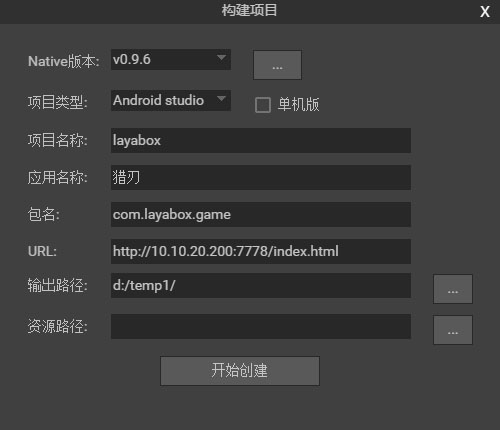

# LayaBox 构建工具
　　构建工具用来生成包含LayaNative Runtime的移动端APP项目，相当于APP项目向导。目前支持Android（Eclipse项目、Android studio项目）和IOS(XCode项目)。

## 1. 运行需求
#### 1.1 基础开发环境

​	构建项目必须要准备好开发环境。比如：构建IOS项目需要准备好Mac电脑和XCode。另外，构建项目需要安装1.7（含）以上的jdk，如果没有，请先安装。

​	**下载地 址：**

​	[http://www.oracle.com/technetwork/java/javase/downloads/jdk8-downloads-2133151.html](http://www.oracle.com/technetwork/java/javase/downloads/jdk8-downloads-2133151.html)

#### 1.2 下载工具包

　　由于构建工具需的库文件很大，因此并没有包含在LayaAirIDE中，要使用这个工具需要下载单独的工具包。

　　**下载地址：**
​	[http://ldc.layabox.com/download/LayaAir/runtime/download.zip](http://ldc.layabox.com/download/LayaAir/runtime/download.zip)  

　　*Tips: IDE内部提供下载引导功能，可以在IDE中直接跟随引导操作。*

#### 1.3 安装

　　下载完成以后，解压到IDE目录的 resources\app\out\vs\layaEditor\libs\RuntimePackTools 子目录下，覆盖原来的文件或者目录，就能使用了。


## 2. 面向用户
　　无论是构建Android还是IOS项目，则必须要有相应的Android或IOS的APP开发基础。  如果不具备，请先去学习了解相关的基础知识。


## 3. 在LayaAirIDE的打开app构建

在[Layabox官网](Layabox.com)下载layaAirIDE，打开LayaAirIDE-->工具-->app构建，如图1所示：


  <br /> 
(图1)


## 4. 项目构建界面参数

在LayaAirIDE中打开项目构建的界面，如图2所示：

 <br /> 
(图2)

`平台` 构建生成的项目工程的类型，有Android Eclipse项目、Android studio项目、IOS 项目 三种选项，如果需要生成Android项目，可以选择Android-eclipse或Android-studio；如果需要生成XCode(IOS)项目，则选择IOS选项。 

`单机版app`：如果勾选此选项，则构建的项目打包的app是单机版，否则就是在线版。单机版通常不需要联网，没有对应的url，不用提供url。但是必须提供游戏资源，否则打包之后无法运行。

`项目名称`：APP的名称。同时也是构建项目的输出目录。

`包名` ：应用的包名，这个正常情况下是不可见的。一般采用反域名命名规则（有利于分辨和避免与系统中已经有的APP冲突)。   
　　例如 : com.layabox.runtime.demo   
　　包名必须是 xxx.yyy.zzz 的格式，至少要有两级，即xxx.yyy 。否则打包会失败。

`游戏url`：如果要打包的应用是一个在线项目，则需要提供一个启动url，指向一个html页面，是应用的入口。而通过LayaAir生成的项目，会输出一个启动页面，一般是index.html。 在测试的时候，为了方便，通常是使用的本地URL地址在浏览器中测试，当打成Anroid APP的时候，必须有一个真正的webserver的地址，

**例如：**  
　　*局域网地址：*  

``` 
    http://10.10.20.19:8888/index.html
```
　　*实际地址:*  
```
    http://layaair.ldc.layabox.com/layaplayer/index.html
```

`输出路径`：构建生成的 App 工程项目的存放地址。

`资源路径`：资源是脚本、图片、声音等资源。对于在线游戏，只要有游戏的url就能正常运行，但是把资源直接打进APP包中的话，可以避免网络下载，加快资源载入速度。如果是单机游戏，由于没有提供游戏url，就必须给资源目录，把所需的资源全部打包进apk。
注意打包进apk的资源依然可以通过我们的dcc工具（资源缓存管理）进行更新。
如果这时候没有设置资源路径，在构建完项目以后，依然可以手动添加资源，添加方法参考 [LayaDcc工具](https://github.com/layabox/layaair-doc/tree/master/Chinese/LayaNative/LayaDcc_Tool)。  

**注意：**  

　　把资源打包的缺点是会增加包体的大小。  

　　打包资源的在线游戏，必须在server端打dcc了，否则就会失去打包的优势，依然会下载所有的资源。如何打dcc，参考 [LayaDcc工具](https://github.com/layabox/layaair-doc/tree/master/Chinese/LayaNative/LayaDcc_Tool)。


## ５. 构建好的项目工程的使用

构建好的 App工程，可以用对应的开发工具打开进行二次开发和打包等操作。

- Android-eclipe（android）项目可以使用 eclipe软件进行导入和开发。
- Android-studio（android）项目可以使用 android-studio软件进行导入和开发。
- XCode（ios）项目可以使用 xcode 软件进行导入和开发。打开XCode(ios)项目后需要选择真正的ios设备进行build。（注意：真正的设备是 armv7、armv7s、arm64 架构。而如果使用ios Simulator 则是 X86 架构，目前 LayaNative 在 ios 设备上尚未支持 X86 架构，如果使用模拟器编译是无法通过的。


**参考资源：**

- [Eclipse搭建Android环境](https://github.com/layabox/layaair-doc/tree/master/Chinese/LayaNative/setUpAndroidEnvironment_Eclipse)

- [Android Studio的使用和配置](http://ldc.layabox.com/index.php?m=content&c=index&a=show&catid=42&id=193)

- [IOS打包发布App详细流程](http://ldc.layabox.com/index.php?m=content&c=index&a=show&catid=42&id=192)

  ​

## 6. 怎样构建Android单机版
　　在构建的项目中打开MainActivity.java，搜索 `mPlugin.game_plugin_set_option("localize","false");`单机版需要设置为"true"，如`mPlugin.game_plugin_set_option("localize","true");`


## 7. 注意问题
　　android studio构建完成后，需要根据自己的环境修改android sdk的版本号，现在设置的是23，需要修改的
文件是 app/build.gradle。