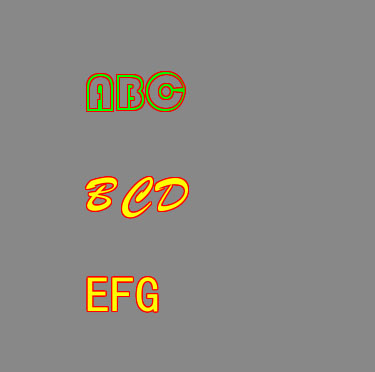

# 扩展字体

在移动设备中，自带的中文字体一般只有一种，开发者如果想要定制个性化字体，LayaPlayer-0.9.7以后的版本支持通过XMLHttpRequest下载字体，并使用该字体，效果如下图1所示：



## 实现步骤

1、通过XMLHttpRequest以arraybuffer的方式进行下载字体文件。  
2、字体下载成功后，调用`conch.setFontFaceFromBuffer("AA",xhr.response);`这个函数进行设置字体,第一个参数是在引擎中的字体名字，在这随便取名为AA。
3、设置使用该字体，然后进行绘制。


具体实现代码:

```javascript
var xhr = new XMLHttpRequest();
xhr.responseType = 'arraybuffer';
xhr.open('GET', "layabox.ttf", true);
xhr.onload = function () 
{
	conch.setFontFaceFromBuffer("AA",xhr.response);
    setInterval(onDrawFrame, 15);
};
xhr.onerror = function (e) 
{
	alert('>>>download ttf error :' + e);
};
xhr.send(null);

//这里以html5标准canvas接口为例
function onDrawFrame()
{
    context.save();
    context.font = "normal 100 50px AA 1 #ff0000 1 #00ff00";
	context.fillStyle = "#00ff00";
	context.fillText( "ABC",100,100 );
    context.restore();
}
```

**TIPS：一定要等待字体下载完成后，设置了setFontFaceFromBuffer，才可以使用该字体。**


