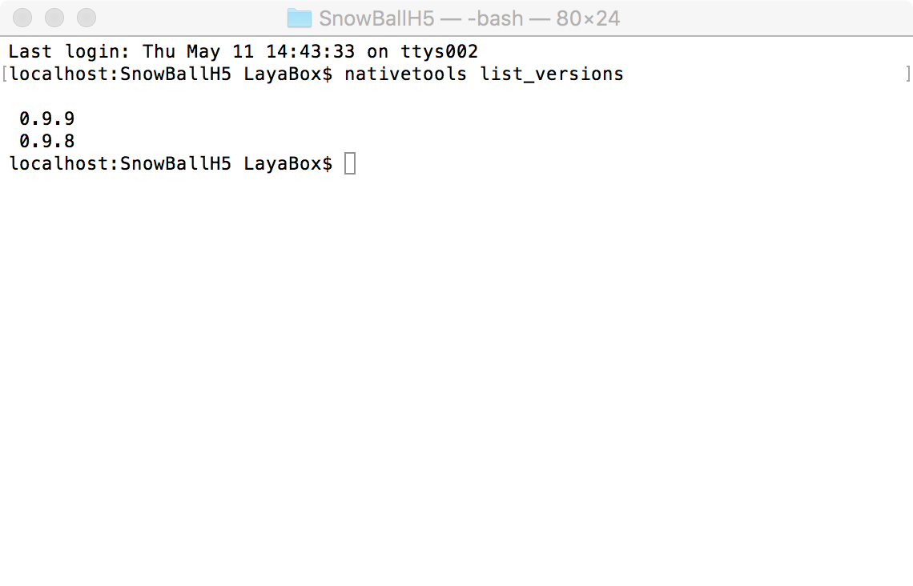
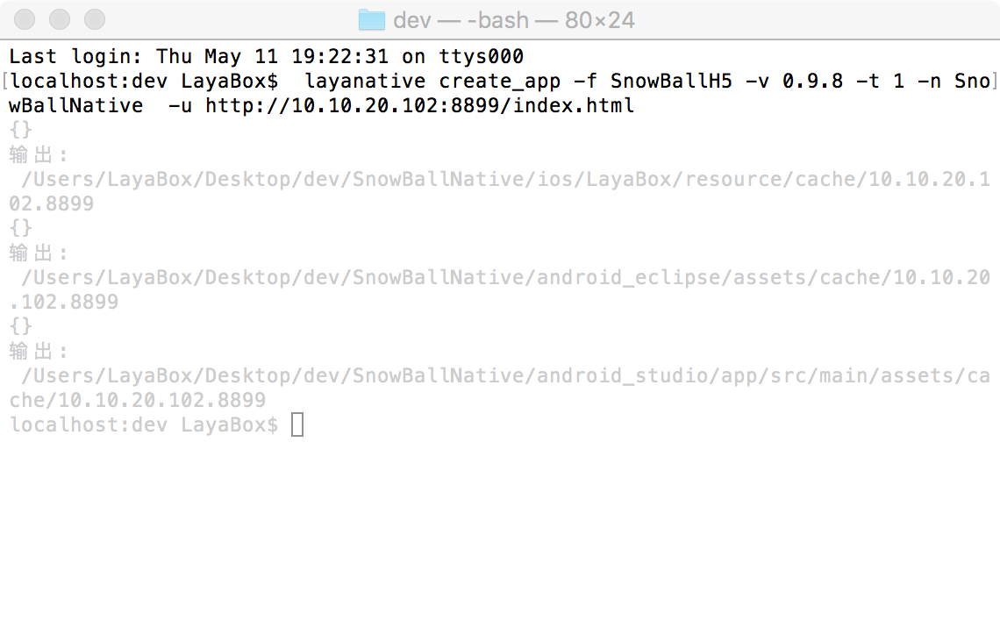
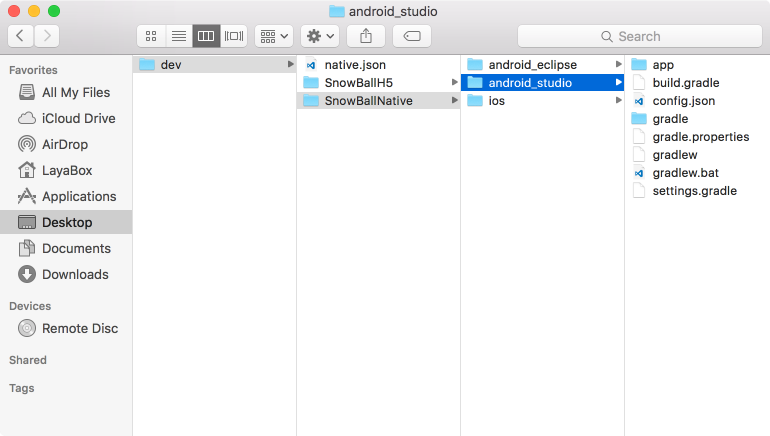
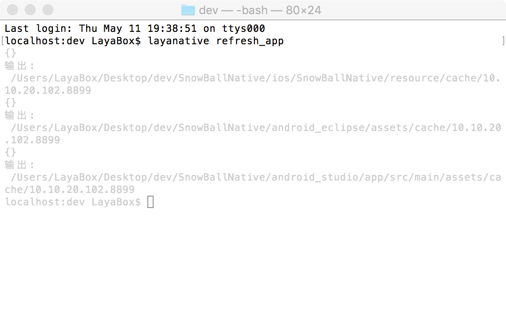

# LayaNative命令行工具

## 1.命令详解
### 1.查看SDK版本信息
SDK就是native项目的模板。list_version命令会列出当前所有可用的SDK版本信息，在下面创建native项目的时候可以通过参数指定需要的版本。    
```   
$ layanative list_versions  
```
### 2.创建native项目
create_app命令用于在当前目录下创建native项目  
可以先用下面的命令查看下命令create_app的帮助信息
```
$ layanative create_app --help
```
#### 用法:
    layanative create_app -f h5_path [-s sdk_path | -v 0.1.0] [-p all|ios|android_eclipse|android_studio] [-t 0|1|2] [-u url] [-n SnowBall] [-a 疯狂雪球] [-package_name com.snowball.game]

#### 参数说明:

| 关键字 | 描述
| ------------ | ------------ 
| `--folder,-f` |    html5项目目录或资源路径 说明：把游戏资源打包进客户端以减少网络下载,选择本地的游戏目录，例如启动index在d:/game/index.html下,那资源路径就是d:/game
| `--sdk,-s` |       SDK本地目录 说明：自定义的SDK目录
| `--version，-v` |       SDK版本 说明：自动使用特定版本的SDK，系统会从服务器下载SDK并存放在特定位置。--version和--sdk互相矛盾不能同时指定，都不指定时默认使用最新版本的SDK
| `--platform, -p` |    项目平台 [可选值: all, ios, android_eclipse, android_studio][默认值: all]
| `--type, -t` |       创建类型 [0: 不打资源包 1: 打资源包 2: 单机版本] [默认值: 0]
| `--url, -u` |       游戏地址 [当t为0或者1的时候，必须填，当t为2的时候，不用填写]
| `--name, -n` |       项目名称 说明：native项目的名称 [默认值: LayaBox]
| `--app_name, -a` |      应用名称 说明：app安装到手机后显示的名称 [默认值: LayaBox]
| `--package_name` |       包名 [默认值: com.layabox.game]

当type为1或2时会打资源包到native项目，为0时不打。打包资源底层实际是调用dcc的方法。打包资源dcc相关，参考 [LayaDcc工具](https://github.com/layabox/layaair-doc/tree/master/Chinese/LayaNative/LayaDcc_Tool)。

### 3.刷新native项目
create_app命令用于刷新当前目录下native项目的资源包
项目迭代过程中，h5项目有了修改，可以用refresh_app命令，重新打包刷新资源和代码到native项目中。
#### 用法:
    layanative refresh_app [-t 0|1|2] [-u url]

#### 参数说明:

| 关键字 | 描述
| ------------ | ------------ 
| `--type, -t` |       创建类型 [可选值: 0: 不打资源包 1: 打资源包 2: 单机版本]
| `--url, -u` |       游戏地址

刷新资源包。如果创建的类型为0，其实啥也没做。
```   
$  layanative refresh_app
  
```
删除资源包（如果之前有打包资源），url不变
```   
$  layanative refresh_app -t 0 
  
```
删除资源包（如果之前有打包资源），设置新的url
```   
$  layanative refresh_app -t 0 --url new_url
  
```
刷新资源包，url不变
```   
$  layanative refresh_app -t 1 
  
```
刷新资源包，设置新的url
```   
$  layanative refresh_app -t 1 --url new_url
  
```
如果type为0或1，刷新资源包,设置新的url
```   
$  layanative refresh_app --url new_url
  
```
改为单机版，刷新资源包
```   
$  layanative refresh_app -t 2
  
```
## 2.参数缓存机制
例如我们一开始通过下面命令建立了一个iOS项目
```   
$  layanative create_app -f h5_path  -v 0.1.0 -p ios -t 0 -u url -n SnowBall -a 疯狂雪球 -package_name com.snowball.game
  
```
接着又需要建立android studio项目，由于第一次建立项目的参数缓存到了文件中，所以这次可以不用输入冗长的参数。只需输入下面命令即可。
```   
$  layanative create_app -p android_studio
  
```
当然此时也可以更改其他参数，比如app_name
```   
$  layanative create_app -p android_studio -a new_app_name
  
```
但是需要注意的是这不会影响之前生成的iOS项目的app_name。
## 3.应用实例
1.首先建立下图所示的目录结构。SnowBallH5是html5项目目录或资源目录

  
2.查看SDK版本信息  
  
3.创建native项目  
  
4.生成下图所示目录结构。注意这是生成了项目SnowBallNative和文件native.json。如果需要删除，两个文件要一起删除。
  
5.随时刷新资源包  
  