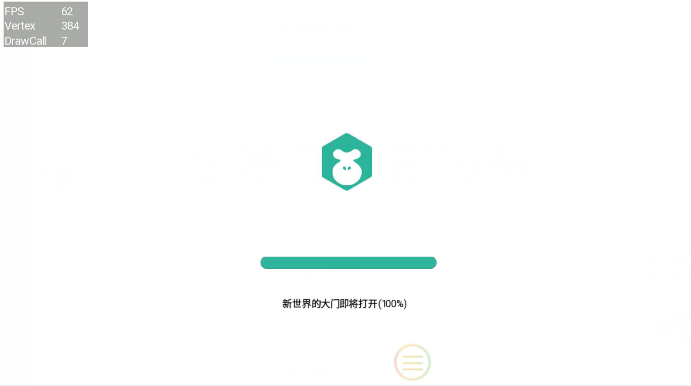

# 加载界面

应用程序在启动的时候，需要加载必要的html、js、图片，这个时候就需要通过加载界面显示进度，LayaPlayer在运行项目的时候，默认有一个LodingView界面，当动画播放完成后，即可进入游戏，如图一所示：  

​ <br/>


## 1.进度条控制

​开发者可以在config.js中，控制LoadingView的背景色、字体颜色、Tips等。  

config.js的位置：  
```
Android: 工程目录下的assets/scripts/config.js  
IOS:工程目录下的resources/scripts/config.js  
```

config.js中的内容如下所示，开发者可以根据自己的需求进行修改：

```javascript
var loadingView=window.loadingView;
if(loadingView)
{
    loadingView.loadingAutoClose=true;//true代表当动画播放完毕，自动进入游戏。false为开发者手动控制
    loadingView.bgColor("#FFFFFF");//设置背景颜色
    loadingView.setFontColor("#000000");//设置字体颜色
    loadingView.setTips(["新世界的大门即将打开","敌军还有30秒抵达战场","妈妈说，心急吃不了热豆腐"]);//设置tips数组，会随机出现
}
```

## 2.进度条控制实例

在实际开发过程中，通常想要精确控制LoadingView的隐藏和显示，那么开发者可以在config.js中这样设置loadingView.loadingAutoClose的值为false
然后在项目中根据加载完成情况，设置进度条的显示进度，调用函数如下:  
`loadingView.loading(nPercent);//参数为0-100的整数值，当值为100的时候LoadingView自动关闭`  

项目中的伪代码如下：
```javascript
var nPercent=0;
var image1 = document.createElement('img');
image1.onload=function()
{
    if(window.loadingView){
        nPercent+=33;
        window.loadingView.loading(nPercent);
    }
}
image1.src = "a.png";

var image2 = document.createElement('img');
image2.onload=function()
{
    if(window.loadingView){
        nPercent+=33;
        window.loadingView.loading(nPercent);
    }
}
image2.src = "b.png";

var image3 = document.createElement('img');
image3.onload=function()
{
    if(window.loadingView){
        nPercent+=33;
        window.loadingView.loading(nPercent);
    }
}
image3.src = "c.png";
```

## 3.替换开发者自己的logo
如果开发者想使用自己的logo，开发者只需将自己的logo图logo.png拷贝到相应目录下即可，目录如下所示：

```
Android: assets/logo/logo.png
IOS:resource/logo/logo.png
```
此时就不会加载layabox的动画而是居中显示logo.png，还可再通过config.js的设置，设置背景色，字体颜色，tips。

**Tips：**  
*1、logo只能是png格式*  
*2、替换成开发者自己的logo.png，不支持动画播放*  
*3、替换掉开发者自己的logo.png，依然可以通过loadingView.loading设置加载进度*

## 4.去掉所有文字显示

LayaPlayer-0.9.6以后的版本，可以去掉所有文字的显示，包括tips和加载百分比，修改config.js，把showTextInfo设置为false即可。
```javascript
loadingView.showTextInfo=true;//改成false
```

## 5.制作酷炫进度条

在实际项目中，如果开发者想要做出自己喜欢的酷炫的进度条，LayaPlayer现有的方案是不够满足的，建议开发者快速加载LayaAir-JS引擎和必备的图片，通过LayaAir自己实现酷炫的进度条。

## 6.白名单功能

后续LayaBox会有白名单机制，如果开发者购买了授权或者和LayaBox联合运营产品，便可以去掉LayaBox的logo，如果没有则需要强制增加LayaBox的logo。引擎内部会有检测机制，随机检测，如果检测不通过则无法进入游戏。

## 7.打包app（测试版）

目前在LayaAir-IDE支持打包APP-测试版的功能（**注意：建议开发者还是使用构建工程的方式，学习一些IOS和android的基本知识**），如果想要替换config.js或者替换logo，如下图2、图3所示：  

 <br/>
​ 图（2）

步骤二：点击高级选项，配置脚本以及启动LOGO

 <br/>
​ 图（3）
