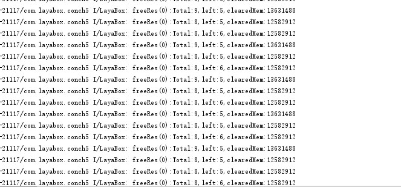

# 显存池管理

为了避免由于显存过大，或者开发者忘记释放显存，导致应用程序被系统直接kill的风险，在LayaPlayer中有一套显存管理机制，原理如图1所示：  


  


**为什么需要自动显存管理，早期的ios设备（iphone4S、ipad2）或者早期的android设备，内存只有512MB，当应用程序内存达到270MB左右，应用程序就会被系统直接kill掉，用户体验非常不好，在游戏中占用资源最多的就是图片资源。**

### 1.如何配置


####  1.1. 默认设置

显存池的size，开发者需要在应用程序开始执行前设定，如果开发者未设定，LayaPlayer内部根据设备的内存情况设定了一个默认值，代码如下：  
```javascript
var nMem = conchConfig.getTotalMem();
if (nMem <= 524288) {
    conchConfig.maxTextureMemSize = 64 * 1024 * 1024;
}
else if (nMem > 524288 && nMem <= 1048576) {
    conchConfig.maxTextureMemSize = 84 * 1024 * 1024;
}
else if (nMem > 1048576) {
    conchConfig.maxTextureMemSize = 128 * 1024 * 1024;
}
```


####  1.2. 开发者设定
开发者也可以根据自己需求进行设定，需要在config.js设定，代码如下：

```javascript
var loadingView= window.loadingView;
if(loadingView)
{
    loadingView.loadingAutoClose=true;
    loadingView.bgColor("#ffffff");
    loadingView.setFontColor("#000000");
    loadingView.setTips(["新世界的大门即将打开", "敌军还有30秒抵达战场", "妈妈说，心急吃不了热豆腐"]);
}
//在这进行设定
var nMem = conchConfig.getTotalMem();
if (nMem <= 524288) {
    conchConfig.maxTextureMemSize = 80 * 1024 * 1024;
}
else if (nMem > 524288 && nMem <= 1048576) {
    conchConfig.maxTextureMemSize = 128 * 1024 * 1024;
}
else if (nMem > 1048576) {
    conchConfig.maxTextureMemSize = 200 * 1024 * 1024;
}
```

**Tips：这个显存池size的设定必须放在应用程序开始启动的地方，程序中不可动态设定，config.js是LayaPlayer启动后立刻就会执行的js，所以放在这才是最安全的。**


####  1.3. config.js在哪

ios版本：在工程目录下的resource\scripts\config.js  
android版本：在工程目录下的assets\scripts\config.js  


### 2.出现严重卡顿、屏幕闪烁现象

在LayaPlayer下运行项目，如果出现了严重卡顿、或者屏幕闪烁的现象。这个时候可以把设备连接到电脑上查看log，如果log中一直频繁打印如下内容：  
`freeRes(0):Total:8,left:5,clearedMem:115620`  
如下图2所示：
  

出现这种情况的原因：当前画面下，绘制的图片显存数量已经超出了显存池的最大size，显存池就会一直触发清理函数，同时有可能会出现闪烁现象。


### 3.如何解决

####  3.1.扩大显存池的大小

先按照1.2的方法，把显存池size设置大一些，再次测试项目，如果不在频繁打印freeRes的log，并且卡顿、屏幕闪烁现象也不存在了，证明因为显存问题所导致的问题，或许这个时候你心情能好点。

####  3.2.从根本上解决问题

如果想从根本上解决问题，开发者需要严格控制图片的生命周期、显存的大小以及是否有残留的画面还在显示。
#####  3.2.1.如何计算图片的显存
(1)、一张`1024*1024`图片占用显存大小是： `1024 * 1024 * 4 = 4MB`。
(2)、一张`768*890`图片占用显存大小是：`1024 * 1024 * 4 = 4MB`，由于部分显卡硬件限制创建纹理的尺寸必须是2的n次幂，所有`768*890`的图片，在显卡中会按照`1024*1024`来创建。
(3)、强烈建议美术在制作图片的时候，如果图片宽或者高超过512像素的时候，要求图片的尺寸是2的n次幂，切记避免513、1025这样的尺寸出现，低于512的图片LayaPlayer引擎会自动处理合并图集。
#####  3.2.3.图片内存、显卡关系
  

**图解：**
(1)、一张png图片，尺寸为`768*890`，文件大小为420KB。  
(2)、通过loader函数进行网络加载，消耗流量为420KB。  
(3)、通过png解码成ImageBitmapData，占用内存`768*890*4=2.73MB`。  
(4)、将该图片绘制到屏幕上，首先需要在显卡创建一张纹理，这张纹理的大小需要是2的n次幂，所以创建了一张`1024*1024`的纹理，然后把ImageBitmapData数据上传到显卡，内存到显存的拷贝。  
(5)、这个时候占用`1024*1024*4=4MB`显存，图片数据从内存拷贝到显卡后，内存的BitmapData，引擎中会自动释放掉。  
(6)、如果预加载了一张图片，但是这张图片长时间都没有进行绘制，就会一直占用内存，LayaPlayer引擎默认会在图片加载20秒后，将该图片的内存进行释放，等需要绘制的时候，再从硬盘中重新加载。

#####  3.2.3.预加载图片
很多应用都会用到预加载功能，提前把很多图片预加载到内存中，但是这些图片并没有进行绘制，这个时候内存会比较紧张，LayaPlayer引擎默认会在图片加载20秒后，将这些资源清空掉。所以一定要控制好预加载图片的数量。  
如果项目需求只是想将图片先下载到本地，先不进行使用，这种情况可以使用资源打包的方式或者LayaDCC的方式。  
总之预加载图片的数量要慎重。
通过以下代码可以设置删除内存图片的时间：

```javascript
conch.config.setImageReleaseSpaceTime(15000);//单位为毫秒，默认是20000
```
看见log输出`JCImageManager::setReleaseSpaceTime=15000`代表设置成功  

**Tips：setImageReleaseSpaceTime函数最好也写在config.js中调用**

##### 3.2.4. 由于某些节点未删除导致的显存问题

在很多项目中，经常会碰到开始进入游戏首屏界面是正常的，但是切换几次界面或者进入几次场景再回来，发现首屏界面出现了屏幕闪烁，log一直在打印freeRes。  
这种情况大部分是因为，有的节点没有被删除，画面其实还在一直渲染，只是被主界面遮挡住，这个时候就确保你的应用程序控制好节点的删除、隐藏机制。


### 4.调试手段

如果你在项目中出现了3.2.4的现象，LayaPlayer引擎提供了一个小方法，可以通过该函数把所有画面都设置成半透明，这样找出那些节点画面没有隐藏或者删除，导致的显存问题。

```javascript
if( window.conch )
{
    window.conch.config.setTransparentMode();
}
```
**Tips**  
*1、conch只能LayaPlayer环境下调用，在网页版本中是没有conch定义的，所有需要判断一下是否存在。*  
*2、如果使用as语言开发的时候，可以通过 `Browser.window['conch'] `这种方式获得conch对象。*

如图4所示：

  
