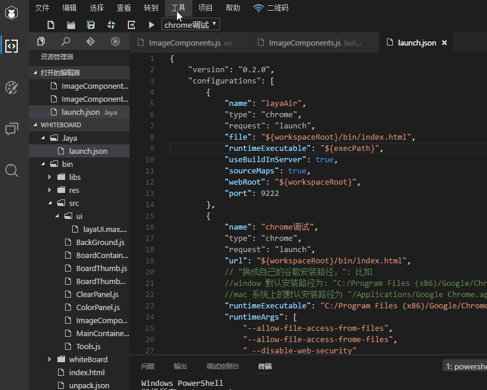
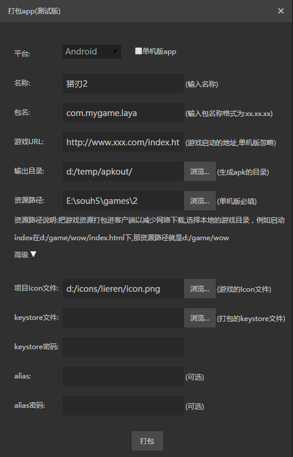
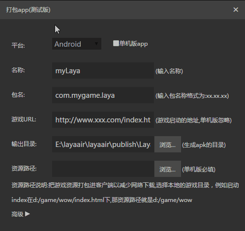

# LayaBox打包工具

使用 LayaAir IDE 创建的项目，不仅可以生成 h5 页面在网站上运行，也可以打包成App 在移动端安装运行。不过，目前只支持打包Andorid版本的app，因为IOS系统只能够通过Apple的XCode来打包，无法使用其他第三方的工具进行打包。关于构建IOS的XCode项目工程，可以参考 “构建项目” 的文档。

打包功能仅用于快速测试和演示，真正要发布的话，建议用构建项目的方法。


## 1、作用：

　　把已有的layabox的包解开，修改图标和启动页面等参数，重新生成一个新的app。生成的这个app可以直接安装运行，也可以直接发布到各大平台（接入登陆和支付功能以后提供）。

## 2、运行需求：
1. 需要已经安装了1.7（含）以上的jdk，如果没有安装，可以到
   [这里](http://www.oracle.com/technetwork/java/javase/downloads/jdk8-downloads-2133151.html)下载。

   (现在有个问题：在mac系统下，如果已经安装了1.8，可能会导致打包错误)

## 3、使用方法：
单击菜单的 工具/打包app(测试版)，如下图:  
  
填好参数后，点 打包 即可。 **打包时间较长**，因此会有一个进度提示，如果没有任何错误，进度到达100%
以后就输出目录就会生成最后的打包结果。

具体参数的含义见下面的说明。 


## 4、Android Apk 打包
### 4.1 主界面:  



### 4.2 界面参数的意义：  

#### 4.2.1单机版app  

　　如果选中，就是要打包单机版，否则就是打包在线版。  
　　单机版不需要联网，没有对应的url。所以不用提供url，但是必须提供游戏资源，启动页面固定为资源路径中的 index.html。如果项目的启动页面不是index.html，会在app启动的时候报网络错误。  
　　在线版必须有url才行，是否打包资源可以自行决定（见下面的 "资源路径" 部分）。   
　　  <br />
　　**Tips:  即使在单机版里面依然可以通过XMLHttpRequest或者websocket进行网络操作，只是不支持动态更新资源。**


#### 4.2.2 名称  

就是app的名称，安装以后显示在app图标下面的名称。  
例如：  
    
 `猎刃2` 就是这里要填的名称。  
*Tips: 目前只能修改中文系统下的名称。* 


#### 4.2.3 包名  

android应用的包名，这个正常情况下是不可见的。一般采用反域名命名规则（有利于分辨和避免与系统中已经有的app冲突)。   
　　例如 : com.layabox.runtime.demo   
　　包名必须是 xxx.yyy.zzz 的格式，至少要有两级，即xxx.yyy 。否则打包会失败。


#### 4.2.4 游戏url  

　　由于打包的应用是一个在线项目，就需要提供一个启动url，指向一个html页面，就是应用的入口。如果是通过LayaAir生成的项目，打开二维码里边会有一个index.html地址，在测试的时候，为了方便可以直接使用这个地址。但是当打成anroid应用的时候，就必须有一个真正的webserver的地址。例如：  
*局域网地址：*  

``` 
    http://10.10.20.19:8888/index.html
```
*实际地址:*  
```
    http://layaair.ldc.layabox.com/layaplayer/index.html
```


#### 4.2.5 输出目录  

　　就是打包结果，如果没有错误的话，这个目录下面就会生成重新打包好的文件，现在名字固定为 game.apk。 实际使用的时候可以改名，
　　改文件名不会影响app安装后显示的名称。  
　　*Tips: 如果打包过程中出现问题而中断，则会在这个目录下残留一些临时目录，遇到这种情况，只要直接把这些目录删掉即可。*


#### 4.2.6 资源路径

　　资源就是实际的游戏资源，例如脚本、图片、声音等。对于在线游戏，只要有游戏的url就能正常运行，但是把资源直接打进包中的话， 可以避免网络下载，加快资源载入速度。如果是单机游戏，由于没有提供游戏url，就必须给资源目录，把所需的资源全部打包进apk。 注意打包进apk的资源依然可以通过我们的dcc工具（资源缓存管理）进行更新。

　　*Tips: 打包资源的在线游戏，必须在server端打dcc了，否则就会失去打包的优势，依然会下载所有的资源。如何打dcc，参考[LayaDcc打包工具](https://github.com/layabox/layaair-doc/tree/master/Chinese/LayaNative/LayaDcc_Tool)*


#### 4.2.7 ICON  

　　APP的图标文件，打包工具会根据这个文件来生成android需要的各个大小的图标。因此，这个图标最好符合android的最大图标的大小， 例如 144x144，如果原始图片太小，生成的图标效果就会变差。图标文件的格式必须是jpg或者png，如果有圆角的话，必须是png格式且圆角部分透明。


#### 4.2.8 keystore，keystore密码，alias，alias密码  

　　这些都是keystore相关的参数。keystore用来给生成的apk进行签名。如果不填，打包工具会使用自带的keystore文件来签名。 不过为了安全，建议使用自己的keystore文件。如果还没有keystore文件，可以用java自带的keytool来生成一个，具体生成方法可以 查找keytool帮助或者百度一下。

　　为什么要有keystore密码和alias密码两个密码呢？ 如果粗略解释下，可以认为keystore是一个 集合，可以包含很多证书，他里面的每个证书都有一个别名，就是alias。如果要取出某个证书来使用的话，首先要进入keystore，于是就需要 keystore的密码，然后要取出里面的某个alias的证书，又要这个alias的密码。


#### 4.2.9 配置脚本：

　　配置脚本相关请参考：[打包相关的其它设置综述](https://github.com/layabox/layaair-doc/tree/master/Chinese/LayaNative/Other_settings)


#### 4.2.10 启动LOGO：

　　启动页面中的logo可以替换成自己的设计的图片。

　　*Tips: 使用LayaNative打包服务。启动页面中必须保留包含Layabox的LOGO图，此处仅为启动LOGO的设计样式改变，也就是说可以采用Layabox的LOGO图与产品LOGO结合等方式。*


#### 4.2.11打包：

　　填好各参数后点击 `打包` 按钮执行打包工作，打包时间较长，因此会有一个进度提示，如果没有任何错误，进度到达100% 以后，在输出目录就会生成最后的打包结果。打包完成后，在输出目录下会生成一个game.apk文件。

